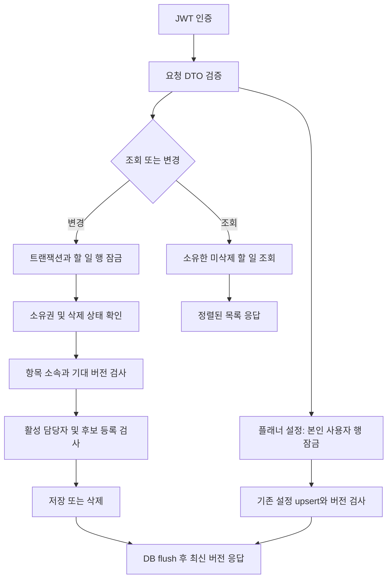

# API 구현 설계 · 2026-10-03

이 문서는 Java 코드를 작성하기 전에 확정한 이번 작업의 범위와 처리 흐름이다. 기존 `/api` 계약을 유지하고, `/api/v1` 목표 계약을 구현된 것으로 표시하지 않는다. 전체 상태는 [현행 목록](current-api-inventory.md), 상세 요청·응답은 [현재 계약](../api-info/current-contract.md)을 따른다.

## 이번에 완성할 범위

| Method | 경로 | 책임 |
|---|---|---|
| GET | /api/tasks/{taskId}/checklist-items | 체크리스트 목록 조회 |
| POST | /api/tasks/{taskId}/checklist-items | 제목·담당자로 항목 생성 |
| PUT | /api/tasks/{taskId}/checklist-items/{itemId} | 제목·담당자 변경 |
| PUT | /api/tasks/{taskId}/checklist-items/{itemId}/completion | 완료 상태 지정 |
| DELETE | /api/tasks/{taskId}/checklist-items/{itemId} | 항목 삭제 |
| GET | /api/tasks/{taskId}/assignees | 지정 가능한 담당자 조회 |
| PUT | /api/tasks/{taskId}/assignees/{userId} | 담당자 후보 등록 |
| DELETE | /api/tasks/{taskId}/assignees/{userId} | 담당자 후보 해제 |
| GET | /api/planner/preferences | 본인 플래너 기본 보기 조회 |
| PUT | /api/planner/preferences | 본인 플래너 기본 보기 저장 |

체크리스트는 최대 100개, 담당자 후보는 본인 외 최대 50명으로 제한한다. 담당자 후보는 할 일 소유자가 등록한 활성 계정이며 등록 자체가 할 일 조회·수정 권한을 부여하지 않는다. 기존 공유 API는 stub이므로 공유 권한을 구현한 것처럼 취급하지 않는다. 클라이언트가 보낸 ownerId는 사용하지 않고 JWT의 사용자 ID로 접근한다. 프런트엔드의 localStorage 글 저장 방식은 이번 서버 구현과 별개이며 UI 서버 연동은 후속 작업이다.

## 처리 흐름

없는 할 일, 타인 할 일, 삭제된 할 일은 동일한 404다. 담당자 후보가 없거나 비활성 계정이면 400이다. 사용 중인 후보 해제, 항목 기대 버전 불일치 및 DB 낙관적 잠금 충돌은 409다. 유효하지 않은 JSON·enum·경로 및 쿼리 자료형은 400이고 예상하지 못한 서버 실패는 상세 정보를 숨겨 500으로 반환하면서 서버 로그를 남긴다.

## 클래스와 네이밍 규칙

- Java 17, 공백 4칸, 새 파일 LF, 같은 줄 여는 중괄호, 명시적 import, 생성자 주입을 사용한다. 프로젝트의 기존 패키지 `kr.timebar.diary` 아래에 기능 모듈을 배치한다.
- 클래스·record·enum은 PascalCase, 변수·메서드는 camelCase, 상수·enum 값은 UPPER_SNAKE_CASE, DB 컬럼은 snake_case, URL은 소문자 복수 명사와 kebab-case를 사용한다.
- `Controller`는 HTTP 변환, `Service`는 권한·트랜잭션과 업무 흐름, `Repository`는 조회, `Entity`는 상태와 불변식, `Request`/`Response` record는 외부 계약만 담당한다.
- `task.checklist` 모듈은 `TaskChecklistService`, `TaskAssigneeService`, 공통 `TaskChecklistAccess`로 책임을 분리한다. `planner.preferences` 모듈은 플래너 설정만 담당한다.
- 메서드는 보통 30줄 이내로 작성한다. 새로운 상태를 정하는 API는 toggle 대신 `completed: true/false` 또는 `defaultView`로 명시하여 재요청 시 반전되는 문제를 피한다.
- 공개 DTO는 Bean Validation과 업무 규칙을 함께 검사한다. 주석은 잠금 순서·후보 등록과 접근권한의 차이 등 판단 배경을 설명한다. 비밀 값·본문 전체를 실패 로그에 기록하지 않는다.

## 저장 및 동시성

새 `task_checklist_item`, `task_assignee`, `planner_preference` 테이블을 증가 migration으로 생성한다. 이전 V1은 수정하지 않는다. 현재 V1의 `tbl_` 이름과 JPA의 이름이 다른 문제는 기존 [DB 정합성 문서](../design/04-schema-gaps.md)를 따른다. 기존 DB에 이번 SQL을 자동 실행하지 않는다. 새 migration은 JPA 호환 `task`/`users`가 이미 존재한다는 전제다. 격리 `chat-local` 프로필도 동일 증가 migration을 읽도록 별도 경로를 추가한다.

체크리스트는 `(task_id, created_at, id)` 인덱스, 담당자 후보는 `(task_id, user_id)` UNIQUE 인덱스로 조회한다. 후보의 PK는 기존 ULID 생성기를 재사용한다. 외부 FK에는 기존 CHAR/VARCHAR 타입 차이를 임의로 추측하지 않고 서비스 소유권 검사를 적용한다. 신규 두 테이블 간 담당자 참조 무결성은 서비스 트랜잭션으로 보장한다. 모든 후보·항목 변경은 먼저 부모 할 일 행을 잠가 한도·후보 해제·항목 추가 간 경쟁을 직렬화한다. 기존 할 일 수정·완료·삭제도 같은 잠금을 사용해 삭제를 오래된 수정이 되돌리지 못하도록 한다. 항목 변경·완료·삭제는 호출자가 읽은 `version`을 요구하며 JPA `@Version`을 함께 사용한다. 삭제의 버전은 쿼리 `version`으로 전달한다. 체크리스트와 설정의 공개 버전은 저장된 JPA 버전 + 1이며 최초 저장 응답은 1이다. 동일 값 저장은 버전을 증가시키지 않을 수 있다.

플래너 기본 보기는 DAILY/WEEKLY/MONTHLY/YEARLY다. 저장되지 않은 설정은 DAILY, version 0으로 조회되며 첫 저장은 version 0을 요구한다. 저장 전 본인 사용자 행을 잠가 최초 삽입 경쟁을 막는다. 저장 이후 기대 버전을 확인하고 최신 버전을 반환한다.

## 검증 계획과 상태 정의

단위 테스트는 타인·삭제된 할 일 접근, 담당자 자격, 잘못된 입력, 100/50 한도, 완료 상태 재요청, 버전 충돌, 후보 해제 충돌 및 플래너 upsert를 검증한다. MockMvc는 실제 JSON 변환·Bean Validation·상태 코드와 인증 주체 전달을 검증한다. 전체 Gradle 테스트와 소스/API 문서 대조를 실행한다. MariaDB/Redis에 접속하지 않은 검증을 운영 통합 완료로 표시하지 않는다.

현행 목록의 `구현 완료 · 단위/HTTP 계약 검증`은 이번 소스와 테스트가 완료되었다는 뜻이다. `기존 구현 · 서비스 연결`은 기존 소스 경로 존재만 확인했다는 뜻이다. `미구현 · stub`, `시연 · 메모리`, `/api/v1`의 `설계 · 미구현`은 완료로 집계하지 않는다.

## 부팅 오류 대응 후속 설계

위 내용은 API 소스 구현 전 계획이다. 이후 실제 Flyway 오류 대응에서는 [데이터 보존 복구 설계](../development/database-recovery-2026-10-03.md)를 먼저 기록하고 guarded baseline 2·safe core V3·workspace V4·계정 폭 V5 및 chat V4를 추가했다. 기존 SQL checksum과 데이터는 보존한다. 실제 MySQL·Redis 검증을 거쳐 로컬 DB에 반영했으며 결과는 복구 기록을 따른다.
