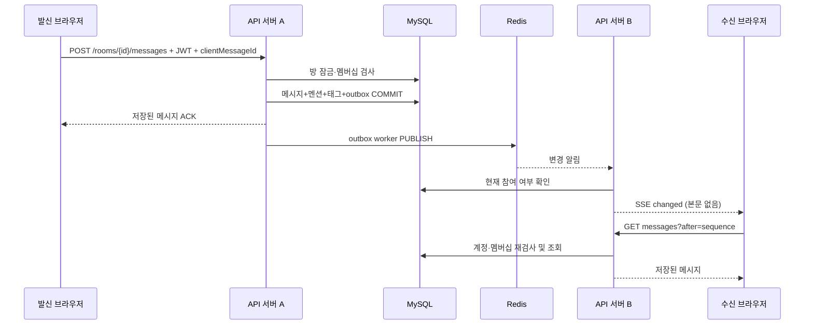

# 채팅 기능과 모듈 구조

로그인 전 화면은 `features/chat/api/demoChatApi.js`의 메모리 어댑터로 스크린샷의 샘플 대화를 보여준다. 인증 세션이 있으면 `chatApi.js`가 REST 어댑터를 선택한다. 미리보기는 SSE/Redis 연결을 만들지 않고 새로고침 시 초기 상태로 돌아간다. 인증 사용자가 서버 오류를 만났을 때 샘플 데이터로 바꾸지는 않는다.

## 구현 기능

| 기능 | 동작 |
|---|---|
| 개인 대화 | 정확한 가입 이메일로 상대를 찾아 생성. 같은 사용자 쌍은 기존 방 반환 |
| 그룹 대화 | 나를 포함해 2~20명, 이름 1~80자. 지정 사용자가 즉시 참여 |
| 메시지 | 일반 텍스트 1~4,000 UTF-16 코드 단위, 시간·발신자·전송 상태·재시도 표시 |
| 실시간 수신 | REST 전송 + Redis Pub/Sub + 인증된 SSE 수신. 서버 노드 간 전달 |
| 읽음 | 방별 단조 증가 읽음 위치, 안 읽은 수와 메시지별 미열람 참여자 수 |
| 복구 | 15초 DB 재조회, SSE 재연결, after 커서로 누락 복원, 메시지 ID 중복 제거 |
| 멘션함 | 다른 참여자 최대 19명 지정, 수신자별 읽음 상태·안 읽음 필터 |
| 태그함 | 본문 해시태그 최대 10개. NFKC·소문자 정규화, 참여 중인 방만 검색 |
| 태그 필터 | 방 안 특정 태그 필터 + 전체 참여 방에서 태그별 메시지 모아보기 |
| 그룹 관리 | 방장 이전, 그룹 나가기. 마지막 참여자 외 방장은 먼저 소유권 이전 |
| 작성 UX | 방별 초안, Enter 전송/Shift+Enter 줄바꿈, 한글 조합 중 오전송 방지, 멘션 선택칩 |
| 반응형 UX | 데스크톱 목록/대화 2단, 모바일 목록/대화 전환, 새 메시지 위치 안내, 이전 메시지 불러오기 |

파일·이미지 첨부, 메시지 편집/삭제, 초대 수락, 차단, 검색엔진 기반 본문 검색, 신규 그룹 참여자 추가, 커뮤니티 채널 권한 연동은 이번 구현에 포함하지 않는다. 현재 그룹 생성은 초대 수락 방식이 아니라 즉시 등록 정책이다. 외부 공개 서비스 전환 전에 연락 가능 범위·차단/신고 정책을 확장해야 한다. 다른 도메인의 기존 태그·멘션 시연 데이터는 SQL 채팅 메시지로 자동 이관하지 않는다.

## 전달 흐름



Pub/Sub는 구독 중단 동안의 이벤트를 재생하지 않는다. SQL outbox는 DB 저장 후 발행 실패를 재시도하지만 브라우저 수신을 보장하는 큐는 아니다. 그래서 주기적 REST 동기화와 재연결 동기화를 함께 구현했다. [Redis 공식 전달 보장](https://redis.io/docs/latest/develop/pubsub/)을 기준으로 설계했다.

## 디렉터리

```text
backend/src/main/java/kr/timebar/diary/chat/
  api/                       HTTP 계약, 입력 오류 처리
  application/               방·메시지·멘션·태그 유스케이스, ChatIdentity 포트
  domain/                    응답 모델, 태그 정규화 규칙
  infrastructure/
    CoreChatIdentity.java    기존 인증 모듈 연동 어댑터
    jdbc/                    채팅 전용 SQL 저장소
    redis/                   outbox 발행, SSE hub, TTL·요청 제한
  config/                    별도 Flyway 이력, Redis listener, scheduler
backend/src/main/resources/db/
  migration/                 기존 모듈 (수정하지 않음)
  chat/                      채팅 V1·멘션/태그 V2
  chat-local-core/            새 로컬 DB 전용 기존 JPA 부트스트랩
frontend/src/features/
  auth/                      실제 로그인 세션·공통 인증 fetch·가입 화면
  chat/
    api/                     HTTP 요청
    domain/                  SSE 프레임 해석·BIGINT 순서 병합
    model/                   대화 상태·재연결·재시도·방별 초안
    components/              메시지 작성창·새 대화 모달
    views/                   대화 화면·멘션/태그함
    styles/                  채팅 범위 CSS
infra/chat/                  MySQL·Redis 개발용 Compose
docs/chat/
  database/                  관계형 DB 설계
  api/                       채팅 HTTP 목록·설계
  redis/                     Redis 전용 데이터 설계·API 목록
  verification/              검증 결과
scripts/chat/                두 노드 통합 검증
```

`people.js`의 시연 채팅 배열과 전송 함수를 제거했다. 기존 프로필·알림 코드는 유지하고 채팅은 기능 모듈로 연결한다. 이전 `views/chat` 경로는 호환용 진입점이다. 기존 도메인 패키지(auth/task/routine/event 등)는 이미 기능별로 나뉘므로 일괄 이름 변경하지 않는다. 혼재된 계약용 스텁 컨트롤러에서 채팅 로직을 추가하지 않고 전용 API 계층에 둔다.

기존 서비스에 남아 있던 존재하지 않는 `authTransactionManager`, `taskTransactionManager`, `routineTransactionManager` 참조를 실제 단일 DB의 기본 트랜잭션 관리자로 맞췄다. 채팅 SQL도 같은 데이터소스·트랜잭션에 참여한다. 갱신 토큰은 같은 초의 회전에도 충돌하지 않도록 JWT jti를 추가했다.
