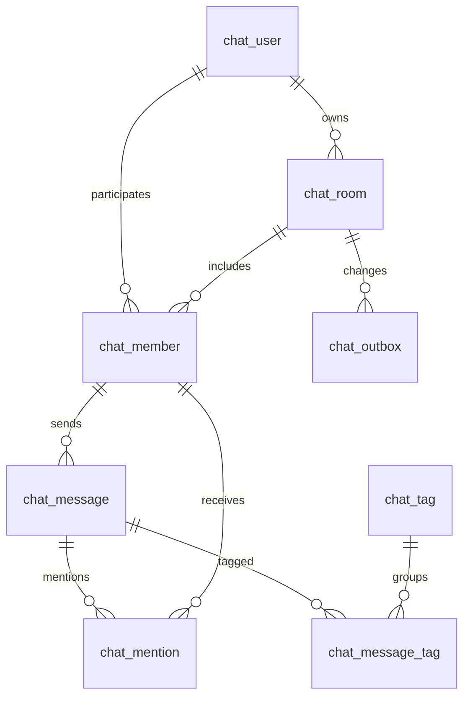

# 채팅 관계형 데이터베이스 설계서

2026-09-27 · 실행 기준 MySQL 8.4 / InnoDB. Redis 데이터 구조는 [별도 설계서](../redis/database-design.md)를 따른다.

## 범위와 공통 규칙

채팅 전용 **8개 테이블**을 사용한다. 기존 40개 목표 테이블에 대한 변경 스크립트가 아니며, 현재 JPA 인증 모델과 `ChatIdentity` 어댑터로 연동한다. 동일 DB 안에서 `chat_` 접두사·별도 Flyway 이력으로 분리한다. `chat_user`는 인증 원본을 대체하지 않는 ID/닉네임 투영이다. 코어 사용자와 SQL FK를 연결하지 않아 기존 `users`/`tbl_users` 명칭 불일치와 분리했다. API가 매번 인증 원본의 계정 활성 여부를 검사한다. 사용자 삭제 시 채팅 투영·본문 익명화는 별도 수명주기 작업으로 수행해야 한다.

ULID는 CHAR(26) ascii_bin, clientMessageId는 CHAR(36) ascii_bin이다. 시각은 DATETIME(6) UTC이며 모든 연결 및 JVM이 UTC를 사용한다. `sequence_no`와 `last_sequence`는 BIGINT이지만 API에서는 문자열로 반환한다. 본문은 평문이고 화면은 Vue 텍스트 바인딩으로 출력한다. 관계 삭제는 모두 RESTRICT다. 참여자는 물리 삭제하지 않고 left_at으로 나감을 기록하여 발신자·멘션 FK를 보존한다.

NULL 표기: N=NOT NULL, Y=NULL 허용. 시간 기본값 CURRENT_TIMESTAMP(6)은 아래에서 NOW로 줄여 표기한다. 정확한 실행문은 [V1](../../../backend/src/main/resources/db/chat/V1__chat_schema.sql), [V2](../../../backend/src/main/resources/db/chat/V2__mentions_and_tags.sql)에 있다.

## 1. chat_user / 채팅 사용자 투영

| 컬럼 | 타입 | NULL | 키·기본값 | 설명 |
|---|---|---|---|---|
| user_id | CHAR(26) | N | PK | 인증 모듈 사용자 ID |
| nickname | VARCHAR(80) | N | — | 표시 이름, 방 생성 시 인증 모듈에서 동기화 |
| updated_at | DATETIME(6) | N | NOW | 투영 갱신 시각 |

계정 활성 판단에 이 테이블의 존재만 사용하지 않는다. 닉네임은 프로필 변경 이벤트까지 실시간 동기화하지 않으며 이후 방 생성 시 갱신된다. 닉네임 변경을 즉시 전파하려면 인증 모듈 이벤트 소비를 후속 추가한다.

## 2. chat_room / 대화방

| 컬럼 | 타입 | NULL | 키·기본값 | 설명 |
|---|---|---|---|---|
| id | CHAR(26) | N | PK | 대화방 ULID |
| kind | VARCHAR(8) | N | CHECK | DM 또는 GROUP |
| name | VARCHAR(80) | Y | 그룹 필수 | 개인 대화 제목은 상대 닉네임으로 계산 |
| owner_id | CHAR(26) | N | FK chat_user | 생성자/현재 그룹 방장 |
| direct_key | VARCHAR(53) | Y | UK | 정렬된 사용자 ULID 2개를 `:`로 연결, 그룹은 NULL |
| last_sequence | BIGINT | N | 0, CHECK >=0 | 방 안에서 마지막 저장한 메시지 순번 |
| created_at | DATETIME(6) | N | NOW | 생성 시각 |
| updated_at | DATETIME(6) | N | NOW | 최근 메시지 저장 시각 |

DM은 direct_key 필수, GROUP은 direct_key NULL과 name NOT NULL을 CHECK로 강제한다. 그룹 이름의 공백·길이, DM 참여자가 정확히 두 명인지, 방장의 활성 참여 여부는 서비스가 보장한다. 방 생성 시 참여자 ID 순서로 chat_user 행 잠금을 얻어 동일 쌍의 동시 생성을 직렬화한다.

## 3. chat_member / 대화 참여자

| 컬럼 | 타입 | NULL | 키·기본값 | 설명 |
|---|---|---|---|---|
| room_id | CHAR(26) | N | 복합 PK, FK chat_room | 대화방 |
| user_id | CHAR(26) | N | 복합 PK, FK chat_user | 참여자 |
| last_read_sequence | BIGINT | N | 0, CHECK >=0 | 마지막으로 읽은 방 순번 |
| joined_at | DATETIME(6) | N | NOW | 참여 시각 |
| left_at | DATETIME(6) | Y | — | 나간 시각. NULL일 때만 현재 참여자 |

읽음은 방 잠금 후 `max(기존값, 요청값)`으로만 증가하며 last_sequence 초과 요청은 거부한다. 보낸 사람이 본인의 메시지를 보내는 행위만으로 이전 수신 메시지를 모두 읽었다고 처리하지 않는다. 안 읽은 수는 본인 발신 메시지를 제외해 계산한다.

## 4. chat_message / 메시지

| 컬럼 | 타입 | NULL | 키·기본값 | 설명 |
|---|---|---|---|---|
| id | CHAR(26) | N | PK | 메시지 ULID |
| room_id | CHAR(26) | N | 복합 FK/UK | 대화방 |
| sequence_no | BIGINT | N | CHECK >0 | 방 내부 저장 순서 |
| sender_id | CHAR(26) | N | 복합 FK | 보낸 참여자 |
| client_message_id | CHAR(36) | N | 복합 UK | 클라이언트 생성 소문자 canonical UUID |
| body | VARCHAR(4000) | N | CHECK 공백 제외 1~4000자 | 메시지 본문. 서비스는 Java 문자열 길이도 제한 |
| created_at | DATETIME(6) | N | NOW | 저장 시각 |

- UNIQUE(room_id, sequence_no): 같은 방의 순번 충돌 방지.
- UNIQUE(room_id, sender_id, client_message_id): 재전송 중복 방지. 같은 키의 본문 또는 멘션 집합이 다르면 409.
- UNIQUE(room_id, id): 멘션의 동일 대화방 복합 FK 참조 후보 키.
- FK(room_id, sender_id) → chat_member(room_id, user_id): 발신자가 해당 방 참여 이력을 가짐. 현재 미탈퇴 여부는 서비스가 방 잠금 후 FOR UPDATE로 다시 확인한다.

## 5. chat_outbox / 발행 대기 이벤트

| 컬럼 | 타입 | NULL | 키·기본값 | 설명 |
|---|---|---|---|---|
| id | BIGINT | N | PK, AUTO_INCREMENT | 발행 작업 ID |
| room_id | CHAR(26) | N | FK chat_room | 변경된 방 |
| event_type | VARCHAR(16) | N | — | MESSAGE, READ, ROOM |
| attempts | INT | N | 0, CHECK >=0 | 발행 오류 횟수 |
| available_at | DATETIME(6) | N | NOW | 다음 발행 시도 시각 |
| published_at | DATETIME(6) | Y | — | Redis 명령 성공 시각, 수신자의 수신 ACK가 아님 |
| created_at | DATETIME(6) | N | NOW | 이벤트 생성 시각 |

본문은 outbox에도 Redis에도 복제하지 않는다. 메시지·멘션·태그·방 순번 갱신과 outbox INSERT는 하나의 SQL 트랜잭션이다. worker는 `FOR UPDATE SKIP LOCKED`로 여러 서버 간 작업을 분담한다. 발행 후 DB COMMIT 전에 장애가 나면 재발행될 수 있어 수신 측은 항상 멱등하게 재조회한다.

## 6. chat_mention / 메시지 멘션

| 컬럼 | 타입 | NULL | 키·기본값 | 설명 |
|---|---|---|---|---|
| room_id | CHAR(26) | N | 복합 FK | 메시지·수신자 공통 방 |
| message_id | CHAR(26) | N | 복합 PK, 복합 FK | 언급이 포함된 메시지 |
| user_id | CHAR(26) | N | 복합 PK, 복합 FK | 멘션을 받을 참여자 |
| read_at | DATETIME(6) | Y | — | 멘션함에서 확인한 시각 |
| created_at | DATETIME(6) | N | NOW | 멘션 생성 시각 |

FK(room_id,message_id) → chat_message(room_id,id), FK(room_id,user_id) → chat_member(room_id,user_id). 다른 방의 사용자를 멘션하는 잘못된 연결은 DB도 거부한다. 본문 `@닉네임`을 임의 사용자에게 자동 연결하지 않는다. UI가 선택한 ID를 서버가 검증한다. 자기 멘션은 거부하며 중복 ID는 집합으로 정규화한다. 멘션함 읽음과 방 읽음은 서로 독립이다.

## 7. chat_tag / 태그 사전

| 컬럼 | 타입 | NULL | 키·기본값 | 설명 |
|---|---|---|---|---|
| id | BIGINT | N | PK, AUTO_INCREMENT | 내부 태그 키 |
| name | VARCHAR(32) | N | UK, utf8mb4_bin, CHECK 1~32자 | NFKC·소문자 정규화한 태그 |

`#회고`, `#plan` 형태를 본문에서 추출한다. 한글·문자·숫자·밑줄·하이픈을 허용하고 공백은 허용하지 않는다. `#Plan`과 `#ＰＬＡＮ`은 plan 하나로 합쳐진다. 메시지당 태그 집합 10개 초과 시 전송 전체를 거부한다. 사전은 전역이지만 외부 API는 현재 참여 방에 연결된 태그만 노출한다.

## 8. chat_message_tag / 메시지·태그 연결

| 컬럼 | 타입 | NULL | 키·기본값 | 설명 |
|---|---|---|---|---|
| message_id | CHAR(26) | N | 복합 PK, FK chat_message.id | 메시지 |
| tag_id | BIGINT | N | 복합 PK, FK chat_tag.id | 태그 |

## 관계와 인덱스 전략

사용자↔방, 메시지↔태그, 메시지↔멘션 수신자는 각각 연결 테이블을 통한 N:M이다. 선택적 1:1 확장은 없다. 모든 테이블은 PK를 가지며 FK와 동일 타입·문자 비교 규칙을 사용한다.

| 인덱스/컬럼 순서 | 이유 |
|---|---|
| chat_room direct_key UK | 사용자 쌍별 DM 한 개 |
| chat_room owner_id | 소유자 FK 검사 |
| chat_member PK(room_id,user_id) | 권한·멤버 목록·발신자/멘션 FK |
| chat_member(user_id,left_at,room_id) | 현재 참여 방 목록과 방 커서 |
| chat_message(room_id,sequence_no) UK | 이전/이후 메시지 키셋 조회, 방 순서 |
| chat_message(room_id,sender_id,client_message_id) UK | 멱등 재시도 및 발신자 FK |
| chat_message(room_id,id) UK | 동일 방 멘션 FK |
| chat_outbox(published_at,available_at,id) | 발행 가능한 미처리 작업 선택 |
| chat_outbox(room_id) | 방 FK 검사 |
| chat_mention PK(message_id,user_id) | 동일 메시지/수신자 중복 금지 |
| chat_mention(user_id,read_at,message_id) | 사용자별 미확인 멘션함 |
| chat_mention(room_id,message_id), (room_id,user_id) | 복합 FK 검사 |
| chat_tag name UK | 정규화한 태그 동등 조회·이름순 페이지 |
| chat_message_tag PK(message_id,tag_id) | 메시지별 태그와 중복 방지 |
| chat_message_tag(tag_id,message_id) | 태그별 메시지 커서 조회 |

태그 조회는 반드시 message→active member를 JOIN한다. `%본문%` 검색이나 JSON 태그 검색을 사용하지 않는다. 초기 구현은 방별 멤버·미열람 수와 메시지별 태그·멘션을 추가 조회하므로 최대 페이지 100, 그룹 20명으로 제한했다. 대규모 사용자 데이터에서는 batch hydration과 읽음 집계 캐시를 도입하기 전에 EXPLAIN ANALYZE·부하 테스트로 병목을 측정한다. 조회 성능을 아직 대규모 실데이터로 보장하지 않는다.

## 실행과 수명주기

채팅 활성화 시 core Flyway 완료 후 `db/chat`를 별도 `flyway_chat_history`로 V1→V2 적용한다. 비어 있지 않은 core 스키마에는 chat history만 baseline 0으로 초기화한다. 채팅 migration은 CREATE/ALTER만 포함하며 DROP·REPLACE·FK 비활성화를 사용하지 않는다. 기존 V1을 수정하거나 기존 DB에 local bootstrap을 적용하지 않는다.

전송 기록은 임의 TTL로 삭제하지 않는다. 게시된 outbox만 7일 경과 후 시간당 최대 1,000행 정리한다. 미발행 행은 자동 삭제하지 않는다. 서비스 탈퇴·법적 보존·첨부 삭제 정책은 인증 원본과 협의하여 별도 파기 작업을 추가한다. 태그 사전의 고아 행은 당장 기능에 영향이 없으며 운영 정리 작업의 대상으로 둘 수 있다.
