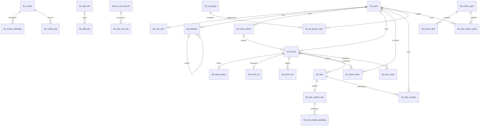

# Timeflow 데이터베이스 설계서

작성일: 2026-09-26 · 상태: 검토용 목표 설계 · 대상: MySQL 8.4 / InnoDB / utf8mb4

기준 문서는 [current-ddl-relationships.md](../design/diagrams/current-ddl-relationships.md)다. 이 관계도에는 키 컬럼만 있으므로, 나머지 컬럼·기본값은 [V1__initial_schema.sql](../../backend/src/main/resources/db/migration/V1__initial_schema.sql)에서 확인했다. [기존 분석 자료](../design/04-schema-gaps.md)와 Java 엔티티·상태 enum을 대조했다. 실행 중인 업무 DB를 조사한 결과가 아니라 저장소를 바탕으로 한 설계다.

**원본 37개 엔티티를 모두 다루고, 반복 시리즈·루틴 요일·할 일 반복 요일 3개를 추가한 총 40개 테이블을 제안한다.** 아래 테이블 정의와 DDL은 개선 후 목표 구조이며, 현재 운영 스키마와 동일하다는 의미가 아니다. 이 작업은 기존 Flyway V1이나 애플리케이션을 변경하지 않는다.

## 1. 개념적/논리적 설계 개요

### 1.1. 도메인과 주요 엔티티

| 도메인 | 엔티티(테이블명에서 tbl_ 생략) | 설계 책임 |
|---|---|---|
| 인증·계정 | users, refresh_token, login_throttle | 사용자, 토큰 수명, 로그인 제한 |
| 일정·실제 기록 | events, event_series, event_policy, event_share, event_ex, event_ver, time_entry | 계획 회차, 공유, 변경 이력, 실제 사용 시간 |
| 할 일·루틴·플래너 | task, task_member, task_repeat_rule, task_repeat_weekday, routine, routine_weekday, routine_log, planner_item | 실행할 일, 반복 규칙, 일별 수행, 수동 계획 |
| 개인 설정 | category, user_pref, dash_layout, dash_portlet_pref, notif_pref, user_device | 사용자 소유 분류, UI 설정, 알림·기기 |
| 데이터 연동·운영 | data_file, data_job, import_mapping_profile, ext_cal_account, sync_run_log, support_ticket, settings_audit_log | 파일 작업, 계정별 동기화, 문의, 감사 |
| 개인 기록·협업 | memo, diary, friend, cal_group, cal_group_mem | 개인 기록, 친구, 그룹과 참여자 |
| 공용 자산 | theme_catalog, sticker_pack, sticker_item, user_sticker_pack | 테마·스티커 카탈로그 및 사용자 설치 |

사용자를 개인 데이터의 소유권 경계로 삼는다. 공유받은 사용자와 데이터 소유자는 서로 다른 역할이다. 소유자 간 잘못된 참조는 `(user_id, 참조 ID)` 복합 FK로 차단하고, 공유 권한은 연결 테이블과 서비스 권한 검사로 처리한다. 단일 MySQL DB를 기본으로 하되 도메인별 모듈을 구분한다. 도메인 간 FK를 제거하는 서비스 분할·샤딩은 별도 설계가 필요하다.

도식은 핵심 관계 요약이다. 모든 FK와 선택성은 3절에 기재한다.

### 1.2. 현재 구조의 문제와 목표 설계 결정

| 현재 구조에서 확인한 사항 | 목표 설계 | 호환성·이관 영향 |
|---|---|---|
| 생성명은 tbl_ 접두사이나 FK 39개는 users/events/task 등 미해결 이름 참조 | 모든 FK를 실제 tbl_ 테이블로 통일 | Java @Table도 후속 변경 필요. 기존 8개 엔티티는 비접두사 이름 사용 |
| MariaDB용 CREATE OR REPLACE TABLE | MySQL CREATE TABLE | 빈 DB용 스크립트. 기존 테이블을 덮어쓰지 않음 |
| task.event_id CHAR(26), events.id BIGINT | BIGINT로 일치, 소유자 복합 FK 추가 | 숫자 변환·실재 일정·소유자를 검증한 뒤 이관 |
| planner_item에 user_id 없음 | user_id NOT NULL 및 FK 추가 | 소유자를 확인할 수 없는 데이터는 별도 격리·검토 |
| category.user_id NULL 및 UNIQUE(user_id,name) | 개인 카테고리만 허용, user_id NOT NULL | **제품 정책 제안**: 공용 기본 분류를 사용자별 복제. 공용 분류 유지가 필수라면 별도 catalog/사용자 매핑 설계를 먼저 확정 |
| 카테고리·일정·파일 참조가 없거나 소유자 경계 없음 | 동일 사용자의 후보 키를 참조하는 복합 FK | 기존 타 사용자 참조 정리. 공유 일정은 개인 time_entry/task에 직접 연결하지 않는 정책 제안 |
| 카테고리 속성이 task/routine/time_entry에 중복 | cat_id로 조인, 복제된 이름·색상·아이콘 제거 | 현재 카테고리 변경을 반영. 당시 표시값이 필요한 이력은 event_ver.snap 등 스냅샷에 보존 |
| events가 date와 TIME 두 개만 저장 | 시간 일정은 UTC 구간, 종일은 현지 DATE 구간으로 분리 | 자정 통과·여러 날·시간대 지원. API의 기존 date/time DTO 변환 필요 |
| series_id가 첫 회차 ID를 재사용 | event_series 독립 부모 추가 | 기존 series_id별 소유자를 검증해 부모 생성. 첫 회차 삭제와 식별 수명을 분리 |
| routine.days/task_repeat_rule.weekdays가 문자열 | 별도 요일 테이블의 복합 PK, CHECK(1~7) | 문자열 파싱과 중복 제거. task.is_repeat는 반복 규칙 행 존재로 대체 |
| routine.at_time/dnd_s/dnd_e가 문자열 | TIME 및 시각 범위 CHECK | 기존 HH:mm 형식 검증 후 변환 |
| dash_layout.bp NULL로 기본 레이아웃 중복 가능 | NOT NULL DEFAULT 'default' | 기존 NULL을 default로 매핑하며 중복 통합 |
| JSON을 LONGTEXT로 저장 | MySQL JSON | 깨진 JSON 정리 필요. JSON 내용의 스키마·버전은 서비스 검증 |
| refresh_token.device_id가 연결되지 않음 | (user_id, device_id) → user_device | NULL이면 기기 미연결, 값이 있으면 등록된 동일 사용자 기기만 허용 |
| ext_cal_account는 사용자·공급자당 한 계정 | external_subject를 추가해 다중 계정 허용 | 기존 계정의 공급자 고유 식별자를 확보해야 함 |
| sync_run_log가 provider 문자열만 보유 | account_id와 소유자 복합 FK | 구체 계정을 식별할 수 없는 기존 로그는 별도 보관 후 검토 |
| event_ex는 (event_id,occ_start) UK | 물리 회차 event_id에 UNIQUE | 원본은 반복 마스터 모델과 혼재. 현재 물리화 방식에 맞춰 회차당 현재 예외 한 건으로 결정 |
| by_id/req_by/d_by/parent_id/theme_id 등 일부 참조 누락 | 사용자·카테고리·테마 FK 추가 | 삭제된 사용자, 누락 테마 등 고아 데이터 정리 |
| 친구 쌍 역방향 중복·자기 참조 가능 | ascii_bin ULID 정렬 a_id < b_id, 요청자는 쌍 구성원 | 기존 쌍 정렬·상태 충돌 정리 |
| DATETIME(3)/(6) 혼용, 상태·수치 검증 부족 | DATETIME(6), BOOLEAN·범위·주요 상태 CHECK | 기존 불량 값 정리. 신규 상태 값은 아래 정책 확인 필요 |

### 1.3. 공통 물리 설계 규칙

- MySQL **8.4**를 실행 기준으로 한다. 문자 데이터는 utf8mb4, 기본 비교는 utf8mb4_unicode_ci다. ULID는 대문자 26자리 문자열이며 `ascii_bin`으로 정확히 비교한다. 서비스에서 ULID 길이·문자 집합을 검증한다. BIGINT ID는 기존 타입을 유지하고, API에서 JavaScript 정밀도 손실을 피하려면 문자열로 직렬화한다.
- 모든 테이블에 PK를 둔다. 기존 CHAR(26)과 BIGINT 혼용은 참조별 타입을 일치시키는 범위에서 유지한다. 임의 UUID로 일괄 교체하지 않는다.
- `*_utc`, `c_at`, `u_at`, `created_at`, `updated_at`, `at`는 UTC다. 커넥션 풀의 **모든 연결**에 `time_zone='+00:00'`를 설정한다. DATETIME 자체가 시간대를 변환하지 않으므로 서비스도 UTC로 입력한다. 기본 생성·수정 시각은 DB가 채우며, 업무 발생 시각은 호출자가 입력한다.
- 시간 구간은 `[시작, 종료)`다. 시간 일정은 start_utc/end_utc, 종일 일정은 start_date/end_date만 사용한다. 종일 1일은 다음 날짜가 end_date다. 종료와 시작이 같은 0분 기록은 허용하지 않는다. 일광절약시간의 모호한 현지 시각과 RRULE 전개는 시간대 라이브러리에서 처리한다.
- 반복 일정은 기존 구현처럼 회차별 events 행을 생성한다. 시리즈에는 생성 규칙을 보관하고 무한 미래를 한 번에 만들지 않는다. 일정 원본은 events이며, event_ex는 현재 예외의 보조 데이터다. 취소는 event_ex.cancel과 events.d_at를 함께 반영하고, 수정은 예외와 현재 행·event_ver를 같은 트랜잭션으로 기록한다. 예외의 NULL은 “변경 없음”으로 정의하므로 필드 값을 NULL로 지우는 변경은 events 및 버전 기록으로 처리한다.
- 개인 카테고리 이름은 소프트 삭제 후에도 재사용하지 않는 정책이다. 사용자 이메일도 탈퇴 후 재사용을 허용하지 않는 기준이다. 기존 UK가 삭제 이력을 포함한다. 재사용이 필요하면 활성 행만을 위한 생성 컬럼 UK와 익명화 정책을 별도 설계한다.
- 모든 FK는 삭제·갱신 RESTRICT다. 부모 하드 삭제가 이력과 여러 관계를 암묵적으로 지우지 않도록 하고, 삭제 서비스가 자식→부모 순서로 처리한다. 원본의 CASCADE·SET NULL 정책에서 의도적으로 변경했다. 참조가 있는 카테고리·테마·기기는 삭제 대신 비활성화한다. 소프트 삭제를 FK가 활성 상태로 판별해 주지는 않는다.
- JSON에는 설정·스냅샷·외부 메타데이터만 둔다. 조인·권한·반복 요일은 관계형 컬럼/테이블로 관리한다. 기존 memo.tags와 ext_cal_account.scopes는 표시·외부 응답 보존용 문자열로 한정한다. 태그 검색이 제품 요구라면 tag/memo_tag N:M을 후속 추가한다.

MySQL CHECK는 TRUE 또는 UNKNOWN을 허용하므로, 필수 쌍은 NOT NULL 및 명시적인 IS NOT NULL 조건과 함께 검증한다. UNIQUE의 NULL 중복 허용도 고려했다. 참조 대상 복합 키는 모두 명시적인 UNIQUE다. 근거: [MySQL CHECK 문서](https://dev.mysql.com/doc/refman/8.4/en/create-table-check-constraints.html), [FK 문서](https://dev.mysql.com/doc/refman/8.4/en/create-table-foreign-keys.html), [CREATE TABLE 문서](https://dev.mysql.com/doc/refman/8.4/en/create-table.html).

### 1.4. 무결성 보장 범위와 서비스 책임

| 규칙 | DB에서 보장 | 서비스·트랜잭션에서 보장 |
|---|---|---|
| 엔티티 참조·중복 | PK/FK/UK, 참조 ID 타입·소유자 일치 | 권한 및 미삭제·활성 부모만 신규 연결 |
| 일정·실제 기록 시간 | 시작 < 종료, 종일/시간 필드 상호 배타 | 시간대 유효성, DST, 기간 중첩 정책 |
| 카테고리 트리 | 자기 참조 금지, 같은 소유자 부모 FK | 2개 이상 노드의 순환 금지. 사용자 행을 FOR UPDATE로 잠그고 트리 변경을 직렬화하여 검사 |
| 반복 규칙 | 양수 간격·요일 범위·중복 금지·종료 필드 일치 | 활성 루틴은 요일 최소 1개, 주간 규칙 요일 필수, 다른 주기의 요일 사용 금지. 부모 잠금 후 자식 교체 |
| 반복 회차 생성 | 시리즈 실재·동일 소유자 | 시리즈 행 잠금 후 생성 범위 확인과 INSERT를 한 트랜잭션으로 수행하여 재시도 중복 방지. 수정된 회차의 현재 시각에 UNIQUE를 걸어 중복을 막지는 않음 |
| 공유·그룹 권한 | 사용자·대상 실재, 참여 중복 금지 | 소유자/편집자 권한, 정책상 최대 범위, 자기 공유 금지, 그룹 소유자 멤버 중복 금지 |
| 버전·이력 | UNIQUE(event_id,ver_no), ver_no > 0 | row_version 조건부 UPDATE 후 증가. 영향 행 0이면 충돌. 버전 할당·스냅샷 저장을 같은 트랜잭션으로 처리 |
| 토큰 | 해시·선택적 jti 유일성, 만료 > 생성, 기기 소유자 | 해시 계산, 만료·폐기·기기 폐기 확인, 토큰 회전 시 이전 토큰 잠금·폐기와 새 행 INSERT를 원자 처리 |
| 작업·동기화 | 상태 값·시간 순서·건수 범위, 결과 소유자 | PENDING→RUNNING→완료 전이, 완료 상태의 종료 시각, 성공 결과 존재, 재시도 멱등성 |
| 개인정보·감사 | 사용자 참조 유지 | 비밀번호·토큰 원문 금지, 접근 제한, 감사 INSERT-only 권한, 보존 기간 이후 익명화/파기 |

사용자/할 일/루틴 기록/일정 공개 범위/로그인 제한의 CHECK 값은 Java enum에서 확인했다. 카테고리·작업·동기화·공유·친구·그룹·기기 등의 허용 값은 **새 목표 설계의 제안 코드 집합**이다. 기존 데이터에 해당 값이 들어 있다고 가정하지 않는다. 미구현 도메인의 typ/status/mood/src_typ 등 자유 코드 컬럼은 길이·NULL 제약만 DB가 보장하며, 서비스의 버전 관리된 코드 사전으로 검증한다. 운영 중 코드가 자주 추가되면 도메인별 코드 테이블과 FK로 전환한다. ENUM 타입 대신 VARCHAR+CHECK를 사용해 코드 변경을 명시적인 마이그레이션으로 관리한다.
