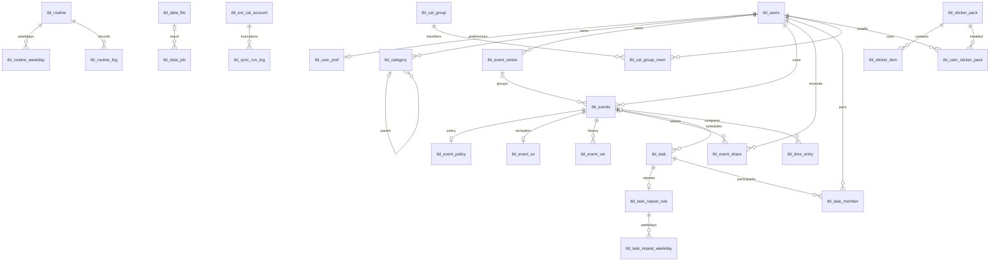

# Timeflow 데이터베이스 설계서

작성일: 2026-09-26 · 상태: 검토용 목표 설계 · 대상: MySQL 8.4 / InnoDB / utf8mb4

기준 문서는 [current-ddl-relationships.md](../design/diagrams/current-ddl-relationships.md)다. 이 관계도에는 키 컬럼만 있으므로, 나머지 컬럼·기본값은 [V1__initial_schema.sql](../../backend/src/main/resources/db/migration/V1__initial_schema.sql)에서 확인했다. [기존 분석 자료](../design/04-schema-gaps.md)와 Java 엔티티·상태 enum을 대조했다. 실행 중인 업무 DB를 조사한 결과가 아니라 저장소를 바탕으로 한 설계다.

**원본 37개 엔티티를 모두 다루고, 반복 시리즈·루틴 요일·할 일 반복 요일 3개를 추가한 총 40개 테이블을 제안한다.** 아래 테이블 정의와 DDL은 개선 후 목표 구조이며, 현재 운영 스키마와 동일하다는 의미가 아니다. 이 작업은 기존 Flyway V1이나 애플리케이션을 변경하지 않는다.

## 1. 개념적/논리적 설계 개요

### 1.1. 도메인과 주요 엔티티

| 도메인 | 엔티티(테이블명에서 tbl_ 생략) | 설계 책임 |
|---|---|---|
| 인증·계정 | users, refresh_token, login_throttle | 사용자, 토큰 수명, 로그인 제한 |
| 일정·실제 기록 | events, event_series, event_policy, event_share, event_ex, event_ver, time_entry | 계획 회차, 공유, 변경 이력, 실제 사용 시간 |
| 할 일·루틴·플래너 | task, task_member, task_repeat_rule, task_repeat_weekday, routine, routine_weekday, routine_log, planner_item | 실행할 일, 반복 규칙, 일별 수행, 수동 계획 |
| 개인 설정 | category, user_pref, dash_layout, dash_portlet_pref, notif_pref, user_device | 사용자 소유 분류, UI 설정, 알림·기기 |
| 데이터 연동·운영 | data_file, data_job, import_mapping_profile, ext_cal_account, sync_run_log, support_ticket, settings_audit_log | 파일 작업, 계정별 동기화, 문의, 감사 |
| 개인 기록·협업 | memo, diary, friend, cal_group, cal_group_mem | 개인 기록, 친구, 그룹과 참여자 |
| 공용 자산 | theme_catalog, sticker_pack, sticker_item, user_sticker_pack | 테마·스티커 카탈로그 및 사용자 설치 |

사용자를 개인 데이터의 소유권 경계로 삼는다. 공유받은 사용자와 데이터 소유자는 서로 다른 역할이다. 소유자 간 잘못된 참조는 `(user_id, 참조 ID)` 복합 FK로 차단하고, 공유 권한은 연결 테이블과 서비스 권한 검사로 처리한다. 단일 MySQL DB를 기본으로 하되 도메인별 모듈을 구분한다. 도메인 간 FK를 제거하는 서비스 분할·샤딩은 별도 설계가 필요하다.



도식은 핵심 관계 요약이다. 모든 FK와 선택성은 3절에 기재한다.

### 1.2. 현재 구조의 문제와 목표 설계 결정

| 현재 구조에서 확인한 사항 | 목표 설계 | 호환성·이관 영향 |
|---|---|---|
| 생성명은 tbl_ 접두사이나 FK 39개는 users/events/task 등 미해결 이름 참조 | 모든 FK를 실제 tbl_ 테이블로 통일 | Java @Table도 후속 변경 필요. 기존 8개 엔티티는 비접두사 이름 사용 |
| MariaDB용 CREATE OR REPLACE TABLE | MySQL CREATE TABLE | 빈 DB용 스크립트. 기존 테이블을 덮어쓰지 않음 |
| task.event_id CHAR(26), events.id BIGINT | BIGINT로 일치, 소유자 복합 FK 추가 | 숫자 변환·실재 일정·소유자를 검증한 뒤 이관 |
| planner_item에 user_id 없음 | user_id NOT NULL 및 FK 추가 | 소유자를 확인할 수 없는 데이터는 별도 격리·검토 |
| category.user_id NULL 및 UNIQUE(user_id,name) | 개인 카테고리만 허용, user_id NOT NULL | **제품 정책 제안**: 공용 기본 분류를 사용자별 복제. 공용 분류 유지가 필수라면 별도 catalog/사용자 매핑 설계를 먼저 확정 |
| 카테고리·일정·파일 참조가 없거나 소유자 경계 없음 | 동일 사용자의 후보 키를 참조하는 복합 FK | 기존 타 사용자 참조 정리. 공유 일정은 개인 time_entry/task에 직접 연결하지 않는 정책 제안 |
| 카테고리 속성이 task/routine/time_entry에 중복 | cat_id로 조인, 복제된 이름·색상·아이콘 제거 | 현재 카테고리 변경을 반영. 당시 표시값이 필요한 이력은 event_ver.snap 등 스냅샷에 보존 |
| events가 date와 TIME 두 개만 저장 | 시간 일정은 UTC 구간, 종일은 현지 DATE 구간으로 분리 | 자정 통과·여러 날·시간대 지원. API의 기존 date/time DTO 변환 필요 |
| series_id가 첫 회차 ID를 재사용 | event_series 독립 부모 추가 | 기존 series_id별 소유자를 검증해 부모 생성. 첫 회차 삭제와 식별 수명을 분리 |
| routine.days/task_repeat_rule.weekdays가 문자열 | 별도 요일 테이블의 복합 PK, CHECK(1~7) | 문자열 파싱과 중복 제거. task.is_repeat는 반복 규칙 행 존재로 대체 |
| routine.at_time/dnd_s/dnd_e가 문자열 | TIME 및 시각 범위 CHECK | 기존 HH:mm 형식 검증 후 변환 |
| dash_layout.bp NULL로 기본 레이아웃 중복 가능 | NOT NULL DEFAULT 'default' | 기존 NULL을 default로 매핑하며 중복 통합 |
| JSON을 LONGTEXT로 저장 | MySQL JSON | 깨진 JSON 정리 필요. JSON 내용의 스키마·버전은 서비스 검증 |
| refresh_token.device_id가 연결되지 않음 | (user_id, device_id) → user_device | NULL이면 기기 미연결, 값이 있으면 등록된 동일 사용자 기기만 허용 |
| ext_cal_account는 사용자·공급자당 한 계정 | external_subject를 추가해 다중 계정 허용 | 기존 계정의 공급자 고유 식별자를 확보해야 함 |
| sync_run_log가 provider 문자열만 보유 | account_id와 소유자 복합 FK | 구체 계정을 식별할 수 없는 기존 로그는 별도 보관 후 검토 |
| event_ex는 (event_id,occ_start) UK | 물리 회차 event_id에 UNIQUE | 원본은 반복 마스터 모델과 혼재. 현재 물리화 방식에 맞춰 회차당 현재 예외 한 건으로 결정 |
| by_id/req_by/d_by/parent_id/theme_id 등 일부 참조 누락 | 사용자·카테고리·테마 FK 추가 | 삭제된 사용자, 누락 테마 등 고아 데이터 정리 |
| 친구 쌍 역방향 중복·자기 참조 가능 | ascii_bin ULID 정렬 a_id < b_id, 요청자는 쌍 구성원 | 기존 쌍 정렬·상태 충돌 정리 |
| DATETIME(3)/(6) 혼용, 상태·수치 검증 부족 | DATETIME(6), BOOLEAN·범위·주요 상태 CHECK | 기존 불량 값 정리. 신규 상태 값은 아래 정책 확인 필요 |

### 1.3. 공통 물리 설계 규칙

- MySQL **8.4**를 실행 기준으로 한다. 문자 데이터는 utf8mb4, 기본 비교는 utf8mb4_unicode_ci다. ULID는 대문자 26자리 문자열이며 `ascii_bin`으로 정확히 비교한다. 서비스에서 ULID 길이·문자 집합을 검증한다. BIGINT ID는 기존 타입을 유지하고, API에서 JavaScript 정밀도 손실을 피하려면 문자열로 직렬화한다.
- 모든 테이블에 PK를 둔다. 기존 CHAR(26)과 BIGINT 혼용은 참조별 타입을 일치시키는 범위에서 유지한다. 임의 UUID로 일괄 교체하지 않는다.
- `*_utc`, `c_at`, `u_at`, `created_at`, `updated_at`, `at`는 UTC다. 커넥션 풀의 **모든 연결**에 `time_zone='+00:00'`를 설정한다. DATETIME 자체가 시간대를 변환하지 않으므로 서비스도 UTC로 입력한다. 기본 생성·수정 시각은 DB가 채우며, 업무 발생 시각은 호출자가 입력한다.
- 시간 구간은 `[시작, 종료)`다. 시간 일정은 start_utc/end_utc, 종일 일정은 start_date/end_date만 사용한다. 종일 1일은 다음 날짜가 end_date다. 종료와 시작이 같은 0분 기록은 허용하지 않는다. 일광절약시간의 모호한 현지 시각과 RRULE 전개는 시간대 라이브러리에서 처리한다.
- 반복 일정은 기존 구현처럼 회차별 events 행을 생성한다. 시리즈에는 생성 규칙을 보관하고 무한 미래를 한 번에 만들지 않는다. 일정 원본은 events이며, event_ex는 현재 예외의 보조 데이터다. 취소는 event_ex.cancel과 events.d_at를 함께 반영하고, 수정은 예외와 현재 행·event_ver를 같은 트랜잭션으로 기록한다. 예외의 NULL은 “변경 없음”으로 정의하므로 필드 값을 NULL로 지우는 변경은 events 및 버전 기록으로 처리한다.
- 개인 카테고리 이름은 소프트 삭제 후에도 재사용하지 않는 정책이다. 사용자 이메일도 탈퇴 후 재사용을 허용하지 않는 기준이다. 기존 UK가 삭제 이력을 포함한다. 재사용이 필요하면 활성 행만을 위한 생성 컬럼 UK와 익명화 정책을 별도 설계한다.
- 모든 FK는 삭제·갱신 RESTRICT다. 부모 하드 삭제가 이력과 여러 관계를 암묵적으로 지우지 않도록 하고, 삭제 서비스가 자식→부모 순서로 처리한다. 원본의 CASCADE·SET NULL 정책에서 의도적으로 변경했다. 참조가 있는 카테고리·테마·기기는 삭제 대신 비활성화한다. 소프트 삭제를 FK가 활성 상태로 판별해 주지는 않는다.
- JSON에는 설정·스냅샷·외부 메타데이터만 둔다. 조인·권한·반복 요일은 관계형 컬럼/테이블로 관리한다. 기존 memo.tags와 ext_cal_account.scopes는 표시·외부 응답 보존용 문자열로 한정한다. 태그 검색이 제품 요구라면 tag/memo_tag N:M을 후속 추가한다.

MySQL CHECK는 TRUE 또는 UNKNOWN을 허용하므로, 필수 쌍은 NOT NULL 및 명시적인 IS NOT NULL 조건과 함께 검증한다. UNIQUE의 NULL 중복 허용도 고려했다. 참조 대상 복합 키는 모두 명시적인 UNIQUE다. 근거: [MySQL CHECK 문서](https://dev.mysql.com/doc/refman/8.4/en/create-table-check-constraints.html), [FK 문서](https://dev.mysql.com/doc/refman/8.4/en/create-table-foreign-keys.html), [CREATE TABLE 문서](https://dev.mysql.com/doc/refman/8.4/en/create-table.html).

### 1.4. 무결성 보장 범위와 서비스 책임

| 규칙 | DB에서 보장 | 서비스·트랜잭션에서 보장 |
|---|---|---|
| 엔티티 참조·중복 | PK/FK/UK, 참조 ID 타입·소유자 일치 | 권한 및 미삭제·활성 부모만 신규 연결 |
| 일정·실제 기록 시간 | 시작 < 종료, 종일/시간 필드 상호 배타 | 시간대 유효성, DST, 기간 중첩 정책 |
| 카테고리 트리 | 자기 참조 금지, 같은 소유자 부모 FK | 2개 이상 노드의 순환 금지. 사용자 행을 FOR UPDATE로 잠그고 트리 변경을 직렬화하여 검사 |
| 반복 규칙 | 양수 간격·요일 범위·중복 금지·종료 필드 일치 | 활성 루틴은 요일 최소 1개, 주간 규칙 요일 필수, 다른 주기의 요일 사용 금지. 부모 잠금 후 자식 교체 |
| 반복 회차 생성 | 시리즈 실재·동일 소유자 | 시리즈 행 잠금 후 생성 범위 확인과 INSERT를 한 트랜잭션으로 수행하여 재시도 중복 방지. 수정된 회차의 현재 시각에 UNIQUE를 걸어 중복을 막지는 않음 |
| 공유·그룹 권한 | 사용자·대상 실재, 참여 중복 금지 | 소유자/편집자 권한, 정책상 최대 범위, 자기 공유 금지, 그룹 소유자 멤버 중복 금지 |
| 버전·이력 | UNIQUE(event_id,ver_no), ver_no > 0 | row_version 조건부 UPDATE 후 증가. 영향 행 0이면 충돌. 버전 할당·스냅샷 저장을 같은 트랜잭션으로 처리 |
| 토큰 | 해시·선택적 jti 유일성, 만료 > 생성, 기기 소유자 | 해시 계산, 만료·폐기·기기 폐기 확인, 토큰 회전 시 이전 토큰 잠금·폐기와 새 행 INSERT를 원자 처리 |
| 작업·동기화 | 상태 값·시간 순서·건수 범위, 결과 소유자 | PENDING→RUNNING→완료 전이, 완료 상태의 종료 시각, 성공 결과 존재, 재시도 멱등성 |
| 개인정보·감사 | 사용자 참조 유지 | 비밀번호·토큰 원문 금지, 접근 제한, 감사 INSERT-only 권한, 보존 기간 이후 익명화/파기 |

사용자/할 일/루틴 기록/일정 공개 범위/로그인 제한의 CHECK 값은 Java enum에서 확인했다. 카테고리·작업·동기화·공유·친구·그룹·기기 등의 허용 값은 **새 목표 설계의 제안 코드 집합**이다. 기존 데이터에 해당 값이 들어 있다고 가정하지 않는다. 미구현 도메인의 typ/status/mood/src_typ 등 자유 코드 컬럼은 길이·NULL 제약만 DB가 보장하며, 서비스의 버전 관리된 코드 사전으로 검증한다. 운영 중 코드가 자주 추가되면 도메인별 코드 테이블과 FK로 전환한다. ENUM 타입 대신 VARCHAR+CHECK를 사용해 코드 변경을 명시적인 마이그레이션으로 관리한다.


## 2. 테이블 정의서

NULL 열의 Y는 NULL 허용, N은 NOT NULL이다. PK/FK는 복합 키의 구성원도 표시한다. `—`는 명시 제약 없음이며, NOT NULL·기본값 없음 컬럼은 INSERT 시 필수다. 모든 시간 정밀도는 6자리다. CHAR(26)은 모두 `ascii_bin`이며, 기타 별도 정렬 규칙은 해당 표와 DDL에 표시한다. 각 표 아래 UK·CHECK는 복합 조건까지 포함한 실제 DDL과 일치한다.

### 2.1. `tbl_users` / 사용자

인증 주체와 계정 상태, 기본 시간대를 관리한다.

| 컬럼명 | 데이터 타입 | NULL | Key | 기본값·추가 속성 | 설명 |
|---|---|:---:|---|---|---|
| `id` | `CHAR(26)` | N | PK | `CHARACTER SET ascii COLLATE ascii_bin` | 행 식별자. CHAR(26)은 애플리케이션에서 생성하는 대문자 ULID |
| `email` | `VARCHAR(255)` | N | UK | — | 로그인 이메일. 애플리케이션에서 trim 및 소문자 정규화 |
| `pw_hash` | `VARCHAR(255)` | N | — | — | 단방향 비밀번호 해시(솔트와 알고리즘 정보 포함) |
| `nick` | `VARCHAR(80)` | N | — | — | 표시 이름 |
| `role` | `VARCHAR(20)` | N | — | — | 역할 코드 |
| `st` | `VARCHAR(20)` | N | — | — | 상태 코드 |
| `tz` | `VARCHAR(64)` | N | — | `DEFAULT 'Asia/Seoul'` | IANA 시간대 식별자. 서비스에서 유효성 검증 |
| `email_vfy` | `BOOLEAN` | N | — | `DEFAULT FALSE` | 이메일 인증 여부 |
| `last_login_utc` | `DATETIME(6)` | Y | — | — | 최근 로그인 UTC 시각 |
| `pw_chg_utc` | `DATETIME(6)` | Y | — | — | 비밀번호 변경 UTC 시각 |
| `c_at` | `DATETIME(6)` | N | — | `DEFAULT CURRENT_TIMESTAMP(6)` | 생성 UTC 시각 |
| `u_at` | `DATETIME(6)` | N | — | `DEFAULT CURRENT_TIMESTAMP(6) ON UPDATE CURRENT_TIMESTAMP(6)` | 최종 수정 UTC 시각 |
| `d_at` | `DATETIME(6)` | Y | — | — | 논리 삭제 UTC 시각. NULL이면 미삭제 |
| `is_enabled` | `BOOLEAN` | N | — | `DEFAULT TRUE` | 로그인 허용 플래그. 상태와 함께 검사 |

- `UNIQUE KEY uk_users_email (email)`
- `CONSTRAINT ck_users_role CHECK (role IN ('USER', 'ADMIN'))`
- `CONSTRAINT ck_users_st CHECK (st IN ('ACTIVE', 'SUSPENDED', 'DELETED'))`
- `CONSTRAINT ck_users_email_vfy_bool CHECK (`email_vfy` IN (0, 1))`
- `CONSTRAINT ck_users_is_enabled_bool CHECK (`is_enabled` IN (0, 1))`

### 2.2. `tbl_refresh_token` / 갱신 토큰

갱신 토큰의 해시, 만료와 폐기를 관리한다. 원문 토큰은 저장하지 않는다.

| 컬럼명 | 데이터 타입 | NULL | Key | 기본값·추가 속성 | 설명 |
|---|---|:---:|---|---|---|
| `id` | `CHAR(26)` | N | PK | `CHARACTER SET ascii COLLATE ascii_bin` | 행 식별자. CHAR(26)은 애플리케이션에서 생성하는 대문자 ULID |
| `user_id` | `CHAR(26)` | N | FK | `CHARACTER SET ascii COLLATE ascii_bin` | 소유 사용자 식별자 |
| `device_id` | `VARCHAR(128)` | Y | FK | `CHARACTER SET utf8mb4 COLLATE utf8mb4_bin` | 클라이언트 기기 식별자 |
| `tok_hash` | `CHAR(64)` | N | UK | `CHARACTER SET ascii COLLATE ascii_bin` | 갱신 토큰 SHA-256 해시의 64자리 소문자 hex |
| `jti` | `CHAR(36)` | Y | UK | `CHARACTER SET utf8mb4 COLLATE utf8mb4_bin` | 토큰 고유 식별자. 미사용 시 NULL |
| `exp_utc` | `DATETIME(6)` | N | — | — | 만료 UTC 시각 |
| `rev_utc` | `DATETIME(6)` | Y | — | — | 토큰 폐기 UTC 시각 |
| `last_used_utc` | `DATETIME(6)` | Y | — | — | 최근 사용 UTC 시각 |
| `c_at` | `DATETIME(6)` | N | — | `DEFAULT CURRENT_TIMESTAMP(6)` | 생성 UTC 시각 |

- `UNIQUE KEY uk_refresh_token_hash (tok_hash)`
- `UNIQUE KEY uk_refresh_token_jti (jti)`
- `CONSTRAINT ck_refresh_token_expiry CHECK (exp_utc > c_at)`

### 2.3. `tbl_login_throttle` / 로그인 시도 제한

미가입 이메일과 IP에도 적용되는 로그인 실패 카운터다. 사용자 FK가 없는 독립 엔티티다.

| 컬럼명 | 데이터 타입 | NULL | Key | 기본값·추가 속성 | 설명 |
|---|---|:---:|---|---|---|
| `id` | `CHAR(26)` | N | PK | `CHARACTER SET ascii COLLATE ascii_bin` | 행 식별자. CHAR(26)은 애플리케이션에서 생성하는 대문자 ULID |
| `key_type` | `VARCHAR(10)` | N | UK | — | 제한 키 유형(이메일 또는 IP) |
| `key_val` | `VARCHAR(255)` | N | UK | — | 정규화된 이메일 또는 IP |
| `fail_cnt` | `INT` | N | — | `DEFAULT 0` | 실패 횟수 |
| `lock_utc` | `DATETIME(6)` | Y | — | — | 잠금 해제 UTC 시각 |
| `last_fail_utc` | `DATETIME(6)` | Y | — | — | 마지막 실패 UTC 시각 |
| `u_at` | `DATETIME(6)` | N | — | `DEFAULT CURRENT_TIMESTAMP(6) ON UPDATE CURRENT_TIMESTAMP(6)` | 최종 수정 UTC 시각 |

- `UNIQUE KEY uk_login_throttle_key (key_type, key_val)`
- `CONSTRAINT ck_login_throttle_count CHECK (fail_cnt >= 0)`
- `CONSTRAINT ck_login_throttle_key_type CHECK (key_type IN ('EMAIL', 'IP'))`

### 2.4. `tbl_events` / 일정 회차

단일 일정 또는 물리적으로 생성된 반복 일정 한 회차의 현재 값을 저장한다.

| 컬럼명 | 데이터 타입 | NULL | Key | 기본값·추가 속성 | 설명 |
|---|---|:---:|---|---|---|
| `id` | `BIGINT` | N | PK, UK | `AUTO_INCREMENT` | 자동 증가 행 식별자. 기존 BIGINT API 식별자 유지 |
| `user_id` | `CHAR(26)` | N | FK, UK | `CHARACTER SET ascii COLLATE ascii_bin` | 소유 사용자 식별자 |
| `title` | `VARCHAR(255)` | N | — | — | 제목 |
| `location` | `VARCHAR(255)` | Y | — | — | 장소 |
| `visibility` | `VARCHAR(20)` | N | — | `DEFAULT 'PRIVATE'` | 공개 범위 |
| `note` | `VARCHAR(255)` | Y | — | — | 상세 설명 |
| `series_id` | `BIGINT` | Y | FK | — | 반복 시리즈 ID. 단발 일정은 NULL |
| `created_at` | `DATETIME(6)` | N | — | `DEFAULT CURRENT_TIMESTAMP(6)` | 생성 UTC 시각 |
| `updated_at` | `DATETIME(6)` | N | — | `DEFAULT CURRENT_TIMESTAMP(6) ON UPDATE CURRENT_TIMESTAMP(6)` | 최종 수정 UTC 시각 |
| `cat_id` | `CHAR(26)` | Y | FK | `CHARACTER SET ascii COLLATE ascii_bin` | 동일 소유자의 카테고리 ID |
| `all_day` | `BOOLEAN` | N | — | `DEFAULT FALSE` | 종일 일정 여부 |
| `start_utc` | `DATETIME(6)` | Y | — | — | 시작 UTC 시각 |
| `end_utc` | `DATETIME(6)` | Y | — | — | 종료 UTC 시각(미포함) |
| `start_date` | `DATE` | Y | — | — | 종일 일정의 현지 시작 날짜 |
| `end_date` | `DATE` | Y | — | — | 종일 일정의 현지 종료 날짜(미포함) |
| `tz` | `VARCHAR(64)` | N | — | `DEFAULT 'Asia/Seoul'` | IANA 시간대 식별자. 서비스에서 유효성 검증 |
| `d_at` | `DATETIME(6)` | Y | — | — | 논리 삭제 UTC 시각. NULL이면 미삭제 |
| `row_version` | `BIGINT` | N | — | `DEFAULT 0` | 낙관적 동시성 제어 버전. 수정 SQL에서 비교 및 증가 |

- `UNIQUE KEY uk_events_owner_id (user_id, id)`
- `CONSTRAINT ck_events_range CHECK ((all_day = 0 AND start_utc IS NOT NULL AND end_utc IS NOT NULL AND end_utc > start_utc AND start_date IS NULL AND end_date IS NULL) OR (all_day = 1 AND start_date IS NOT NULL AND end_date IS NOT NULL AND end_date > start_date AND start_utc IS NULL AND end_utc IS NULL))`
- `CONSTRAINT ck_events_version CHECK (row_version >= 0)`
- `CONSTRAINT ck_events_visibility CHECK (visibility IN ('PRIVATE', 'FRIENDS', 'SHARED', 'PUBLIC'))`
- `CONSTRAINT ck_events_all_day_bool CHECK (`all_day` IN (0, 1))`

### 2.5. `tbl_task` / 할 일

사용자 할 일과 상태, 우선순위, 선택적 일정 연결을 관리한다.

| 컬럼명 | 데이터 타입 | NULL | Key | 기본값·추가 속성 | 설명 |
|---|---|:---:|---|---|---|
| `id` | `CHAR(26)` | N | PK | `CHARACTER SET ascii COLLATE ascii_bin` | 행 식별자. CHAR(26)은 애플리케이션에서 생성하는 대문자 ULID |
| `user_id` | `CHAR(26)` | N | FK | `CHARACTER SET ascii COLLATE ascii_bin` | 소유 사용자 식별자 |
| `title` | `VARCHAR(200)` | N | — | — | 제목 |
| `note` | `TEXT` | Y | — | — | 상세 설명 |
| `st` | `VARCHAR(20)` | N | — | — | 상태 코드 |
| `pri` | `VARCHAR(20)` | N | — | — | 우선순위 |
| `energy_lvl` | `VARCHAR(20)` | N | — | — | 필요 에너지 수준 |
| `duration_min` | `INT` | N | — | `DEFAULT 30` | 예상 소요 분 |
| `due` | `DATE` | Y | — | — | 사용자 현지 마감 날짜 |
| `cat_id` | `CHAR(26)` | Y | FK | `CHARACTER SET ascii COLLATE ascii_bin` | 동일 소유자의 카테고리 ID |
| `event_id` | `BIGINT` | Y | FK | — | 연결 일정 ID |
| `c_at` | `DATETIME(6)` | N | — | `DEFAULT CURRENT_TIMESTAMP(6)` | 생성 UTC 시각 |
| `u_at` | `DATETIME(6)` | N | — | `DEFAULT CURRENT_TIMESTAMP(6) ON UPDATE CURRENT_TIMESTAMP(6)` | 최종 수정 UTC 시각 |
| `d_at` | `DATETIME(6)` | Y | — | — | 논리 삭제 UTC 시각. NULL이면 미삭제 |

- `CONSTRAINT ck_task_duration CHECK (duration_min > 0)`
- `CONSTRAINT ck_task_st CHECK (st IN ('TODO', 'DOING', 'DONE', 'CANCELED'))`
- `CONSTRAINT ck_task_pri CHECK (pri IN ('LOW', 'MEDIUM', 'HIGH'))`
- `CONSTRAINT ck_task_energy_lvl CHECK (energy_lvl IN ('LOW', 'MEDIUM', 'HIGH'))`

### 2.6. `tbl_routine` / 루틴

특정 지역 시간에 반복하는 개인 루틴의 정의다.

| 컬럼명 | 데이터 타입 | NULL | Key | 기본값·추가 속성 | 설명 |
|---|---|:---:|---|---|---|
| `id` | `CHAR(26)` | N | PK | `CHARACTER SET ascii COLLATE ascii_bin` | 행 식별자. CHAR(26)은 애플리케이션에서 생성하는 대문자 ULID |
| `user_id` | `CHAR(26)` | N | FK | `CHARACTER SET ascii COLLATE ascii_bin` | 소유 사용자 식별자 |
| `name` | `VARCHAR(200)` | N | — | — | 이름 |
| `icon` | `VARCHAR(16)` | Y | — | — | 아이콘 식별자 |
| `cat_id` | `CHAR(26)` | Y | FK | `CHARACTER SET ascii COLLATE ascii_bin` | 동일 소유자의 카테고리 ID |
| `at_time` | `TIME` | N | — | — | 루틴 시간대 기준 실행 시각 |
| `onoff` | `BOOLEAN` | N | — | `DEFAULT TRUE` | 루틴 활성 여부 |
| `notify` | `BOOLEAN` | N | — | `DEFAULT FALSE` | 사전 알림 여부 |
| `n_min` | `INT` | Y | — | — | 사전 알림 분. NULL이면 기본 정책 |
| `c_at` | `DATETIME(6)` | N | — | `DEFAULT CURRENT_TIMESTAMP(6)` | 생성 UTC 시각 |
| `u_at` | `DATETIME(6)` | N | — | `DEFAULT CURRENT_TIMESTAMP(6) ON UPDATE CURRENT_TIMESTAMP(6)` | 최종 수정 UTC 시각 |
| `d_at` | `DATETIME(6)` | Y | — | — | 논리 삭제 UTC 시각. NULL이면 미삭제 |
| `tz` | `VARCHAR(64)` | N | — | `DEFAULT 'Asia/Seoul'` | IANA 시간대 식별자. 서비스에서 유효성 검증 |

- `CONSTRAINT ck_routine_clock CHECK (at_time >= '00:00:00' AND at_time < '24:00:00')`
- `CONSTRAINT ck_routine_reminder CHECK (n_min IS NULL OR n_min >= 0)`
- `CONSTRAINT ck_routine_onoff_bool CHECK (`onoff` IN (0, 1))`
- `CONSTRAINT ck_routine_notify_bool CHECK (`notify` IN (0, 1))`

### 2.7. `tbl_routine_log` / 루틴 실행 기록

루틴별 현지 날짜당 한 건의 수행 결과다.

| 컬럼명 | 데이터 타입 | NULL | Key | 기본값·추가 속성 | 설명 |
|---|---|:---:|---|---|---|
| `id` | `CHAR(26)` | N | PK | `CHARACTER SET ascii COLLATE ascii_bin` | 행 식별자. CHAR(26)은 애플리케이션에서 생성하는 대문자 ULID |
| `routine_id` | `CHAR(26)` | N | FK, UK | `CHARACTER SET ascii COLLATE ascii_bin` | 루틴 ID |
| `dt` | `DATE` | N | UK | — | 시간대 기준 날짜 |
| `st` | `VARCHAR(10)` | N | — | — | 상태 코드 |
| `u_at` | `DATETIME(6)` | N | — | `DEFAULT CURRENT_TIMESTAMP(6) ON UPDATE CURRENT_TIMESTAMP(6)` | 최종 수정 UTC 시각 |

- `UNIQUE KEY uk_routine_log_date (routine_id, dt)`
- `CONSTRAINT ck_routine_log_st CHECK (st IN ('done', 'missed', 'skip'))`

### 2.8. `tbl_planner_item` / 플래너 수동 항목

일정·할 일과 별도로 입력한 수동 계획이다. 다른 원본의 복제 저장소로 사용하지 않는다.

| 컬럼명 | 데이터 타입 | NULL | Key | 기본값·추가 속성 | 설명 |
|---|---|:---:|---|---|---|
| `id` | `BIGINT` | N | PK | `AUTO_INCREMENT` | 자동 증가 행 식별자. 기존 BIGINT API 식별자 유지 |
| `type` | `VARCHAR(20)` | N | — | — | 수동 계획 유형 코드 |
| `title` | `VARCHAR(255)` | N | — | — | 제목 |
| `date` | `DATE` | Y | — | — | 사용자 시간대 기준 계획 날짜 |
| `start_time` | `TIME` | Y | — | — | 같은 날의 시작 시각 |
| `end_time` | `TIME` | Y | — | — | 같은 날의 종료 시각 |
| `status` | `VARCHAR(20)` | Y | — | — | 수동 계획 상태 코드 |
| `dday` | `BOOLEAN` | N | — | `DEFAULT FALSE` | D-Day 표시 여부 |
| `note` | `VARCHAR(255)` | Y | — | — | 상세 설명 |
| `created_at` | `DATETIME(6)` | N | — | `DEFAULT CURRENT_TIMESTAMP(6)` | 생성 UTC 시각 |
| `updated_at` | `DATETIME(6)` | N | — | `DEFAULT CURRENT_TIMESTAMP(6) ON UPDATE CURRENT_TIMESTAMP(6)` | 최종 수정 UTC 시각 |
| `user_id` | `CHAR(26)` | N | FK | `CHARACTER SET ascii COLLATE ascii_bin` | 소유 사용자 식별자 |
| `cat_id` | `CHAR(26)` | Y | FK | `CHARACTER SET ascii COLLATE ascii_bin` | 동일 소유자의 카테고리 ID |

- `CONSTRAINT ck_planner_item_time CHECK ((start_time IS NULL AND end_time IS NULL) OR (date IS NOT NULL AND start_time IS NOT NULL AND end_time IS NOT NULL AND start_time >= '00:00:00' AND end_time < '24:00:00' AND end_time > start_time))`
- `CONSTRAINT ck_planner_item_dday_bool CHECK (`dday` IN (0, 1))`

### 2.9. `tbl_category` / 개인 카테고리

사용자별 카테고리 트리다. 시스템 기본 카테고리는 가입 시 사용자 소유로 복제한다.

| 컬럼명 | 데이터 타입 | NULL | Key | 기본값·추가 속성 | 설명 |
|---|---|:---:|---|---|---|
| `id` | `CHAR(26)` | N | PK, UK | `CHARACTER SET ascii COLLATE ascii_bin` | 행 식별자. CHAR(26)은 애플리케이션에서 생성하는 대문자 ULID |
| `user_id` | `CHAR(26)` | N | FK, UK | `CHARACTER SET ascii COLLATE ascii_bin` | 소유 사용자 식별자 |
| `parent_id` | `CHAR(26)` | Y | FK | `CHARACTER SET ascii COLLATE ascii_bin` | 동일 소유자의 상위 카테고리 ID |
| `name` | `VARCHAR(60)` | N | UK | — | 이름 |
| `color` | `CHAR(7)` | N | — | `DEFAULT '#64748b'` | #RRGGBB 형식 색상. 서비스 형식 검증 |
| `icon` | `VARCHAR(16)` | Y | — | — | 아이콘 식별자 |
| `ord` | `INT` | N | — | `DEFAULT 0` | 표시 순서 |
| `scope` | `VARCHAR(12)` | N | — | `DEFAULT 'ALL'` | 적용 범위 코드 |
| `is_pinned` | `BOOLEAN` | N | — | `DEFAULT FALSE` | 고정 여부 |
| `st` | `VARCHAR(12)` | N | — | `DEFAULT 'ACTIVE'` | 상태 코드 |
| `c_at` | `DATETIME(6)` | N | — | `DEFAULT CURRENT_TIMESTAMP(6)` | 생성 UTC 시각 |
| `u_at` | `DATETIME(6)` | N | — | `DEFAULT CURRENT_TIMESTAMP(6) ON UPDATE CURRENT_TIMESTAMP(6)` | 최종 수정 UTC 시각 |
| `d_at` | `DATETIME(6)` | Y | — | — | 논리 삭제 UTC 시각. NULL이면 미삭제 |
| `d_by` | `CHAR(26)` | Y | FK | `CHARACTER SET ascii COLLATE ascii_bin` | 삭제 실행 사용자 ID |

- `UNIQUE KEY uk_category_user_name (user_id, name)`
- `UNIQUE KEY uk_category_owner_id (user_id, id)`
- `CONSTRAINT ck_category_parent CHECK (parent_id IS NULL OR parent_id <> id)`
- `CONSTRAINT ck_category_order CHECK (ord >= 0)`
- `CONSTRAINT ck_category_scope CHECK (scope IN ('ALL', 'EVENT', 'TASK', 'ROUTINE', 'ACTUAL'))`
- `CONSTRAINT ck_category_st CHECK (st IN ('ACTIVE', 'ARCHIVED'))`
- `CONSTRAINT ck_category_is_pinned_bool CHECK (`is_pinned` IN (0, 1))`

### 2.10. `tbl_user_pref` / 사용자 환경설정

사용자당 최대 한 행의 기본 환경설정이다.

| 컬럼명 | 데이터 타입 | NULL | Key | 기본값·추가 속성 | 설명 |
|---|---|:---:|---|---|---|
| `user_id` | `CHAR(26)` | N | PK, FK | `CHARACTER SET ascii COLLATE ascii_bin` | 소유 사용자 식별자 |
| `start_scr` | `VARCHAR(32)` | N | — | `DEFAULT 'home'` | 시작 화면 코드 |
| `date_fmt` | `VARCHAR(32)` | N | — | `DEFAULT 'YYYY-MM-DD'` | 날짜 표시 형식 |
| `time_fmt` | `VARCHAR(3)` | N | — | `DEFAULT '24h'` | 시간 표시 형식 |
| `theme_id` | `VARCHAR(64)` | N | FK | `DEFAULT 'default'` | 테마 카탈로그 ID |
| `push_on` | `BOOLEAN` | N | — | `DEFAULT TRUE` | 푸시 알림 허용 |
| `email_on` | `BOOLEAN` | N | — | `DEFAULT FALSE` | 이메일 알림 허용 |
| `inapp_on` | `BOOLEAN` | N | — | `DEFAULT TRUE` | 앱 내 알림 허용 |
| `dnd_s` | `TIME` | Y | — | — | 방해 금지 시작 현지 시각 |
| `dnd_e` | `TIME` | Y | — | — | 방해 금지 종료 현지 시각. 자정 통과 허용 |
| `week_start` | `VARCHAR(3)` | N | — | `DEFAULT 'MON'` | 주 시작 요일 |
| `locale` | `VARCHAR(16)` | N | — | `DEFAULT 'ko-KR'` | 언어·지역 코드 |
| `time_step_min` | `INT` | N | — | `DEFAULT 10` | 시간 눈금 간격(분) |
| `def_event_vis` | `VARCHAR(12)` | N | — | `DEFAULT 'PRIVATE'` | 기본 일정 공개 범위 |
| `def_event_all_day` | `BOOLEAN` | N | — | `DEFAULT TRUE` | 기본 종일 일정 여부 |
| `def_event_dur_min` | `INT` | N | — | `DEFAULT 60` | 기본 일정 소요 분 |
| `def_reminder_min` | `INT` | Y | — | — | 기본 알림 선행 분 |
| `overlap_warn_on` | `BOOLEAN` | N | — | `DEFAULT TRUE` | 일정 겹침 안내 여부 |
| `u_at` | `DATETIME(6)` | N | — | `DEFAULT CURRENT_TIMESTAMP(6) ON UPDATE CURRENT_TIMESTAMP(6)` | 최종 수정 UTC 시각 |

- `CONSTRAINT ck_user_pref_dnd CHECK ((dnd_s IS NULL AND dnd_e IS NULL) OR (dnd_s IS NOT NULL AND dnd_e IS NOT NULL AND dnd_s >= '00:00:00' AND dnd_s < '24:00:00' AND dnd_e >= '00:00:00' AND dnd_e < '24:00:00'))`
- `CONSTRAINT ck_user_pref_duration CHECK (time_step_min > 0 AND def_event_dur_min > 0 AND (def_reminder_min IS NULL OR def_reminder_min >= 0))`
- `CONSTRAINT ck_user_pref_time_fmt CHECK (time_fmt IN ('12h', '24h'))`
- `CONSTRAINT ck_user_pref_week_start CHECK (week_start IN ('MON', 'SUN'))`
- `CONSTRAINT ck_user_pref_def_event_vis CHECK (def_event_vis IN ('PRIVATE', 'FRIENDS', 'SHARED', 'PUBLIC'))`
- `CONSTRAINT ck_user_pref_push_on_bool CHECK (`push_on` IN (0, 1))`
- `CONSTRAINT ck_user_pref_email_on_bool CHECK (`email_on` IN (0, 1))`
- `CONSTRAINT ck_user_pref_inapp_on_bool CHECK (`inapp_on` IN (0, 1))`
- `CONSTRAINT ck_user_pref_def_event_all_day_bool CHECK (`def_event_all_day` IN (0, 1))`
- `CONSTRAINT ck_user_pref_overlap_warn_on_bool CHECK (`overlap_warn_on` IN (0, 1))`

### 2.11. `tbl_dash_layout` / 대시보드 배치

사용자·범위·화면 크기별 배치를 관리한다.

| 컬럼명 | 데이터 타입 | NULL | Key | 기본값·추가 속성 | 설명 |
|---|---|:---:|---|---|---|
| `id` | `CHAR(26)` | N | PK | `CHARACTER SET ascii COLLATE ascii_bin` | 행 식별자. CHAR(26)은 애플리케이션에서 생성하는 대문자 ULID |
| `user_id` | `CHAR(26)` | N | FK, UK | `CHARACTER SET ascii COLLATE ascii_bin` | 소유 사용자 식별자 |
| `scope` | `VARCHAR(12)` | N | UK | `DEFAULT 'all'` | 적용 범위 코드 |
| `bp` | `VARCHAR(16)` | N | UK | `DEFAULT 'default'` | 화면 크기 코드. 기본 배치는 default |
| `json` | `JSON` | N | — | — | 배치 JSON. schemaVersion 포함 |
| `c_at` | `DATETIME(6)` | N | — | `DEFAULT CURRENT_TIMESTAMP(6)` | 생성 UTC 시각 |
| `u_at` | `DATETIME(6)` | N | — | `DEFAULT CURRENT_TIMESTAMP(6) ON UPDATE CURRENT_TIMESTAMP(6)` | 최종 수정 UTC 시각 |

- `UNIQUE KEY uk_dash_layout (user_id, scope, bp)`

### 2.12. `tbl_dash_portlet_pref` / 대시보드 위젯 설정

사용자별 위젯 표시 여부와 설정을 저장한다.

| 컬럼명 | 데이터 타입 | NULL | Key | 기본값·추가 속성 | 설명 |
|---|---|:---:|---|---|---|
| `id` | `CHAR(26)` | N | PK | `CHARACTER SET ascii COLLATE ascii_bin` | 행 식별자. CHAR(26)은 애플리케이션에서 생성하는 대문자 ULID |
| `user_id` | `CHAR(26)` | N | FK, UK | `CHARACTER SET ascii COLLATE ascii_bin` | 소유 사용자 식별자 |
| `portlet_id` | `VARCHAR(64)` | N | UK | — | 위젯 유형 식별자 |
| `vis` | `BOOLEAN` | N | — | `DEFAULT TRUE` | 표시 여부 |
| `ord` | `INT` | N | — | `DEFAULT 0` | 표시 순서 |
| `cfg_json` | `JSON` | Y | — | — | 추가 설정 JSON |
| `u_at` | `DATETIME(6)` | N | — | `DEFAULT CURRENT_TIMESTAMP(6) ON UPDATE CURRENT_TIMESTAMP(6)` | 최종 수정 UTC 시각 |

- `UNIQUE KEY uk_dash_portlet (user_id, portlet_id)`
- `CONSTRAINT ck_dash_portlet_pref_vis_bool CHECK (`vis` IN (0, 1))`

### 2.13. `tbl_notif_pref` / 알림 유형 설정

사용자별 알림 이벤트 유형과 전달 채널을 설정한다.

| 컬럼명 | 데이터 타입 | NULL | Key | 기본값·추가 속성 | 설명 |
|---|---|:---:|---|---|---|
| `id` | `CHAR(26)` | N | PK | `CHARACTER SET ascii COLLATE ascii_bin` | 행 식별자. CHAR(26)은 애플리케이션에서 생성하는 대문자 ULID |
| `user_id` | `CHAR(26)` | N | FK, UK | `CHARACTER SET ascii COLLATE ascii_bin` | 소유 사용자 식별자 |
| `evt` | `VARCHAR(64)` | N | UK | — | 알림 이벤트 유형 코드 |
| `push_on` | `BOOLEAN` | N | — | `DEFAULT TRUE` | 푸시 알림 허용 |
| `email_on` | `BOOLEAN` | N | — | `DEFAULT FALSE` | 이메일 알림 허용 |
| `inapp_on` | `BOOLEAN` | N | — | `DEFAULT TRUE` | 앱 내 알림 허용 |
| `cfg_json` | `JSON` | Y | — | — | 추가 설정 JSON |
| `u_at` | `DATETIME(6)` | N | — | `DEFAULT CURRENT_TIMESTAMP(6) ON UPDATE CURRENT_TIMESTAMP(6)` | 최종 수정 UTC 시각 |

- `UNIQUE KEY uk_notif_pref (user_id, evt)`
- `CONSTRAINT ck_notif_pref_push_on_bool CHECK (`push_on` IN (0, 1))`
- `CONSTRAINT ck_notif_pref_email_on_bool CHECK (`email_on` IN (0, 1))`
- `CONSTRAINT ck_notif_pref_inapp_on_bool CHECK (`inapp_on` IN (0, 1))`

### 2.14. `tbl_user_device` / 사용자 기기

사용자별 기기 등록 및 푸시 전송 대상을 관리한다.

| 컬럼명 | 데이터 타입 | NULL | Key | 기본값·추가 속성 | 설명 |
|---|---|:---:|---|---|---|
| `id` | `CHAR(26)` | N | PK | `CHARACTER SET ascii COLLATE ascii_bin` | 행 식별자. CHAR(26)은 애플리케이션에서 생성하는 대문자 ULID |
| `user_id` | `CHAR(26)` | N | FK, UK | `CHARACTER SET ascii COLLATE ascii_bin` | 소유 사용자 식별자 |
| `device_id` | `VARCHAR(128)` | N | UK | `CHARACTER SET utf8mb4 COLLATE utf8mb4_bin` | 클라이언트 기기 식별자 |
| `platform` | `VARCHAR(10)` | N | — | `DEFAULT 'WEB'` | 기기 플랫폼 |
| `push_tok` | `VARCHAR(512)` | Y | — | — | 푸시 전송 토큰. 접근 권한 제한 |
| `app_ver` | `VARCHAR(32)` | Y | — | — | 앱 버전 |
| `last_seen_utc` | `DATETIME(6)` | Y | — | — | 최근 접속 UTC 시각 |
| `revoked_utc` | `DATETIME(6)` | Y | — | — | 기기 등록 해제 UTC 시각 |
| `c_at` | `DATETIME(6)` | N | — | `DEFAULT CURRENT_TIMESTAMP(6)` | 생성 UTC 시각 |
| `u_at` | `DATETIME(6)` | N | — | `DEFAULT CURRENT_TIMESTAMP(6) ON UPDATE CURRENT_TIMESTAMP(6)` | 최종 수정 UTC 시각 |

- `UNIQUE KEY uk_user_device (user_id, device_id)`
- `CONSTRAINT ck_user_device_platform CHECK (platform IN ('WEB', 'IOS', 'ANDROID'))`

### 2.15. `tbl_data_file` / 데이터 파일

외부 객체 저장소 파일의 메타데이터다. 파일 본문은 DB에 넣지 않는다.

| 컬럼명 | 데이터 타입 | NULL | Key | 기본값·추가 속성 | 설명 |
|---|---|:---:|---|---|---|
| `id` | `CHAR(26)` | N | PK, UK | `CHARACTER SET ascii COLLATE ascii_bin` | 행 식별자. CHAR(26)은 애플리케이션에서 생성하는 대문자 ULID |
| `user_id` | `CHAR(26)` | N | FK, UK | `CHARACTER SET ascii COLLATE ascii_bin` | 소유 사용자 식별자 |
| `kind` | `VARCHAR(10)` | N | — | — | 파일 용도 코드 |
| `filename` | `VARCHAR(255)` | N | — | — | 원본 파일명 |
| `mime` | `VARCHAR(100)` | Y | — | — | MIME 유형 |
| `size_b` | `BIGINT` | N | — | `DEFAULT 0` | 파일 크기(바이트) |
| `sha256` | `CHAR(64)` | Y | — | — | 내용 SHA-256 hex 체크섬 |
| `storage_key` | `VARCHAR(512)` | N | — | `CHARACTER SET utf8mb4 COLLATE utf8mb4_bin` | 객체 저장소 키. 공개 URL이나 인증 정보가 아님 |
| `exp_utc` | `DATETIME(6)` | Y | — | — | 만료 UTC 시각 |
| `c_at` | `DATETIME(6)` | N | — | `DEFAULT CURRENT_TIMESTAMP(6)` | 생성 UTC 시각 |

- `UNIQUE KEY uk_data_file_owner_id (user_id, id)`
- `CONSTRAINT ck_data_file_size CHECK (size_b >= 0)`

### 2.16. `tbl_data_job` / 가져오기·내보내기 작업

비동기 작업의 상태, 실행 시간과 결과 파일을 관리한다.

| 컬럼명 | 데이터 타입 | NULL | Key | 기본값·추가 속성 | 설명 |
|---|---|:---:|---|---|---|
| `id` | `CHAR(26)` | N | PK | `CHARACTER SET ascii COLLATE ascii_bin` | 행 식별자. CHAR(26)은 애플리케이션에서 생성하는 대문자 ULID |
| `user_id` | `CHAR(26)` | N | FK | `CHARACTER SET ascii COLLATE ascii_bin` | 소유 사용자 식별자 |
| `typ` | `VARCHAR(10)` | N | — | — | 업무 유형 코드 |
| `fmt` | `VARCHAR(8)` | N | — | — | 파일 포맷 |
| `st` | `VARCHAR(10)` | N | — | `DEFAULT 'PENDING'` | 상태 코드 |
| `params_json` | `JSON` | Y | — | — | 작업 입력 옵션 JSON |
| `result_file_id` | `CHAR(26)` | Y | FK | `CHARACTER SET ascii COLLATE ascii_bin` | 동일 사용자의 결과 파일 ID |
| `err_msg` | `VARCHAR(500)` | Y | — | — | 오류 요약. 인증 비밀과 개인정보는 제거 |
| `c_at` | `DATETIME(6)` | N | — | `DEFAULT CURRENT_TIMESTAMP(6)` | 생성 UTC 시각 |
| `s_utc` | `DATETIME(6)` | Y | — | — | 작업 시작 UTC 시각 |
| `e_utc` | `DATETIME(6)` | Y | — | — | 작업 종료 UTC 시각 |

- `CONSTRAINT ck_data_job_time CHECK ((s_utc IS NULL OR s_utc >= c_at) AND (e_utc IS NULL OR (s_utc IS NOT NULL AND e_utc >= s_utc)))`
- `CONSTRAINT ck_data_job_typ CHECK (typ IN ('IMPORT', 'EXPORT'))`
- `CONSTRAINT ck_data_job_fmt CHECK (fmt IN ('CSV', 'JSON', 'ICS', 'XLSX'))`
- `CONSTRAINT ck_data_job_st CHECK (st IN ('PENDING', 'RUNNING', 'SUCCEEDED', 'FAILED', 'CANCELED'))`

### 2.17. `tbl_import_mapping_profile` / 가져오기 매핑 프로필

사용자별 외부 필드 매핑과 변환 규칙이다.

| 컬럼명 | 데이터 타입 | NULL | Key | 기본값·추가 속성 | 설명 |
|---|---|:---:|---|---|---|
| `id` | `CHAR(26)` | N | PK | `CHARACTER SET ascii COLLATE ascii_bin` | 행 식별자. CHAR(26)은 애플리케이션에서 생성하는 대문자 ULID |
| `user_id` | `CHAR(26)` | N | FK, UK | `CHARACTER SET ascii COLLATE ascii_bin` | 소유 사용자 식별자 |
| `src_typ` | `VARCHAR(8)` | N | UK | — | 원본 데이터 유형 코드 |
| `name` | `VARCHAR(100)` | N | UK | — | 이름 |
| `map_json` | `JSON` | N | — | — | 필드 매핑 JSON |
| `rule_json` | `JSON` | Y | — | — | 변환 규칙 JSON |
| `c_at` | `DATETIME(6)` | N | — | `DEFAULT CURRENT_TIMESTAMP(6)` | 생성 UTC 시각 |
| `u_at` | `DATETIME(6)` | N | — | `DEFAULT CURRENT_TIMESTAMP(6) ON UPDATE CURRENT_TIMESTAMP(6)` | 최종 수정 UTC 시각 |

- `UNIQUE KEY uk_import_mapping_profile_name (user_id, src_typ, name)`

### 2.18. `tbl_ext_cal_account` / 외부 캘린더 계정

동일 공급자의 여러 계정 연결을 허용한다. 인증 비밀은 별도 보안 저장소에 둔다.

| 컬럼명 | 데이터 타입 | NULL | Key | 기본값·추가 속성 | 설명 |
|---|---|:---:|---|---|---|
| `id` | `CHAR(26)` | N | PK, UK | `CHARACTER SET ascii COLLATE ascii_bin` | 행 식별자. CHAR(26)은 애플리케이션에서 생성하는 대문자 ULID |
| `user_id` | `CHAR(26)` | N | FK, UK | `CHARACTER SET ascii COLLATE ascii_bin` | 소유 사용자 식별자 |
| `provider` | `VARCHAR(10)` | N | UK | — | 외부 공급자 코드 |
| `st` | `VARCHAR(12)` | N | — | `DEFAULT 'CONNECTED'` | 상태 코드 |
| `scopes` | `VARCHAR(500)` | Y | — | — | 외부 서비스가 허용한 권한 목록. 검색용 관계 데이터로 사용하지 않음 |
| `meta_json` | `JSON` | Y | — | — | 확장 메타데이터 JSON |
| `c_at` | `DATETIME(6)` | N | — | `DEFAULT CURRENT_TIMESTAMP(6)` | 생성 UTC 시각 |
| `u_at` | `DATETIME(6)` | N | — | `DEFAULT CURRENT_TIMESTAMP(6) ON UPDATE CURRENT_TIMESTAMP(6)` | 최종 수정 UTC 시각 |
| `external_subject` | `VARCHAR(255)` | N | UK | `CHARACTER SET utf8mb4 COLLATE utf8mb4_bin` | 공급자가 발급한 안정적인 외부 계정 식별자 |

- `UNIQUE KEY uk_ext_cal_account_identity (user_id, provider, external_subject)`
- `UNIQUE KEY uk_ext_cal_account_owner_id (user_id, id)`
- `CONSTRAINT ck_ext_cal_account_st CHECK (st IN ('CONNECTED', 'DISCONNECTED', 'ERROR'))`

### 2.19. `tbl_sync_run_log` / 동기화 실행 기록

특정 외부 계정의 실행 결과와 처리 건수다.

| 컬럼명 | 데이터 타입 | NULL | Key | 기본값·추가 속성 | 설명 |
|---|---|:---:|---|---|---|
| `id` | `CHAR(26)` | N | PK | `CHARACTER SET ascii COLLATE ascii_bin` | 행 식별자. CHAR(26)은 애플리케이션에서 생성하는 대문자 ULID |
| `user_id` | `CHAR(26)` | N | FK | `CHARACTER SET ascii COLLATE ascii_bin` | 소유 사용자 식별자 |
| `st` | `VARCHAR(10)` | N | — | — | 상태 코드 |
| `started_utc` | `DATETIME(6)` | N | — | — | 동기화 시작 UTC 시각 |
| `ended_utc` | `DATETIME(6)` | Y | — | — | 동기화 종료 UTC 시각. 실행 중 NULL |
| `pulled_cnt` | `INT` | N | — | `DEFAULT 0` | 수신 건수 |
| `pushed_cnt` | `INT` | N | — | `DEFAULT 0` | 송신 건수 |
| `conflict_cnt` | `INT` | N | — | `DEFAULT 0` | 충돌 건수 |
| `err_msg` | `VARCHAR(500)` | Y | — | — | 오류 요약. 인증 비밀과 개인정보는 제거 |
| `meta_json` | `JSON` | Y | — | — | 확장 메타데이터 JSON |
| `account_id` | `CHAR(26)` | N | FK | `CHARACTER SET ascii COLLATE ascii_bin` | 동일 사용자의 외부 캘린더 계정 ID |

- `CONSTRAINT ck_sync_run_log_time CHECK (ended_utc IS NULL OR ended_utc >= started_utc)`
- `CONSTRAINT ck_sync_run_log_counts CHECK (pulled_cnt >= 0 AND pushed_cnt >= 0 AND conflict_cnt >= 0)`
- `CONSTRAINT ck_sync_run_log_st CHECK (st IN ('RUNNING', 'SUCCEEDED', 'FAILED', 'PARTIAL'))`

### 2.20. `tbl_support_ticket` / 고객 문의

사용자 문의와 처리 상태를 관리한다.

| 컬럼명 | 데이터 타입 | NULL | Key | 기본값·추가 속성 | 설명 |
|---|---|:---:|---|---|---|
| `id` | `CHAR(26)` | N | PK | `CHARACTER SET ascii COLLATE ascii_bin` | 행 식별자. CHAR(26)은 애플리케이션에서 생성하는 대문자 ULID |
| `user_id` | `CHAR(26)` | N | FK | `CHARACTER SET ascii COLLATE ascii_bin` | 소유 사용자 식별자 |
| `typ` | `VARCHAR(16)` | N | — | `DEFAULT 'OTHER'` | 업무 유형 코드 |
| `st` | `VARCHAR(16)` | N | — | `DEFAULT 'OPEN'` | 상태 코드 |
| `title` | `VARCHAR(200)` | N | — | — | 제목 |
| `body` | `LONGTEXT` | N | — | — | 본문 |
| `meta_json` | `JSON` | Y | — | — | 확장 메타데이터 JSON |
| `c_at` | `DATETIME(6)` | N | — | `DEFAULT CURRENT_TIMESTAMP(6)` | 생성 UTC 시각 |
| `u_at` | `DATETIME(6)` | N | — | `DEFAULT CURRENT_TIMESTAMP(6) ON UPDATE CURRENT_TIMESTAMP(6)` | 최종 수정 UTC 시각 |


### 2.21. `tbl_settings_audit_log` / 설정 변경 감사 기록

설정 변경의 행위와 변경 내역을 보존한다.

| 컬럼명 | 데이터 타입 | NULL | Key | 기본값·추가 속성 | 설명 |
|---|---|:---:|---|---|---|
| `id` | `CHAR(26)` | N | PK | `CHARACTER SET ascii COLLATE ascii_bin` | 행 식별자. CHAR(26)은 애플리케이션에서 생성하는 대문자 ULID |
| `user_id` | `CHAR(26)` | N | FK | `CHARACTER SET ascii COLLATE ascii_bin` | 설정 변경 대상 사용자 ID. 현재 모델은 본인 변경만 기록 |
| `area` | `VARCHAR(32)` | N | — | — | 설정 영역 코드 |
| `action` | `VARCHAR(32)` | N | — | — | 수행 행위 코드 |
| `diff_json` | `JSON` | Y | — | — | 변경 필드와 이전·이후 값 JSON. 비밀값 제외 |
| `at_utc` | `DATETIME(6)` | N | — | — | 행위 발생 UTC 시각 |


### 2.22. `tbl_event_policy` / 일정 편집 정책

일정당 최대 한 건의 공유 편집·삭제 정책이다.

| 컬럼명 | 데이터 타입 | NULL | Key | 기본값·추가 속성 | 설명 |
|---|---|:---:|---|---|---|
| `event_id` | `BIGINT` | N | PK, FK | — | 연결 일정 ID |
| `editor_del` | `BOOLEAN` | N | — | `DEFAULT FALSE` | 편집자의 삭제 허용 여부 |
| `def_edit_sc` | `VARCHAR(8)` | N | — | `DEFAULT 'future'` | 기본 편집 범위 |
| `def_del_sc` | `VARCHAR(8)` | N | — | `DEFAULT 'none'` | 기본 삭제 범위 |
| `max_edit_sc` | `VARCHAR(8)` | N | — | `DEFAULT 'future'` | 최대 편집 범위 |
| `max_del_sc` | `VARCHAR(8)` | N | — | `DEFAULT 'future'` | 최대 삭제 범위 |
| `u_at` | `DATETIME(6)` | N | — | `DEFAULT CURRENT_TIMESTAMP(6) ON UPDATE CURRENT_TIMESTAMP(6)` | 최종 수정 UTC 시각 |

- `CONSTRAINT ck_event_policy_def_edit_sc CHECK (def_edit_sc IN ('none', 'single', 'future', 'all'))`
- `CONSTRAINT ck_event_policy_def_del_sc CHECK (def_del_sc IN ('none', 'single', 'future', 'all'))`
- `CONSTRAINT ck_event_policy_max_edit_sc CHECK (max_edit_sc IN ('none', 'single', 'future', 'all'))`
- `CONSTRAINT ck_event_policy_max_del_sc CHECK (max_del_sc IN ('none', 'single', 'future', 'all'))`
- `CONSTRAINT ck_event_policy_editor_del_bool CHECK (`editor_del` IN (0, 1))`

### 2.23. `tbl_event_share` / 일정 공유

일정과 공유받은 사용자의 N:M 연결 및 권한이다.

| 컬럼명 | 데이터 타입 | NULL | Key | 기본값·추가 속성 | 설명 |
|---|---|:---:|---|---|---|
| `id` | `CHAR(26)` | N | PK | `CHARACTER SET ascii COLLATE ascii_bin` | 행 식별자. CHAR(26)은 애플리케이션에서 생성하는 대문자 ULID |
| `event_id` | `BIGINT` | N | FK, UK | — | 연결 일정 ID |
| `user_id` | `CHAR(26)` | N | FK, UK | `CHARACTER SET ascii COLLATE ascii_bin` | 공유를 받은 사용자 ID. 일정 소유자와 달라도 정상 |
| `role` | `VARCHAR(8)` | N | — | — | 역할 코드 |
| `edit_sc` | `VARCHAR(8)` | N | — | `DEFAULT 'single'` | 허용 편집 범위 |
| `del_sc` | `VARCHAR(8)` | N | — | `DEFAULT 'none'` | 허용 삭제 범위 |
| `by_id` | `CHAR(26)` | N | FK | `CHARACTER SET ascii COLLATE ascii_bin` | 행위자 사용자 ID |
| `at` | `DATETIME(6)` | N | — | — | 등록·행위 UTC 시각 |

- `UNIQUE KEY uk_event_share (event_id, user_id)`
- `CONSTRAINT ck_event_share_role CHECK (role IN ('viewer', 'editor'))`
- `CONSTRAINT ck_event_share_edit_sc CHECK (edit_sc IN ('none', 'single', 'future', 'all'))`
- `CONSTRAINT ck_event_share_del_sc CHECK (del_sc IN ('none', 'single', 'future', 'all'))`

### 2.24. `tbl_event_ex` / 일정 회차 예외

물리화된 한 회차의 원래 발생 시각과 현재 예외를 보존한다. 예외 수정과 일정 현재 값 수정은 같은 트랜잭션이다.

| 컬럼명 | 데이터 타입 | NULL | Key | 기본값·추가 속성 | 설명 |
|---|---|:---:|---|---|---|
| `id` | `CHAR(26)` | N | PK | `CHARACTER SET ascii COLLATE ascii_bin` | 행 식별자. CHAR(26)은 애플리케이션에서 생성하는 대문자 ULID |
| `event_id` | `BIGINT` | N | FK, UK | — | 연결 일정 ID |
| `occ_start` | `DATETIME(6)` | N | — | — | 예외 적용 전 원래 회차 시작 UTC 시각. 종일은 원래 시간대 자정을 UTC로 변환 |
| `cancel` | `BOOLEAN` | N | — | `DEFAULT FALSE` | 해당 회차 취소 여부 |
| `o_title` | `VARCHAR(200)` | Y | — | — | 변경 제목. NULL이면 변경 없음 |
| `o_note` | `TEXT` | Y | — | — | 변경 설명. NULL이면 변경 없음 |
| `o_loc` | `VARCHAR(255)` | Y | — | — | 변경 장소. NULL이면 변경 없음 |
| `o_start_utc` | `DATETIME(6)` | Y | — | — | 변경 시작 UTC 시각 |
| `o_end_utc` | `DATETIME(6)` | Y | — | — | 변경 종료 UTC 시각(미포함) |
| `o_all_day` | `BOOLEAN` | Y | — | — | 변경 종일 여부. 시간 변경 시 필수 |
| `o_tz` | `VARCHAR(64)` | Y | — | — | 변경 시간대 |
| `o_cat_id` | `CHAR(26)` | Y | FK | `CHARACTER SET ascii COLLATE ascii_bin` | 변경 카테고리 ID. NULL이면 변경 없음 |
| `by_id` | `CHAR(26)` | N | FK | `CHARACTER SET ascii COLLATE ascii_bin` | 행위자 사용자 ID |
| `c_at` | `DATETIME(6)` | N | — | `DEFAULT CURRENT_TIMESTAMP(6)` | 생성 UTC 시각 |
| `u_at` | `DATETIME(6)` | N | — | `DEFAULT CURRENT_TIMESTAMP(6) ON UPDATE CURRENT_TIMESTAMP(6)` | 최종 수정 UTC 시각 |
| `user_id` | `CHAR(26)` | N | FK | `CHARACTER SET ascii COLLATE ascii_bin` | 일정 소유자 ID. 행위자는 by_id로 구분 |
| `o_start_date` | `DATE` | Y | — | — | 변경 종일 시작 날짜 |
| `o_end_date` | `DATE` | Y | — | — | 변경 종일 종료 날짜(미포함) |

- `UNIQUE KEY uk_event_ex_occurrence (event_id)`
- `CONSTRAINT ck_event_ex_range CHECK ((o_start_utc IS NULL AND o_end_utc IS NULL AND o_start_date IS NULL AND o_end_date IS NULL AND o_all_day IS NULL) OR (o_all_day IS NOT NULL AND o_all_day = 0 AND o_start_utc IS NOT NULL AND o_end_utc IS NOT NULL AND o_end_utc > o_start_utc AND o_start_date IS NULL AND o_end_date IS NULL) OR (o_all_day IS NOT NULL AND o_all_day = 1 AND o_start_date IS NOT NULL AND o_end_date IS NOT NULL AND o_end_date > o_start_date AND o_start_utc IS NULL AND o_end_utc IS NULL))`
- `CONSTRAINT ck_event_ex_cancel_bool CHECK (`cancel` IN (0, 1))`
- `CONSTRAINT ck_event_ex_o_all_day_bool CHECK (`o_all_day` IN (0, 1))`

### 2.25. `tbl_event_ver` / 일정 변경 버전

일정별 변경 버전과 당시 JSON 스냅샷을 보존한다.

| 컬럼명 | 데이터 타입 | NULL | Key | 기본값·추가 속성 | 설명 |
|---|---|:---:|---|---|---|
| `id` | `CHAR(26)` | N | PK | `CHARACTER SET ascii COLLATE ascii_bin` | 행 식별자. CHAR(26)은 애플리케이션에서 생성하는 대문자 ULID |
| `event_id` | `BIGINT` | N | FK, UK | — | 연결 일정 ID |
| `ver_no` | `INT` | N | UK | — | 일정별 증가하는 버전 번호 |
| `at` | `DATETIME(6)` | N | — | — | 등록·행위 UTC 시각 |
| `by_id` | `CHAR(26)` | N | FK | `CHARACTER SET ascii COLLATE ascii_bin` | 행위자 사용자 ID |
| `summary` | `VARCHAR(255)` | Y | — | — | 변경 요약 |
| `snap` | `JSON` | N | — | — | 변경 당시 전체 일정 스냅샷 JSON |
| `diff` | `JSON` | Y | — | — | 변경점 JSON |

- `UNIQUE KEY uk_event_version (event_id, ver_no)`
- `CONSTRAINT ck_event_ver_number CHECK (ver_no > 0)`

### 2.26. `tbl_time_entry` / 실제 시간 기록

사용자가 실제 사용한 시간 구간과 원래 계획을 연결한다.

| 컬럼명 | 데이터 타입 | NULL | Key | 기본값·추가 속성 | 설명 |
|---|---|:---:|---|---|---|
| `id` | `CHAR(26)` | N | PK | `CHARACTER SET ascii COLLATE ascii_bin` | 행 식별자. CHAR(26)은 애플리케이션에서 생성하는 대문자 ULID |
| `user_id` | `CHAR(26)` | N | FK | `CHARACTER SET ascii COLLATE ascii_bin` | 소유 사용자 식별자 |
| `typ` | `VARCHAR(8)` | N | — | — | 업무 유형 코드 |
| `title` | `VARCHAR(200)` | N | — | — | 제목 |
| `start_utc` | `DATETIME(6)` | N | — | — | 시작 UTC 시각 |
| `end_utc` | `DATETIME(6)` | N | — | — | 종료 UTC 시각(미포함) |
| `tz` | `VARCHAR(64)` | N | — | — | IANA 시간대 식별자. 서비스에서 유효성 검증 |
| `cat_id` | `CHAR(26)` | Y | FK | `CHARACTER SET ascii COLLATE ascii_bin` | 동일 소유자의 카테고리 ID |
| `event_id` | `BIGINT` | Y | FK | — | 연결 일정 ID |
| `memo` | `TEXT` | Y | — | — | 기록 메모 |
| `c_at` | `DATETIME(6)` | N | — | `DEFAULT CURRENT_TIMESTAMP(6)` | 생성 UTC 시각 |
| `u_at` | `DATETIME(6)` | N | — | `DEFAULT CURRENT_TIMESTAMP(6) ON UPDATE CURRENT_TIMESTAMP(6)` | 최종 수정 UTC 시각 |
| `d_at` | `DATETIME(6)` | Y | — | — | 논리 삭제 UTC 시각. NULL이면 미삭제 |

- `CONSTRAINT ck_time_entry_range CHECK (end_utc > start_utc)`

### 2.27. `tbl_task_member` / 할 일 참여자

할 일과 참여 사용자의 N:M 연결이다.

| 컬럼명 | 데이터 타입 | NULL | Key | 기본값·추가 속성 | 설명 |
|---|---|:---:|---|---|---|
| `id` | `BIGINT` | N | PK | `AUTO_INCREMENT` | 자동 증가 행 식별자. 기존 BIGINT API 식별자 유지 |
| `task_id` | `CHAR(26)` | N | FK, UK | `CHARACTER SET ascii COLLATE ascii_bin` | 할 일 ID |
| `user_id` | `CHAR(26)` | N | FK, UK | `CHARACTER SET ascii COLLATE ascii_bin` | 참여 사용자 ID. 할 일 소유자와 달라도 정상 |
| `joined_at` | `DATETIME(6)` | N | — | — | 참여 UTC 시각 |

- `UNIQUE KEY uk_task_member (task_id, user_id)`

### 2.28. `tbl_task_repeat_rule` / 할 일 반복 규칙

할 일당 최대 한 건의 반복 규칙이다. 행의 존재로 반복 여부를 판단한다.

| 컬럼명 | 데이터 타입 | NULL | Key | 기본값·추가 속성 | 설명 |
|---|---|:---:|---|---|---|
| `task_id` | `CHAR(26)` | N | PK, FK | `CHARACTER SET ascii COLLATE ascii_bin` | 할 일 ID |
| `freq` | `VARCHAR(10)` | N | — | `DEFAULT 'DAILY'` | 반복 주기 |
| `interval_val` | `INT` | N | — | `DEFAULT 1` | 반복 간격. 1이면 매 주기 |
| `end_type` | `VARCHAR(8)` | N | — | `DEFAULT 'NONE'` | 종료 유형 NONE 또는 UNTIL |
| `end_until` | `DATE` | Y | — | — | 마지막 발생을 허용하는 현지 날짜(포함) |
| `tz` | `VARCHAR(64)` | N | — | `DEFAULT 'Asia/Seoul'` | IANA 시간대 식별자. 서비스에서 유효성 검증 |

- `CONSTRAINT ck_task_repeat_rule_interval CHECK (interval_val > 0)`
- `CONSTRAINT ck_task_repeat_rule_end CHECK ((end_type = 'NONE' AND end_until IS NULL) OR (end_type = 'UNTIL' AND end_until IS NOT NULL))`
- `CONSTRAINT ck_task_repeat_rule_freq CHECK (freq IN ('DAILY', 'WEEKLY', 'MONTHLY', 'YEARLY'))`

### 2.29. `tbl_memo` / 메모

텍스트·음성 변환 메모와 분류 상태를 관리한다.

| 컬럼명 | 데이터 타입 | NULL | Key | 기본값·추가 속성 | 설명 |
|---|---|:---:|---|---|---|
| `id` | `CHAR(26)` | N | PK | `CHARACTER SET ascii COLLATE ascii_bin` | 행 식별자. CHAR(26)은 애플리케이션에서 생성하는 대문자 ULID |
| `user_id` | `CHAR(26)` | N | FK | `CHARACTER SET ascii COLLATE ascii_bin` | 소유 사용자 식별자 |
| `typ` | `VARCHAR(8)` | N | — | `DEFAULT 'text'` | 업무 유형 코드 |
| `title` | `VARCHAR(200)` | Y | — | — | 제목 |
| `body` | `LONGTEXT` | Y | — | — | 본문 |
| `stt` | `LONGTEXT` | Y | — | — | 음성 인식 텍스트 |
| `st` | `VARCHAR(10)` | N | — | `DEFAULT 'inbox'` | 상태 코드 |
| `tags` | `VARCHAR(500)` | Y | — | — | 기존 태그 표시 문자열. 정식 태그 검색 관계가 아님 |
| `c_at` | `DATETIME(6)` | N | — | `DEFAULT CURRENT_TIMESTAMP(6)` | 생성 UTC 시각 |
| `u_at` | `DATETIME(6)` | N | — | `DEFAULT CURRENT_TIMESTAMP(6) ON UPDATE CURRENT_TIMESTAMP(6)` | 최종 수정 UTC 시각 |
| `d_at` | `DATETIME(6)` | Y | — | — | 논리 삭제 UTC 시각. NULL이면 미삭제 |


### 2.30. `tbl_diary` / 다이어리

사용자 현지 날짜당 한 건의 다이어리를 관리한다.

| 컬럼명 | 데이터 타입 | NULL | Key | 기본값·추가 속성 | 설명 |
|---|---|:---:|---|---|---|
| `id` | `CHAR(26)` | N | PK | `CHARACTER SET ascii COLLATE ascii_bin` | 행 식별자. CHAR(26)은 애플리케이션에서 생성하는 대문자 ULID |
| `user_id` | `CHAR(26)` | N | FK, UK | `CHARACTER SET ascii COLLATE ascii_bin` | 소유 사용자 식별자 |
| `dt` | `DATE` | N | UK | — | 시간대 기준 날짜 |
| `mood` | `VARCHAR(10)` | N | — | `DEFAULT 'good'` | 기분 코드 |
| `sumry` | `TEXT` | Y | — | — | 하루 요약 |
| `body` | `TEXT` | Y | — | — | 본문 |
| `grat` | `TEXT` | Y | — | — | 감사 기록 |
| `c_at` | `DATETIME(6)` | N | — | `DEFAULT CURRENT_TIMESTAMP(6)` | 생성 UTC 시각 |
| `u_at` | `DATETIME(6)` | N | — | `DEFAULT CURRENT_TIMESTAMP(6) ON UPDATE CURRENT_TIMESTAMP(6)` | 최종 수정 UTC 시각 |

- `UNIQUE KEY uk_diary_user_date (user_id, dt)`

### 2.31. `tbl_friend` / 친구 관계

정렬된 사용자 쌍당 한 건의 무방향 친구 관계와 요청자를 관리한다.

| 컬럼명 | 데이터 타입 | NULL | Key | 기본값·추가 속성 | 설명 |
|---|---|:---:|---|---|---|
| `id` | `CHAR(26)` | N | PK | `CHARACTER SET ascii COLLATE ascii_bin` | 행 식별자. CHAR(26)은 애플리케이션에서 생성하는 대문자 ULID |
| `a_id` | `CHAR(26)` | N | FK, UK | `CHARACTER SET ascii COLLATE ascii_bin` | 사전순으로 작은 사용자 ULID |
| `b_id` | `CHAR(26)` | N | FK, UK | `CHARACTER SET ascii COLLATE ascii_bin` | 사전순으로 큰 사용자 ULID |
| `st` | `VARCHAR(10)` | N | — | `DEFAULT 'pending'` | 상태 코드 |
| `req_by` | `CHAR(26)` | N | FK | `CHARACTER SET ascii COLLATE ascii_bin` | 친구 요청자. 반드시 a_id 또는 b_id |
| `c_at` | `DATETIME(6)` | N | — | `DEFAULT CURRENT_TIMESTAMP(6)` | 생성 UTC 시각 |
| `u_at` | `DATETIME(6)` | N | — | `DEFAULT CURRENT_TIMESTAMP(6) ON UPDATE CURRENT_TIMESTAMP(6)` | 최종 수정 UTC 시각 |

- `UNIQUE KEY uk_friend_pair (a_id, b_id)`
- `CONSTRAINT ck_friend_pair CHECK (a_id < b_id AND req_by IN (a_id, b_id))`
- `CONSTRAINT ck_friend_st CHECK (st IN ('pending', 'accepted', 'rejected', 'blocked'))`

### 2.32. `tbl_cal_group` / 캘린더 그룹

공유 그룹과 단일 소유자를 관리한다. 소유자는 멤버 행 없이 소유자 권한을 갖는다.

| 컬럼명 | 데이터 타입 | NULL | Key | 기본값·추가 속성 | 설명 |
|---|---|:---:|---|---|---|
| `id` | `CHAR(26)` | N | PK | `CHARACTER SET ascii COLLATE ascii_bin` | 행 식별자. CHAR(26)은 애플리케이션에서 생성하는 대문자 ULID |
| `owner_id` | `CHAR(26)` | N | FK | `CHARACTER SET ascii COLLATE ascii_bin` | 그룹 소유 사용자 ID |
| `name` | `VARCHAR(80)` | N | — | — | 이름 |
| `note` | `VARCHAR(255)` | Y | — | — | 상세 설명 |
| `c_at` | `DATETIME(6)` | N | — | `DEFAULT CURRENT_TIMESTAMP(6)` | 생성 UTC 시각 |
| `u_at` | `DATETIME(6)` | N | — | `DEFAULT CURRENT_TIMESTAMP(6) ON UPDATE CURRENT_TIMESTAMP(6)` | 최종 수정 UTC 시각 |


### 2.33. `tbl_cal_group_mem` / 캘린더 그룹 멤버

그룹과 참여 사용자의 N:M 연결이다.

| 컬럼명 | 데이터 타입 | NULL | Key | 기본값·추가 속성 | 설명 |
|---|---|:---:|---|---|---|
| `id` | `CHAR(26)` | N | PK | `CHARACTER SET ascii COLLATE ascii_bin` | 행 식별자. CHAR(26)은 애플리케이션에서 생성하는 대문자 ULID |
| `gid` | `CHAR(26)` | N | FK, UK | `CHARACTER SET ascii COLLATE ascii_bin` | 캘린더 그룹 ID |
| `user_id` | `CHAR(26)` | N | FK, UK | `CHARACTER SET ascii COLLATE ascii_bin` | 그룹 참여 사용자 ID |
| `role` | `VARCHAR(10)` | N | — | `DEFAULT 'member'` | 역할 코드 |
| `at` | `DATETIME(6)` | N | — | — | 등록·행위 UTC 시각 |

- `UNIQUE KEY uk_cal_group_member (gid, user_id)`
- `CONSTRAINT ck_cal_group_mem_role CHECK (role IN ('member', 'editor', 'admin'))`

### 2.34. `tbl_theme_catalog` / 테마 카탈로그

환경설정에서 선택 가능한 테마 목록이다.

| 컬럼명 | 데이터 타입 | NULL | Key | 기본값·추가 속성 | 설명 |
|---|---|:---:|---|---|---|
| `id` | `VARCHAR(64)` | N | PK | — | 테마 코드. 기본 테마는 default |
| `name` | `VARCHAR(80)` | N | — | — | 이름 |
| `enabled` | `BOOLEAN` | N | — | `DEFAULT TRUE` | 카탈로그 활성 여부 |
| `ord` | `INT` | N | — | `DEFAULT 0` | 표시 순서 |
| `meta_json` | `JSON` | Y | — | — | 확장 메타데이터 JSON |
| `u_at` | `DATETIME(6)` | N | — | `DEFAULT CURRENT_TIMESTAMP(6) ON UPDATE CURRENT_TIMESTAMP(6)` | 최종 수정 UTC 시각 |

- `CONSTRAINT ck_theme_catalog_enabled_bool CHECK (`enabled` IN (0, 1))`

### 2.35. `tbl_sticker_pack` / 스티커 팩

배포 가능한 스티커 묶음이다.

| 컬럼명 | 데이터 타입 | NULL | Key | 기본값·추가 속성 | 설명 |
|---|---|:---:|---|---|---|
| `id` | `CHAR(26)` | N | PK | `CHARACTER SET ascii COLLATE ascii_bin` | 행 식별자. CHAR(26)은 애플리케이션에서 생성하는 대문자 ULID |
| `code` | `VARCHAR(64)` | N | UK | `CHARACTER SET utf8mb4 COLLATE utf8mb4_bin` | 고유 업무 코드 |
| `name` | `VARCHAR(80)` | N | — | — | 이름 |
| `enabled` | `BOOLEAN` | N | — | `DEFAULT TRUE` | 카탈로그 활성 여부 |
| `ord` | `INT` | N | — | `DEFAULT 0` | 표시 순서 |
| `meta_json` | `JSON` | Y | — | — | 확장 메타데이터 JSON |
| `c_at` | `DATETIME(6)` | N | — | `DEFAULT CURRENT_TIMESTAMP(6)` | 생성 UTC 시각 |
| `u_at` | `DATETIME(6)` | N | — | `DEFAULT CURRENT_TIMESTAMP(6) ON UPDATE CURRENT_TIMESTAMP(6)` | 최종 수정 UTC 시각 |

- `UNIQUE KEY uk_sticker_pack_code (code)`
- `CONSTRAINT ck_sticker_pack_enabled_bool CHECK (`enabled` IN (0, 1))`

### 2.36. `tbl_sticker_item` / 스티커 항목

팩에 속한 개별 스티커 자산이다.

| 컬럼명 | 데이터 타입 | NULL | Key | 기본값·추가 속성 | 설명 |
|---|---|:---:|---|---|---|
| `id` | `CHAR(26)` | N | PK | `CHARACTER SET ascii COLLATE ascii_bin` | 행 식별자. CHAR(26)은 애플리케이션에서 생성하는 대문자 ULID |
| `pack_id` | `CHAR(26)` | N | FK, UK | `CHARACTER SET ascii COLLATE ascii_bin` | 스티커 팩 ID |
| `code` | `VARCHAR(64)` | N | UK | `CHARACTER SET utf8mb4 COLLATE utf8mb4_bin` | 고유 업무 코드 |
| `label` | `VARCHAR(80)` | Y | — | — | 스티커 표시 이름 |
| `asset_url` | `VARCHAR(512)` | N | — | — | 스티커 자산 URL |
| `ord` | `INT` | N | — | `DEFAULT 0` | 표시 순서 |
| `meta_json` | `JSON` | Y | — | — | 확장 메타데이터 JSON |

- `UNIQUE KEY uk_sticker_item (pack_id, code)`

### 2.37. `tbl_user_sticker_pack` / 사용자 스티커 팩

사용자와 팩의 N:M 설치·고정 상태다.

| 컬럼명 | 데이터 타입 | NULL | Key | 기본값·추가 속성 | 설명 |
|---|---|:---:|---|---|---|
| `id` | `CHAR(26)` | N | PK | `CHARACTER SET ascii COLLATE ascii_bin` | 행 식별자. CHAR(26)은 애플리케이션에서 생성하는 대문자 ULID |
| `user_id` | `CHAR(26)` | N | FK, UK | `CHARACTER SET ascii COLLATE ascii_bin` | 소유 사용자 식별자 |
| `pack_id` | `CHAR(26)` | N | FK, UK | `CHARACTER SET ascii COLLATE ascii_bin` | 스티커 팩 ID |
| `installed` | `BOOLEAN` | N | — | `DEFAULT TRUE` | 설치 여부 |
| `pinned` | `BOOLEAN` | N | — | `DEFAULT FALSE` | 고정 여부 |
| `at` | `DATETIME(6)` | N | — | — | 등록·행위 UTC 시각 |

- `UNIQUE KEY uk_user_sticker_pack (user_id, pack_id)`
- `CONSTRAINT ck_user_sticker_pack_installed_bool CHECK (`installed` IN (0, 1))`
- `CONSTRAINT ck_user_sticker_pack_pinned_bool CHECK (`pinned` IN (0, 1))`

### 2.38. `tbl_event_series` / 반복 일정 시리즈

첫 회차 삭제와 독립적인 반복 묶음의 식별자와 생성 규칙이다. 신규 제안 엔티티다.

| 컬럼명 | 데이터 타입 | NULL | Key | 기본값·추가 속성 | 설명 |
|---|---|:---:|---|---|---|
| `id` | `BIGINT` | N | PK, UK | `AUTO_INCREMENT` | 자동 증가 행 식별자. 기존 BIGINT API 식별자 유지 |
| `user_id` | `CHAR(26)` | N | FK, UK | `CHARACTER SET ascii COLLATE ascii_bin` | 소유 사용자 식별자 |
| `rrule` | `VARCHAR(1000)` | Y | — | — | 반복 회차 생성 규칙 문자열. 파싱·횟수 제한은 서비스 책임 |
| `tz` | `VARCHAR(64)` | N | — | `DEFAULT 'Asia/Seoul'` | IANA 시간대 식별자. 서비스에서 유효성 검증 |
| `c_at` | `DATETIME(6)` | N | — | `DEFAULT CURRENT_TIMESTAMP(6)` | 생성 UTC 시각 |
| `u_at` | `DATETIME(6)` | N | — | `DEFAULT CURRENT_TIMESTAMP(6) ON UPDATE CURRENT_TIMESTAMP(6)` | 최종 수정 UTC 시각 |

- `UNIQUE KEY uk_event_series_owner_id (user_id, id)`

### 2.39. `tbl_routine_weekday` / 루틴 반복 요일

CSV 요일을 정규화한 신규 엔티티다. ISO 요일 1~7을 사용한다.

| 컬럼명 | 데이터 타입 | NULL | Key | 기본값·추가 속성 | 설명 |
|---|---|:---:|---|---|---|
| `routine_id` | `CHAR(26)` | N | PK, FK | `CHARACTER SET ascii COLLATE ascii_bin` | 루틴 ID |
| `weekday` | `TINYINT` | N | PK | — | ISO 요일: 월=1, 일=7 |

- `CONSTRAINT ck_routine_weekday_day CHECK (weekday BETWEEN 1 AND 7)`

### 2.40. `tbl_task_repeat_weekday` / 할 일 반복 요일

주간 반복 규칙의 요일을 정규화한 신규 엔티티다.

| 컬럼명 | 데이터 타입 | NULL | Key | 기본값·추가 속성 | 설명 |
|---|---|:---:|---|---|---|
| `task_id` | `CHAR(26)` | N | PK, FK | `CHARACTER SET ascii COLLATE ascii_bin` | 할 일 ID |
| `weekday` | `TINYINT` | N | PK | — | ISO 요일: 월=1, 일=7 |

- `CONSTRAINT ck_task_repeat_weekday_day CHECK (weekday BETWEEN 1 AND 7)`

## 3. 관계(Relationship) 정의

아래는 모든 FK의 완전한 매핑이다. 부모 한 행의 자식 개수는 기본 0..N이고, 자식 FK가 PK 또는 UK이면 0..1이다. 자식의 부모 참여는 FK 구성 컬럼 중 NULL이 허용되면 선택(0..1), 모두 NOT NULL이면 필수(1)다. 모든 FK는 `ON DELETE RESTRICT ON UPDATE RESTRICT`를 사용한다.

| 자식 테이블 | FK명·컬럼 | 부모 테이블·컬럼 | 부모→자식 | 자식→부모 |
|---|---|---|---|---|
| `tbl_refresh_token` | `fk_refresh_token_user` (user_id) | `tbl_users` (id) | 1:0..N | 1 |
| `tbl_refresh_token` | `fk_refresh_token_device` (user_id, device_id) | `tbl_user_device` (user_id, device_id) | 1:0..N | 0..1 |
| `tbl_events` | `fk_events_user` (user_id) | `tbl_users` (id) | 1:0..N | 1 |
| `tbl_events` | `fk_events_series` (user_id, series_id) | `tbl_event_series` (user_id, id) | 1:0..N | 0..1 |
| `tbl_events` | `fk_events_category` (user_id, cat_id) | `tbl_category` (user_id, id) | 1:0..N | 0..1 |
| `tbl_task` | `fk_task_user` (user_id) | `tbl_users` (id) | 1:0..N | 1 |
| `tbl_task` | `fk_task_category` (user_id, cat_id) | `tbl_category` (user_id, id) | 1:0..N | 0..1 |
| `tbl_task` | `fk_task_event` (user_id, event_id) | `tbl_events` (user_id, id) | 1:0..N | 0..1 |
| `tbl_routine` | `fk_routine_user` (user_id) | `tbl_users` (id) | 1:0..N | 1 |
| `tbl_routine` | `fk_routine_category` (user_id, cat_id) | `tbl_category` (user_id, id) | 1:0..N | 0..1 |
| `tbl_routine_log` | `fk_routine_log_routine` (routine_id) | `tbl_routine` (id) | 1:0..N | 1 |
| `tbl_planner_item` | `fk_planner_item_user` (user_id) | `tbl_users` (id) | 1:0..N | 1 |
| `tbl_planner_item` | `fk_planner_item_category` (user_id, cat_id) | `tbl_category` (user_id, id) | 1:0..N | 0..1 |
| `tbl_category` | `fk_category_user` (user_id) | `tbl_users` (id) | 1:0..N | 1 |
| `tbl_category` | `fk_category_parent` (user_id, parent_id) | `tbl_category` (user_id, id) | 1:0..N | 0..1 |
| `tbl_category` | `fk_category_deleted_by` (d_by) | `tbl_users` (id) | 1:0..N | 0..1 |
| `tbl_user_pref` | `fk_user_pref_user` (user_id) | `tbl_users` (id) | 1:0..1 | 1 |
| `tbl_user_pref` | `fk_user_pref_theme` (theme_id) | `tbl_theme_catalog` (id) | 1:0..N | 1 |
| `tbl_dash_layout` | `fk_dash_layout_user` (user_id) | `tbl_users` (id) | 1:0..N | 1 |
| `tbl_dash_portlet_pref` | `fk_dash_portlet_user` (user_id) | `tbl_users` (id) | 1:0..N | 1 |
| `tbl_notif_pref` | `fk_notif_pref_user` (user_id) | `tbl_users` (id) | 1:0..N | 1 |
| `tbl_user_device` | `fk_user_device_user` (user_id) | `tbl_users` (id) | 1:0..N | 1 |
| `tbl_data_file` | `fk_data_file_user` (user_id) | `tbl_users` (id) | 1:0..N | 1 |
| `tbl_data_job` | `fk_data_job_user` (user_id) | `tbl_users` (id) | 1:0..N | 1 |
| `tbl_data_job` | `fk_data_job_result` (user_id, result_file_id) | `tbl_data_file` (user_id, id) | 1:0..N | 0..1 |
| `tbl_import_mapping_profile` | `fk_import_mapping_user` (user_id) | `tbl_users` (id) | 1:0..N | 1 |
| `tbl_ext_cal_account` | `fk_ext_cal_user` (user_id) | `tbl_users` (id) | 1:0..N | 1 |
| `tbl_sync_run_log` | `fk_sync_run_user` (user_id) | `tbl_users` (id) | 1:0..N | 1 |
| `tbl_sync_run_log` | `fk_sync_run_log_account` (user_id, account_id) | `tbl_ext_cal_account` (user_id, id) | 1:0..N | 1 |
| `tbl_support_ticket` | `fk_support_ticket_user` (user_id) | `tbl_users` (id) | 1:0..N | 1 |
| `tbl_settings_audit_log` | `fk_settings_audit_user` (user_id) | `tbl_users` (id) | 1:0..N | 1 |
| `tbl_event_policy` | `fk_event_policy_event` (event_id) | `tbl_events` (id) | 1:0..1 | 1 |
| `tbl_event_share` | `fk_event_share_event` (event_id) | `tbl_events` (id) | 1:0..N | 1 |
| `tbl_event_share` | `fk_event_share_user` (user_id) | `tbl_users` (id) | 1:0..N | 1 |
| `tbl_event_share` | `fk_event_share_actor` (by_id) | `tbl_users` (id) | 1:0..N | 1 |
| `tbl_event_ex` | `fk_event_ex_actor` (by_id) | `tbl_users` (id) | 1:0..N | 1 |
| `tbl_event_ex` | `fk_event_ex_event` (user_id, event_id) | `tbl_events` (user_id, id) | 1:0..1 | 1 |
| `tbl_event_ex` | `fk_event_ex_category` (user_id, o_cat_id) | `tbl_category` (user_id, id) | 1:0..N | 0..1 |
| `tbl_event_ver` | `fk_event_ver_event` (event_id) | `tbl_events` (id) | 1:0..N | 1 |
| `tbl_event_ver` | `fk_event_ver_actor` (by_id) | `tbl_users` (id) | 1:0..N | 1 |
| `tbl_time_entry` | `fk_time_entry_user` (user_id) | `tbl_users` (id) | 1:0..N | 1 |
| `tbl_time_entry` | `fk_time_entry_category` (user_id, cat_id) | `tbl_category` (user_id, id) | 1:0..N | 0..1 |
| `tbl_time_entry` | `fk_time_entry_event` (user_id, event_id) | `tbl_events` (user_id, id) | 1:0..N | 0..1 |
| `tbl_task_member` | `fk_task_member_task` (task_id) | `tbl_task` (id) | 1:0..N | 1 |
| `tbl_task_member` | `fk_task_member_user` (user_id) | `tbl_users` (id) | 1:0..N | 1 |
| `tbl_task_repeat_rule` | `fk_task_repeat_task` (task_id) | `tbl_task` (id) | 1:0..1 | 1 |
| `tbl_memo` | `fk_memo_user` (user_id) | `tbl_users` (id) | 1:0..N | 1 |
| `tbl_diary` | `fk_diary_user` (user_id) | `tbl_users` (id) | 1:0..N | 1 |
| `tbl_friend` | `fk_friend_a` (a_id) | `tbl_users` (id) | 1:0..N | 1 |
| `tbl_friend` | `fk_friend_b` (b_id) | `tbl_users` (id) | 1:0..N | 1 |
| `tbl_friend` | `fk_friend_requester` (req_by) | `tbl_users` (id) | 1:0..N | 1 |
| `tbl_cal_group` | `fk_cal_group_owner` (owner_id) | `tbl_users` (id) | 1:0..N | 1 |
| `tbl_cal_group_mem` | `fk_cal_group_mem_group` (gid) | `tbl_cal_group` (id) | 1:0..N | 1 |
| `tbl_cal_group_mem` | `fk_cal_group_mem_user` (user_id) | `tbl_users` (id) | 1:0..N | 1 |
| `tbl_sticker_item` | `fk_sticker_item_pack` (pack_id) | `tbl_sticker_pack` (id) | 1:0..N | 1 |
| `tbl_user_sticker_pack` | `fk_user_sticker_user` (user_id) | `tbl_users` (id) | 1:0..N | 1 |
| `tbl_user_sticker_pack` | `fk_user_sticker_pack` (pack_id) | `tbl_sticker_pack` (id) | 1:0..N | 1 |
| `tbl_event_series` | `fk_event_series_user` (user_id) | `tbl_users` (id) | 1:0..N | 1 |
| `tbl_routine_weekday` | `fk_routine_weekday_routine` (routine_id) | `tbl_routine` (id) | 1:0..N | 1 |
| `tbl_task_repeat_weekday` | `fk_task_repeat_weekday_rule` (task_id) | `tbl_task_repeat_rule` (task_id) | 1:0..N | 1 |

### N:M 및 집합 관계

| 양쪽 엔티티 | 연결 테이블 | 중복 방지 |
|---|---|---|
| 일정 ↔ 사용자 | `tbl_event_share` | UNIQUE(event_id, user_id) |
| 할 일 ↔ 사용자 | `tbl_task_member` | UNIQUE(task_id, user_id) |
| 그룹 ↔ 사용자 | `tbl_cal_group_mem` | UNIQUE(gid, user_id) |
| 스티커 팩 ↔ 사용자 | `tbl_user_sticker_pack` | UNIQUE(user_id, pack_id) |
| 사용자 ↔ 사용자 | `tbl_friend` | UNIQUE(a_id, b_id), CHECK(a_id < b_id) |

사용자 환경설정·일정 정책·할 일 반복 규칙은 부모 PK를 자식 PK로 재사용한다. DB는 “최대 한 건”을 보장하며, 필수 초기 행 생성은 가입·일정 생성 트랜잭션에서 처리한다. 일정 회차 예외는 UNIQUE(event_id)로 최대 한 건이다. 원본 관계도에서 모두 1:N으로 표시한 부분을 실제 키 제약에 맞춰 보정했다.

## 4. 인덱스(Index) 전략

PK·UK는 식별 및 중복 방지와 조회에 재사용한다. FK 선두 컬럼 인덱스는 모두 명시했다. `(user_id, id)` UK는 일반 PK와 달리 “동일 소유자” FK의 후보 키이므로 유지한다. 저선택도 상태 플래그 단독 인덱스 대신 사용자·상태·날짜를 조합한다. 아래 목록은 DDL의 모든 비-PK 인덱스다.

| 테이블 | 인덱스 | 컬럼 순서 | 목적 |
|---|---|---|---|
| `tbl_users` | `uk_users_email` | `email` | 업무 키 중복 방지·동등 조건 조회 |
| `tbl_users` | `ix_users_status` | `st, d_at` | 관리자 계정 목록의 상태·삭제 여부 필터 |
| `tbl_refresh_token` | `uk_refresh_token_hash` | `tok_hash` | 업무 키 중복 방지·동등 조건 조회 |
| `tbl_refresh_token` | `ix_refresh_token_user` | `user_id, rev_utc, exp_utc` | 사용자별 미폐기 토큰의 만료 조회와 세션 일괄 폐기 |
| `tbl_refresh_token` | `uk_refresh_token_jti` | `jti` | 업무 키 중복 방지·동등 조건 조회 |
| `tbl_refresh_token` | `ix_refresh_token_expiry` | `exp_utc` | 만료 데이터 배치 정리 대상 검색 |
| `tbl_refresh_token` | `ix_refresh_token_fk_device` | `user_id, device_id` | FK 참조 검사·부모 삭제 시 자식 탐색·조인 지원 |
| `tbl_login_throttle` | `uk_login_throttle_key` | `key_type, key_val` | 업무 키 중복 방지·동등 조건 조회 |
| `tbl_login_throttle` | `ix_login_throttle_lock` | `lock_utc` | 잠금 해제 시각이 지난 로그인 제한 행 정리 |
| `tbl_events` | `uk_events_owner_id` | `user_id, id` | 동일 소유자 복합 FK가 참조할 후보 키 |
| `tbl_events` | `ix_events_user_time` | `user_id, d_at, start_utc, id` | 사용자별 미삭제 시간 일정의 기간 조회 및 커서 페이지 |
| `tbl_events` | `ix_events_user_day` | `user_id, d_at, start_date, id` | 사용자별 미삭제 종일 일정의 날짜 구간 조회 |
| `tbl_events` | `ix_events_series_time` | `series_id, start_utc` | 반복 시리즈의 특정 시각 이후 회차 조회 |
| `tbl_events` | `ix_events_series_day` | `series_id, start_date` | 반복 시리즈의 특정 날짜 이후 종일 회차 조회 |
| `tbl_events` | `ix_events_fk_series` | `user_id, series_id` | FK 참조 검사·부모 삭제 시 자식 탐색·조인 지원 |
| `tbl_events` | `ix_events_fk_category` | `user_id, cat_id` | FK 참조 검사·부모 삭제 시 자식 탐색·조인 지원 |
| `tbl_task` | `ix_task_user_due` | `user_id, due, c_at` | 사용자별 마감순 할 일 조회 |
| `tbl_task` | `ix_task_user_status` | `user_id, st, d_at` | 사용자별 상태·논리 삭제 여부 필터 |
| `tbl_task` | `ix_task_fk_category` | `user_id, cat_id` | FK 참조 검사·부모 삭제 시 자식 탐색·조인 지원 |
| `tbl_task` | `ix_task_fk_event` | `user_id, event_id` | FK 참조 검사·부모 삭제 시 자식 탐색·조인 지원 |
| `tbl_routine` | `ix_routine_user_time` | `user_id, onoff, at_time` | 사용자별 활성 루틴과 실행 시각 정렬 |
| `tbl_routine` | `ix_routine_fk_category` | `user_id, cat_id` | FK 참조 검사·부모 삭제 시 자식 탐색·조인 지원 |
| `tbl_routine_log` | `uk_routine_log_date` | `routine_id, dt` | 업무 키 중복 방지·동등 조건 조회 |
| `tbl_routine_log` | `ix_routine_log_date` | `dt` | 날짜별 루틴 결과 집계·보존 기간 정리 |
| `tbl_planner_item` | `ix_planner_item_user_date_type` | `user_id, date, type` | 사용자별 날짜·항목 유형 조회 |
| `tbl_planner_item` | `ix_planner_item_fk_category` | `user_id, cat_id` | FK 참조 검사·부모 삭제 시 자식 탐색·조인 지원 |
| `tbl_category` | `uk_category_user_name` | `user_id, name` | 업무 키 중복 방지·동등 조건 조회 |
| `tbl_category` | `ix_category_parent` | `user_id, parent_id` | 사용자의 특정 부모 아래 카테고리 목록·트리 전개 |
| `tbl_category` | `ix_category_state` | `user_id, st` | 사용자별 활성·보관 카테고리 목록 |
| `tbl_category` | `uk_category_owner_id` | `user_id, id` | 동일 소유자 복합 FK가 참조할 후보 키 |
| `tbl_category` | `ix_category_fk_deleted_by` | `d_by` | FK 참조 검사·부모 삭제 시 자식 탐색·조인 지원 |
| `tbl_user_pref` | `ix_user_pref_fk_theme` | `theme_id` | FK 참조 검사·부모 삭제 시 자식 탐색·조인 지원 |
| `tbl_dash_layout` | `uk_dash_layout` | `user_id, scope, bp` | 업무 키 중복 방지·동등 조건 조회 |
| `tbl_dash_portlet_pref` | `uk_dash_portlet` | `user_id, portlet_id` | 업무 키 중복 방지·동등 조건 조회 |
| `tbl_notif_pref` | `uk_notif_pref` | `user_id, evt` | 업무 키 중복 방지·동등 조건 조회 |
| `tbl_user_device` | `uk_user_device` | `user_id, device_id` | 업무 키 중복 방지·동등 조건 조회 |
| `tbl_data_file` | `ix_data_file_user_kind` | `user_id, kind` | 사용자별 가져오기·내보내기 파일 목록 |
| `tbl_data_file` | `uk_data_file_owner_id` | `user_id, id` | 동일 소유자 복합 FK가 참조할 후보 키 |
| `tbl_data_file` | `ix_data_file_expiry` | `exp_utc` | 만료 데이터 배치 정리 대상 검색 |
| `tbl_data_job` | `ix_data_job_user_state` | `user_id, st` | 사용자별 진행 중·완료 작업 목록 |
| `tbl_data_job` | `ix_data_job_queue` | `st, c_at, id` | 대기 작업을 상태·생성순으로 획득 |
| `tbl_data_job` | `ix_data_job_fk_result` | `user_id, result_file_id` | FK 참조 검사·부모 삭제 시 자식 탐색·조인 지원 |
| `tbl_import_mapping_profile` | `ix_import_mapping_user` | `user_id, src_typ` | 사용자와 원본 유형으로 매핑 프로필 탐색. 추가된 이름 UK와 선두 중복하므로 실측 후 제거 가능 |
| `tbl_import_mapping_profile` | `uk_import_mapping_profile_name` | `user_id, src_typ, name` | 업무 키 중복 방지·동등 조건 조회 |
| `tbl_ext_cal_account` | `uk_ext_cal_account_identity` | `user_id, provider, external_subject` | 업무 키 중복 방지·동등 조건 조회 |
| `tbl_ext_cal_account` | `uk_ext_cal_account_owner_id` | `user_id, id` | 동일 소유자 복합 FK가 참조할 후보 키 |
| `tbl_sync_run_log` | `ix_sync_run_user_time` | `user_id, started_utc` | 사용자별 최근 동기화 이력 정렬과 기간 조회 |
| `tbl_sync_run_log` | `ix_sync_run_log_account_time` | `account_id, started_utc` | 외부 계정별 최근 실행 내역 |
| `tbl_sync_run_log` | `ix_sync_run_log_fk_account` | `user_id, account_id` | FK 참조 검사·부모 삭제 시 자식 탐색·조인 지원 |
| `tbl_support_ticket` | `ix_support_ticket_state_time` | `st, c_at, id` | 문의 처리 대기열의 상태·생성순 조회 |
| `tbl_support_ticket` | `ix_support_ticket_fk_user` | `user_id` | FK 참조 검사·부모 삭제 시 자식 탐색·조인 지원 |
| `tbl_settings_audit_log` | `ix_settings_audit_user_time` | `user_id, at_utc` | 사용자별 설정 변경의 기간별 감사 조회 |
| `tbl_event_share` | `uk_event_share` | `event_id, user_id` | 업무 키 중복 방지·동등 조건 조회 |
| `tbl_event_share` | `ix_event_share_user` | `user_id` | 공유받은 사용자의 일정 목록 조인 |
| `tbl_event_share` | `ix_event_share_fk_actor` | `by_id` | FK 참조 검사·부모 삭제 시 자식 탐색·조인 지원 |
| `tbl_event_ex` | `uk_event_ex_occurrence` | `event_id` | 업무 키 중복 방지·동등 조건 조회 |
| `tbl_event_ex` | `ix_event_ex_fk_actor` | `by_id` | FK 참조 검사·부모 삭제 시 자식 탐색·조인 지원 |
| `tbl_event_ex` | `ix_event_ex_fk_event` | `user_id, event_id` | FK 참조 검사·부모 삭제 시 자식 탐색·조인 지원 |
| `tbl_event_ex` | `ix_event_ex_fk_category` | `user_id, o_cat_id` | FK 참조 검사·부모 삭제 시 자식 탐색·조인 지원 |
| `tbl_event_ver` | `uk_event_version` | `event_id, ver_no` | 업무 키 중복 방지·동등 조건 조회 |
| `tbl_event_ver` | `ix_event_ver_fk_actor` | `by_id` | FK 참조 검사·부모 삭제 시 자식 탐색·조인 지원 |
| `tbl_time_entry` | `ix_time_entry_user_time` | `user_id, start_utc, end_utc` | 사용자별 실제 기록 구간 조회. end_utc는 범위 잔여 필터 |
| `tbl_time_entry` | `ix_time_entry_kind` | `user_id, typ, start_utc` | 사용자별 기록 유형의 기간 통계 |
| `tbl_time_entry` | `ix_time_entry_fk_category` | `user_id, cat_id` | FK 참조 검사·부모 삭제 시 자식 탐색·조인 지원 |
| `tbl_time_entry` | `ix_time_entry_fk_event` | `user_id, event_id` | FK 참조 검사·부모 삭제 시 자식 탐색·조인 지원 |
| `tbl_task_member` | `uk_task_member` | `task_id, user_id` | 업무 키 중복 방지·동등 조건 조회 |
| `tbl_task_member` | `ix_task_member_user` | `user_id` | 참여 사용자 기준 할 일 목록 조인 |
| `tbl_memo` | `ix_memo_user_state` | `user_id, st` | 사용자별 수신함·분류 상태 메모 목록 |
| `tbl_diary` | `uk_diary_user_date` | `user_id, dt` | 업무 키 중복 방지·동등 조건 조회 |
| `tbl_friend` | `uk_friend_pair` | `a_id, b_id` | 업무 키 중복 방지·동등 조건 조회 |
| `tbl_friend` | `ix_friend_a_state` | `a_id, st` | 친구 쌍의 첫 위치에서 상태별 조회 |
| `tbl_friend` | `ix_friend_b_state` | `b_id, st` | 친구 쌍의 두 번째 위치에서 상태별 조회 |
| `tbl_friend` | `ix_friend_fk_requester` | `req_by` | FK 참조 검사·부모 삭제 시 자식 탐색·조인 지원 |
| `tbl_cal_group` | `ix_cal_group_fk_owner` | `owner_id` | FK 참조 검사·부모 삭제 시 자식 탐색·조인 지원 |
| `tbl_cal_group_mem` | `uk_cal_group_member` | `gid, user_id` | 업무 키 중복 방지·동등 조건 조회 |
| `tbl_cal_group_mem` | `ix_cal_group_member_user` | `user_id` | 사용자가 참여한 그룹 목록 조인 |
| `tbl_sticker_pack` | `uk_sticker_pack_code` | `code` | 업무 키 중복 방지·동등 조건 조회 |
| `tbl_sticker_item` | `uk_sticker_item` | `pack_id, code` | 업무 키 중복 방지·동등 조건 조회 |
| `tbl_user_sticker_pack` | `uk_user_sticker_pack` | `user_id, pack_id` | 업무 키 중복 방지·동등 조건 조회 |
| `tbl_user_sticker_pack` | `ix_user_sticker_pack_fk_fk_user_sticker_pack` | `pack_id` | FK 참조 검사·부모 삭제 시 자식 탐색·조인 지원 |
| `tbl_event_series` | `uk_event_series_owner_id` | `user_id, id` | 동일 소유자 복합 FK가 참조할 후보 키 |

### 4.1. 실제 조회 패턴과 실행 계획

월간 캘린더는 시간 일정과 종일 일정을 각각 조회해 합친다. 시간 일정의 UTC 검색 경계는 사용자 시간대로 계산한 기간 경계를 변환한다. 시작이 조회 기간보다 앞선 장기 일정도 빠뜨리지 않도록 종료 조건을 함께 적용한다.

```sql
-- 시간 일정: ix_events_user_time 사용 후보. :from_utc/:to_utc는 바인딩 변수.
SELECT id, title, start_utc, end_utc
FROM tbl_events
WHERE user_id = :user_id AND d_at IS NULL
  AND start_utc < :to_utc AND end_utc > :from_utc;

-- 종일 일정: ix_events_user_day 사용 후보.
SELECT id, title, start_date, end_date
FROM tbl_events
WHERE user_id = :user_id AND d_at IS NULL
  AND start_date < :to_date AND end_date > :from_date;

-- 친구는 양쪽 방향 인덱스를 각각 사용한다. a_id < b_id로 두 집합은 중복되지 않는다.
SELECT b_id AS friend_id FROM tbl_friend WHERE a_id = :user_id AND st = 'accepted'
UNION ALL
SELECT a_id AS friend_id FROM tbl_friend WHERE b_id = :user_id AND st = 'accepted';
```

이 절의 `:name`은 설명용 바인딩 표기이며 mysql CLI에 그대로 실행하는 SQL은 아니다. 5절의 DDL에는 바인딩 변수가 없다.

B-tree 하나로 양쪽 시간 경계의 범위를 모두 좁힐 수는 없다. 기간 중첩 쿼리의 end_utc/end_date 조건은 잔여 필터가 될 수 있다. 장기 일정이 누적되면 종료 시각 선두 보조 인덱스나 별도 기간 검색 구조를 **실측 후** 검토한다. 인덱스를 추가했다고 모든 구간 검색이 상수 시간으로 바뀌지는 않는다.

- 실제 사용자별 데이터 분포를 넣고 EXPLAIN ANALYZE로 예상/실제 행 수, 정렬, 임시 테이블, 응답 시간을 확인한다. 현재 인덱스는 업무 패턴 가설에 따른 초기안이며 실데이터 성능 검증은 별도다.
- 목록은 `(시간, id)` 커서 페이지를 우선한다. 깊은 OFFSET은 피하고 조회 조건·정렬 순서가 인덱스와 맞는지 확인한다. FK 인덱스와 선두가 중복되는 단독 user_id 인덱스를 추가하지 않는다.
- JSON 검색이 빈번해지면 필요한 속성을 정규 컬럼 또는 생성 컬럼으로 승격한 뒤 인덱스를 추가한다. 모든 JSON 키를 무조건 인덱싱하지 않는다.
- 본문 검색은 요구가 확정되면 언어별 검색 전략을 정한다. title/body에 일반 B-tree를 붙여 `%검색어%` 검색 성능을 보장한다고 가정하지 않는다.
- 실행 기록·감사·토큰은 만료/보존 기간에 따라 소량씩 정리한다. 인덱스 유지 비용과 쓰기 증폭을 관찰한다. FK가 있는 InnoDB 테이블을 날짜 파티션으로 바로 전환하는 계획은 채택하지 않는다.
- 대량 통계는 원본 트랜잭션 테이블을 반복 집계하기보다 일별 집계 테이블·읽기 복제본을 후속 도입한다. 쓰기 성공 직후 읽기의 일관성 정책도 정한다.

### 4.2. 실행 방법과 기존 DB 전환

다음 명령은 **새 검증용 DB**에서만 실행한다. MySQL 클라이언트가 설치된 환경에서 접속 정보는 해당 환경에 맞춘다. 비밀번호는 프롬프트로 입력한다.

```text
mysql --default-character-set=utf8mb4 -h 127.0.0.1 -u <user> -p
```

```sql
CREATE DATABASE timeflow_design_review CHARACTER SET utf8mb4 COLLATE utf8mb4_unicode_ci;
USE timeflow_design_review;
SOURCE E:/vscode-proj/vue-timeflow-proj/docs/database/timeflow-mysql84-schema.sql;
SHOW TABLES;
```

스크립트는 DDL 40개와 기본 테마 INSERT를 포함한다. 이미 존재하는 테이블을 건너뛰지 않으며, 두 번째 실행은 실패하도록 한다. MySQL DDL 전체를 하나의 ROLLBACK으로 되돌릴 수 있다고 가정하지 않는다. 실행 실패 시 해당 검증용 DB를 별도로 정리하고 새 빈 DB에서 재검증한다. 실제 업무 DB에 직접 SOURCE하지 않는다.

기존 DB 전환은 이 설계 산출물에 포함된 실행 작업이 아니다. 적용 시 다음 순서의 별도 마이그레이션을 작성한다.

1. 실제 테이블명, MariaDB/MySQL 버전, 데이터 건수, Flyway 적용 이력, 백업·복구 가능 여부를 확인한다. 현재 V1과 JPA 이름 불일치를 실제 DB 상태와 대조한다.
2. tbl_ 이름을 목표로 사용할 경우 JPA 매핑과 모든 SQL을 같이 변경한다. 적용된 V1은 수정하지 않고 후속 마이그레이션 또는 새 MySQL baseline을 준비한다. MariaDB→MySQL 전환은 문자 비교·JSON·인증 드라이버까지 별도로 검증한다.
3. 소유자 없는 플래너, FK 고아 행, 동일 사용자가 아닌 참조, 중복 레이아웃, 역방향 친구 쌍, 잘못된 JSON·날짜·enum을 검출해 매핑 또는 격리한다. 카테고리 이름의 대소문자/악센트 비교가 합쳐지는 사례도 검사한다.
4. 기존 이벤트의 시간 유무에서 종일 여부를 결정하고, 사용자 시간대를 이용해 UTC를 계산한다. 시간대 이력이 없거나 DST가 모호한 값은 자동 추정하지 않고 검토 대상으로 남긴다. 종일 종료일은 다음 날로 정규화한다.
5. 기존 시리즈 첫 회차 ID를 신규 event_series.id에 명시 삽입한 뒤 대응되는 소유자를 설정한다. 다음 AUTO_INCREMENT가 MAX(id)보다 큰지 확인한다. 시리즈별 여러 소유자가 섞인 데이터는 분리한다.
6. 요일 문자열을 자식 행으로 분리하고 반복 플래그를 규칙 존재와 대조한다. event_ex의 여러 행은 회차별 최신 상태로 합치되 이전 내용은 event_ver 이력으로 보존한다. 토큰 해시 표현이 현재 SHA-256 hex와 다르면 기존 토큰을 무효화하고 재로그인한다.
7. 외부 계정 식별자·로그 계정 매핑을 채우고, 목표 스키마의 테이블별 건수·핵심 합계·표본 내용을 대조한다. 변환된 데이터가 FK/UK/CHECK를 모두 통과한 뒤 API 전환을 수행한다.
8. 교차 사용자 접근·회차 편집·소프트 삭제·동시 토큰 회전·작업 재시도·기존 API 응답을 검증한다. 복구 경로와 이전 DB 보존 기간을 확보한 뒤 전환한다. FOREIGN_KEY_CHECKS=0으로 오류를 숨기지 않는다.

### 4.3. 검증 기록

검증 결과와 재실행용 무결성 시나리오는 [검증 보고서](timeflow-schema-validation.md)에 기록한다. 정적 검사만으로 MySQL 실행 성공을 주장하지 않으며, 빈 DB 생성 성공만으로 실데이터 이관·부하 성능·서비스 권한까지 검증되었다고 보지 않는다.


## 5. DDL (Data Definition Language) 쿼리

다음은 [별도 SQL 파일](timeflow-mysql84-schema.sql)과 동일한 전체 스크립트다. 선택한 빈 DB에 부모 테이블부터 생성하고, 필수 기본 테마 한 행을 입력한다. 기존 DB용 증분 마이그레이션은 아니다.

```sql
-- Timeflow target design, MySQL 8.4 / InnoDB; empty schema only.
-- Review artifact, NOT a Flyway migration. No DROP/REPLACE or FK disabling.
-- Select a newly created empty database before sourcing this file.
SET NAMES utf8mb4;
SET SESSION time_zone = '+00:00';
SET SESSION sql_mode = 'STRICT_TRANS_TABLES,NO_ZERO_DATE,NO_ZERO_IN_DATE,ERROR_FOR_DIVISION_BY_ZERO,NO_ENGINE_SUBSTITUTION';

-- 사용자
CREATE TABLE `tbl_users` (
  `id` CHAR(26) CHARACTER SET ascii COLLATE ascii_bin NOT NULL,
  `email` VARCHAR(255) NOT NULL,
  `pw_hash` VARCHAR(255) NOT NULL,
  `nick` VARCHAR(80) NOT NULL,
  `role` VARCHAR(20) NOT NULL,
  `st` VARCHAR(20) NOT NULL,
  `tz` VARCHAR(64) NOT NULL DEFAULT 'Asia/Seoul',
  `email_vfy` BOOLEAN NOT NULL DEFAULT FALSE,
  `last_login_utc` DATETIME(6) NULL,
  `pw_chg_utc` DATETIME(6) NULL,
  `c_at` DATETIME(6) NOT NULL DEFAULT CURRENT_TIMESTAMP(6),
  `u_at` DATETIME(6) NOT NULL DEFAULT CURRENT_TIMESTAMP(6) ON UPDATE CURRENT_TIMESTAMP(6),
  `d_at` DATETIME(6) NULL,
  `is_enabled` BOOLEAN NOT NULL DEFAULT TRUE,
  PRIMARY KEY (id),
  UNIQUE KEY uk_users_email (email),
  KEY ix_users_status (st, d_at),
  CONSTRAINT ck_users_role CHECK (role IN ('USER', 'ADMIN')),
  CONSTRAINT ck_users_st CHECK (st IN ('ACTIVE', 'SUSPENDED', 'DELETED')),
  CONSTRAINT ck_users_email_vfy_bool CHECK (`email_vfy` IN (0, 1)),
  CONSTRAINT ck_users_is_enabled_bool CHECK (`is_enabled` IN (0, 1))
) ENGINE=InnoDB DEFAULT CHARSET=utf8mb4 COLLATE=utf8mb4_unicode_ci COMMENT='사용자';

-- 로그인 시도 제한
CREATE TABLE `tbl_login_throttle` (
  `id` CHAR(26) CHARACTER SET ascii COLLATE ascii_bin NOT NULL,
  `key_type` VARCHAR(10) NOT NULL,
  `key_val` VARCHAR(255) NOT NULL,
  `fail_cnt` INT NOT NULL DEFAULT 0,
  `lock_utc` DATETIME(6) NULL,
  `last_fail_utc` DATETIME(6) NULL,
  `u_at` DATETIME(6) NOT NULL DEFAULT CURRENT_TIMESTAMP(6) ON UPDATE CURRENT_TIMESTAMP(6),
  PRIMARY KEY (id),
  UNIQUE KEY uk_login_throttle_key (key_type, key_val),
  KEY ix_login_throttle_lock (lock_utc),
  CONSTRAINT ck_login_throttle_count CHECK (fail_cnt >= 0),
  CONSTRAINT ck_login_throttle_key_type CHECK (key_type IN ('EMAIL', 'IP'))
) ENGINE=InnoDB DEFAULT CHARSET=utf8mb4 COLLATE=utf8mb4_unicode_ci COMMENT='로그인 시도 제한';

-- 테마 카탈로그
CREATE TABLE `tbl_theme_catalog` (
  `id` VARCHAR(64) NOT NULL,
  `name` VARCHAR(80) NOT NULL,
  `enabled` BOOLEAN NOT NULL DEFAULT TRUE,
  `ord` INT NOT NULL DEFAULT 0,
  `meta_json` JSON NULL,
  `u_at` DATETIME(6) NOT NULL DEFAULT CURRENT_TIMESTAMP(6) ON UPDATE CURRENT_TIMESTAMP(6),
  PRIMARY KEY (id),
  CONSTRAINT ck_theme_catalog_enabled_bool CHECK (`enabled` IN (0, 1))
) ENGINE=InnoDB DEFAULT CHARSET=utf8mb4 COLLATE=utf8mb4_unicode_ci COMMENT='테마 카탈로그';

-- 스티커 팩
CREATE TABLE `tbl_sticker_pack` (
  `id` CHAR(26) CHARACTER SET ascii COLLATE ascii_bin NOT NULL,
  `code` VARCHAR(64) CHARACTER SET utf8mb4 COLLATE utf8mb4_bin NOT NULL,
  `name` VARCHAR(80) NOT NULL,
  `enabled` BOOLEAN NOT NULL DEFAULT TRUE,
  `ord` INT NOT NULL DEFAULT 0,
  `meta_json` JSON NULL,
  `c_at` DATETIME(6) NOT NULL DEFAULT CURRENT_TIMESTAMP(6),
  `u_at` DATETIME(6) NOT NULL DEFAULT CURRENT_TIMESTAMP(6) ON UPDATE CURRENT_TIMESTAMP(6),
  PRIMARY KEY (id),
  UNIQUE KEY uk_sticker_pack_code (code),
  CONSTRAINT ck_sticker_pack_enabled_bool CHECK (`enabled` IN (0, 1))
) ENGINE=InnoDB DEFAULT CHARSET=utf8mb4 COLLATE=utf8mb4_unicode_ci COMMENT='스티커 팩';

-- 개인 카테고리
CREATE TABLE `tbl_category` (
  `id` CHAR(26) CHARACTER SET ascii COLLATE ascii_bin NOT NULL,
  `user_id` CHAR(26) CHARACTER SET ascii COLLATE ascii_bin NOT NULL,
  `parent_id` CHAR(26) CHARACTER SET ascii COLLATE ascii_bin NULL,
  `name` VARCHAR(60) NOT NULL,
  `color` CHAR(7) NOT NULL DEFAULT '#64748b',
  `icon` VARCHAR(16) NULL,
  `ord` INT NOT NULL DEFAULT 0,
  `scope` VARCHAR(12) NOT NULL DEFAULT 'ALL',
  `is_pinned` BOOLEAN NOT NULL DEFAULT FALSE,
  `st` VARCHAR(12) NOT NULL DEFAULT 'ACTIVE',
  `c_at` DATETIME(6) NOT NULL DEFAULT CURRENT_TIMESTAMP(6),
  `u_at` DATETIME(6) NOT NULL DEFAULT CURRENT_TIMESTAMP(6) ON UPDATE CURRENT_TIMESTAMP(6),
  `d_at` DATETIME(6) NULL,
  `d_by` CHAR(26) CHARACTER SET ascii COLLATE ascii_bin NULL,
  PRIMARY KEY (id),
  UNIQUE KEY uk_category_user_name (user_id, name),
  KEY ix_category_parent (user_id, parent_id),
  KEY ix_category_state (user_id, st),
  CONSTRAINT fk_category_user FOREIGN KEY (user_id) REFERENCES tbl_users (id) ON DELETE RESTRICT ON UPDATE RESTRICT,
  UNIQUE KEY uk_category_owner_id (user_id, id),
  CONSTRAINT fk_category_parent FOREIGN KEY (user_id, parent_id) REFERENCES tbl_category (user_id, id) ON DELETE RESTRICT ON UPDATE RESTRICT,
  CONSTRAINT fk_category_deleted_by FOREIGN KEY (d_by) REFERENCES tbl_users (id) ON DELETE RESTRICT ON UPDATE RESTRICT,
  CONSTRAINT ck_category_parent CHECK (parent_id IS NULL OR parent_id <> id),
  CONSTRAINT ck_category_order CHECK (ord >= 0),
  CONSTRAINT ck_category_scope CHECK (scope IN ('ALL', 'EVENT', 'TASK', 'ROUTINE', 'ACTUAL')),
  CONSTRAINT ck_category_st CHECK (st IN ('ACTIVE', 'ARCHIVED')),
  CONSTRAINT ck_category_is_pinned_bool CHECK (`is_pinned` IN (0, 1)),
  KEY ix_category_fk_deleted_by (d_by)
) ENGINE=InnoDB DEFAULT CHARSET=utf8mb4 COLLATE=utf8mb4_unicode_ci COMMENT='개인 카테고리';

-- 사용자 환경설정
CREATE TABLE `tbl_user_pref` (
  `user_id` CHAR(26) CHARACTER SET ascii COLLATE ascii_bin NOT NULL,
  `start_scr` VARCHAR(32) NOT NULL DEFAULT 'home',
  `date_fmt` VARCHAR(32) NOT NULL DEFAULT 'YYYY-MM-DD',
  `time_fmt` VARCHAR(3) NOT NULL DEFAULT '24h',
  `theme_id` VARCHAR(64) NOT NULL DEFAULT 'default',
  `push_on` BOOLEAN NOT NULL DEFAULT TRUE,
  `email_on` BOOLEAN NOT NULL DEFAULT FALSE,
  `inapp_on` BOOLEAN NOT NULL DEFAULT TRUE,
  `dnd_s` TIME NULL,
  `dnd_e` TIME NULL,
  `week_start` VARCHAR(3) NOT NULL DEFAULT 'MON',
  `locale` VARCHAR(16) NOT NULL DEFAULT 'ko-KR',
  `time_step_min` INT NOT NULL DEFAULT 10,
  `def_event_vis` VARCHAR(12) NOT NULL DEFAULT 'PRIVATE',
  `def_event_all_day` BOOLEAN NOT NULL DEFAULT TRUE,
  `def_event_dur_min` INT NOT NULL DEFAULT 60,
  `def_reminder_min` INT NULL,
  `overlap_warn_on` BOOLEAN NOT NULL DEFAULT TRUE,
  `u_at` DATETIME(6) NOT NULL DEFAULT CURRENT_TIMESTAMP(6) ON UPDATE CURRENT_TIMESTAMP(6),
  PRIMARY KEY (user_id),
  CONSTRAINT fk_user_pref_user FOREIGN KEY (user_id) REFERENCES tbl_users (id) ON DELETE RESTRICT ON UPDATE RESTRICT,
  CONSTRAINT fk_user_pref_theme FOREIGN KEY (theme_id) REFERENCES tbl_theme_catalog (id) ON DELETE RESTRICT ON UPDATE RESTRICT,
  CONSTRAINT ck_user_pref_dnd CHECK ((dnd_s IS NULL AND dnd_e IS NULL) OR (dnd_s IS NOT NULL AND dnd_e IS NOT NULL AND dnd_s >= '00:00:00' AND dnd_s < '24:00:00' AND dnd_e >= '00:00:00' AND dnd_e < '24:00:00')),
  CONSTRAINT ck_user_pref_duration CHECK (time_step_min > 0 AND def_event_dur_min > 0 AND (def_reminder_min IS NULL OR def_reminder_min >= 0)),
  CONSTRAINT ck_user_pref_time_fmt CHECK (time_fmt IN ('12h', '24h')),
  CONSTRAINT ck_user_pref_week_start CHECK (week_start IN ('MON', 'SUN')),
  CONSTRAINT ck_user_pref_def_event_vis CHECK (def_event_vis IN ('PRIVATE', 'FRIENDS', 'SHARED', 'PUBLIC')),
  CONSTRAINT ck_user_pref_push_on_bool CHECK (`push_on` IN (0, 1)),
  CONSTRAINT ck_user_pref_email_on_bool CHECK (`email_on` IN (0, 1)),
  CONSTRAINT ck_user_pref_inapp_on_bool CHECK (`inapp_on` IN (0, 1)),
  CONSTRAINT ck_user_pref_def_event_all_day_bool CHECK (`def_event_all_day` IN (0, 1)),
  CONSTRAINT ck_user_pref_overlap_warn_on_bool CHECK (`overlap_warn_on` IN (0, 1)),
  KEY ix_user_pref_fk_theme (theme_id)
) ENGINE=InnoDB DEFAULT CHARSET=utf8mb4 COLLATE=utf8mb4_unicode_ci COMMENT='사용자 환경설정';

-- 대시보드 배치
CREATE TABLE `tbl_dash_layout` (
  `id` CHAR(26) CHARACTER SET ascii COLLATE ascii_bin NOT NULL,
  `user_id` CHAR(26) CHARACTER SET ascii COLLATE ascii_bin NOT NULL,
  `scope` VARCHAR(12) NOT NULL DEFAULT 'all',
  `bp` VARCHAR(16) NOT NULL DEFAULT 'default',
  `json` JSON NOT NULL,
  `c_at` DATETIME(6) NOT NULL DEFAULT CURRENT_TIMESTAMP(6),
  `u_at` DATETIME(6) NOT NULL DEFAULT CURRENT_TIMESTAMP(6) ON UPDATE CURRENT_TIMESTAMP(6),
  PRIMARY KEY (id),
  UNIQUE KEY uk_dash_layout (user_id, scope, bp),
  CONSTRAINT fk_dash_layout_user FOREIGN KEY (user_id) REFERENCES tbl_users (id) ON DELETE RESTRICT ON UPDATE RESTRICT
) ENGINE=InnoDB DEFAULT CHARSET=utf8mb4 COLLATE=utf8mb4_unicode_ci COMMENT='대시보드 배치';

-- 대시보드 위젯 설정
CREATE TABLE `tbl_dash_portlet_pref` (
  `id` CHAR(26) CHARACTER SET ascii COLLATE ascii_bin NOT NULL,
  `user_id` CHAR(26) CHARACTER SET ascii COLLATE ascii_bin NOT NULL,
  `portlet_id` VARCHAR(64) NOT NULL,
  `vis` BOOLEAN NOT NULL DEFAULT TRUE,
  `ord` INT NOT NULL DEFAULT 0,
  `cfg_json` JSON NULL,
  `u_at` DATETIME(6) NOT NULL DEFAULT CURRENT_TIMESTAMP(6) ON UPDATE CURRENT_TIMESTAMP(6),
  PRIMARY KEY (id),
  UNIQUE KEY uk_dash_portlet (user_id, portlet_id),
  CONSTRAINT fk_dash_portlet_user FOREIGN KEY (user_id) REFERENCES tbl_users (id) ON DELETE RESTRICT ON UPDATE RESTRICT,
  CONSTRAINT ck_dash_portlet_pref_vis_bool CHECK (`vis` IN (0, 1))
) ENGINE=InnoDB DEFAULT CHARSET=utf8mb4 COLLATE=utf8mb4_unicode_ci COMMENT='대시보드 위젯 설정';

-- 알림 유형 설정
CREATE TABLE `tbl_notif_pref` (
  `id` CHAR(26) CHARACTER SET ascii COLLATE ascii_bin NOT NULL,
  `user_id` CHAR(26) CHARACTER SET ascii COLLATE ascii_bin NOT NULL,
  `evt` VARCHAR(64) NOT NULL,
  `push_on` BOOLEAN NOT NULL DEFAULT TRUE,
  `email_on` BOOLEAN NOT NULL DEFAULT FALSE,
  `inapp_on` BOOLEAN NOT NULL DEFAULT TRUE,
  `cfg_json` JSON NULL,
  `u_at` DATETIME(6) NOT NULL DEFAULT CURRENT_TIMESTAMP(6) ON UPDATE CURRENT_TIMESTAMP(6),
  PRIMARY KEY (id),
  UNIQUE KEY uk_notif_pref (user_id, evt),
  CONSTRAINT fk_notif_pref_user FOREIGN KEY (user_id) REFERENCES tbl_users (id) ON DELETE RESTRICT ON UPDATE RESTRICT,
  CONSTRAINT ck_notif_pref_push_on_bool CHECK (`push_on` IN (0, 1)),
  CONSTRAINT ck_notif_pref_email_on_bool CHECK (`email_on` IN (0, 1)),
  CONSTRAINT ck_notif_pref_inapp_on_bool CHECK (`inapp_on` IN (0, 1))
) ENGINE=InnoDB DEFAULT CHARSET=utf8mb4 COLLATE=utf8mb4_unicode_ci COMMENT='알림 유형 설정';

-- 사용자 기기
CREATE TABLE `tbl_user_device` (
  `id` CHAR(26) CHARACTER SET ascii COLLATE ascii_bin NOT NULL,
  `user_id` CHAR(26) CHARACTER SET ascii COLLATE ascii_bin NOT NULL,
  `device_id` VARCHAR(128) CHARACTER SET utf8mb4 COLLATE utf8mb4_bin NOT NULL,
  `platform` VARCHAR(10) NOT NULL DEFAULT 'WEB',
  `push_tok` VARCHAR(512) NULL,
  `app_ver` VARCHAR(32) NULL,
  `last_seen_utc` DATETIME(6) NULL,
  `revoked_utc` DATETIME(6) NULL,
  `c_at` DATETIME(6) NOT NULL DEFAULT CURRENT_TIMESTAMP(6),
  `u_at` DATETIME(6) NOT NULL DEFAULT CURRENT_TIMESTAMP(6) ON UPDATE CURRENT_TIMESTAMP(6),
  PRIMARY KEY (id),
  UNIQUE KEY uk_user_device (user_id, device_id),
  CONSTRAINT fk_user_device_user FOREIGN KEY (user_id) REFERENCES tbl_users (id) ON DELETE RESTRICT ON UPDATE RESTRICT,
  CONSTRAINT ck_user_device_platform CHECK (platform IN ('WEB', 'IOS', 'ANDROID'))
) ENGINE=InnoDB DEFAULT CHARSET=utf8mb4 COLLATE=utf8mb4_unicode_ci COMMENT='사용자 기기';

-- 데이터 파일
CREATE TABLE `tbl_data_file` (
  `id` CHAR(26) CHARACTER SET ascii COLLATE ascii_bin NOT NULL,
  `user_id` CHAR(26) CHARACTER SET ascii COLLATE ascii_bin NOT NULL,
  `kind` VARCHAR(10) NOT NULL,
  `filename` VARCHAR(255) NOT NULL,
  `mime` VARCHAR(100) NULL,
  `size_b` BIGINT NOT NULL DEFAULT 0,
  `sha256` CHAR(64) NULL,
  `storage_key` VARCHAR(512) CHARACTER SET utf8mb4 COLLATE utf8mb4_bin NOT NULL,
  `exp_utc` DATETIME(6) NULL,
  `c_at` DATETIME(6) NOT NULL DEFAULT CURRENT_TIMESTAMP(6),
  PRIMARY KEY (id),
  KEY ix_data_file_user_kind (user_id, kind),
  CONSTRAINT fk_data_file_user FOREIGN KEY (user_id) REFERENCES tbl_users (id) ON DELETE RESTRICT ON UPDATE RESTRICT,
  UNIQUE KEY uk_data_file_owner_id (user_id, id),
  CONSTRAINT ck_data_file_size CHECK (size_b >= 0),
  KEY ix_data_file_expiry (exp_utc)
) ENGINE=InnoDB DEFAULT CHARSET=utf8mb4 COLLATE=utf8mb4_unicode_ci COMMENT='데이터 파일';

-- 가져오기 매핑 프로필
CREATE TABLE `tbl_import_mapping_profile` (
  `id` CHAR(26) CHARACTER SET ascii COLLATE ascii_bin NOT NULL,
  `user_id` CHAR(26) CHARACTER SET ascii COLLATE ascii_bin NOT NULL,
  `src_typ` VARCHAR(8) NOT NULL,
  `name` VARCHAR(100) NOT NULL,
  `map_json` JSON NOT NULL,
  `rule_json` JSON NULL,
  `c_at` DATETIME(6) NOT NULL DEFAULT CURRENT_TIMESTAMP(6),
  `u_at` DATETIME(6) NOT NULL DEFAULT CURRENT_TIMESTAMP(6) ON UPDATE CURRENT_TIMESTAMP(6),
  PRIMARY KEY (id),
  KEY ix_import_mapping_user (user_id, src_typ),
  CONSTRAINT fk_import_mapping_user FOREIGN KEY (user_id) REFERENCES tbl_users (id) ON DELETE RESTRICT ON UPDATE RESTRICT,
  UNIQUE KEY uk_import_mapping_profile_name (user_id, src_typ, name)
) ENGINE=InnoDB DEFAULT CHARSET=utf8mb4 COLLATE=utf8mb4_unicode_ci COMMENT='가져오기 매핑 프로필';

-- 외부 캘린더 계정
CREATE TABLE `tbl_ext_cal_account` (
  `id` CHAR(26) CHARACTER SET ascii COLLATE ascii_bin NOT NULL,
  `user_id` CHAR(26) CHARACTER SET ascii COLLATE ascii_bin NOT NULL,
  `provider` VARCHAR(10) NOT NULL,
  `st` VARCHAR(12) NOT NULL DEFAULT 'CONNECTED',
  `scopes` VARCHAR(500) NULL,
  `meta_json` JSON NULL,
  `c_at` DATETIME(6) NOT NULL DEFAULT CURRENT_TIMESTAMP(6),
  `u_at` DATETIME(6) NOT NULL DEFAULT CURRENT_TIMESTAMP(6) ON UPDATE CURRENT_TIMESTAMP(6),
  `external_subject` VARCHAR(255) CHARACTER SET utf8mb4 COLLATE utf8mb4_bin NOT NULL,
  PRIMARY KEY (id),
  CONSTRAINT fk_ext_cal_user FOREIGN KEY (user_id) REFERENCES tbl_users (id) ON DELETE RESTRICT ON UPDATE RESTRICT,
  UNIQUE KEY uk_ext_cal_account_identity (user_id, provider, external_subject),
  UNIQUE KEY uk_ext_cal_account_owner_id (user_id, id),
  CONSTRAINT ck_ext_cal_account_st CHECK (st IN ('CONNECTED', 'DISCONNECTED', 'ERROR'))
) ENGINE=InnoDB DEFAULT CHARSET=utf8mb4 COLLATE=utf8mb4_unicode_ci COMMENT='외부 캘린더 계정';

-- 고객 문의
CREATE TABLE `tbl_support_ticket` (
  `id` CHAR(26) CHARACTER SET ascii COLLATE ascii_bin NOT NULL,
  `user_id` CHAR(26) CHARACTER SET ascii COLLATE ascii_bin NOT NULL,
  `typ` VARCHAR(16) NOT NULL DEFAULT 'OTHER',
  `st` VARCHAR(16) NOT NULL DEFAULT 'OPEN',
  `title` VARCHAR(200) NOT NULL,
  `body` LONGTEXT NOT NULL,
  `meta_json` JSON NULL,
  `c_at` DATETIME(6) NOT NULL DEFAULT CURRENT_TIMESTAMP(6),
  `u_at` DATETIME(6) NOT NULL DEFAULT CURRENT_TIMESTAMP(6) ON UPDATE CURRENT_TIMESTAMP(6),
  PRIMARY KEY (id),
  CONSTRAINT fk_support_ticket_user FOREIGN KEY (user_id) REFERENCES tbl_users (id) ON DELETE RESTRICT ON UPDATE RESTRICT,
  KEY ix_support_ticket_state_time (st, c_at, id),
  KEY ix_support_ticket_fk_user (user_id)
) ENGINE=InnoDB DEFAULT CHARSET=utf8mb4 COLLATE=utf8mb4_unicode_ci COMMENT='고객 문의';

-- 설정 변경 감사 기록
CREATE TABLE `tbl_settings_audit_log` (
  `id` CHAR(26) CHARACTER SET ascii COLLATE ascii_bin NOT NULL,
  `user_id` CHAR(26) CHARACTER SET ascii COLLATE ascii_bin NOT NULL,
  `area` VARCHAR(32) NOT NULL,
  `action` VARCHAR(32) NOT NULL,
  `diff_json` JSON NULL,
  `at_utc` DATETIME(6) NOT NULL,
  PRIMARY KEY (id),
  KEY ix_settings_audit_user_time (user_id, at_utc),
  CONSTRAINT fk_settings_audit_user FOREIGN KEY (user_id) REFERENCES tbl_users (id) ON DELETE RESTRICT ON UPDATE RESTRICT
) ENGINE=InnoDB DEFAULT CHARSET=utf8mb4 COLLATE=utf8mb4_unicode_ci COMMENT='설정 변경 감사 기록';

-- 메모
CREATE TABLE `tbl_memo` (
  `id` CHAR(26) CHARACTER SET ascii COLLATE ascii_bin NOT NULL,
  `user_id` CHAR(26) CHARACTER SET ascii COLLATE ascii_bin NOT NULL,
  `typ` VARCHAR(8) NOT NULL DEFAULT 'text',
  `title` VARCHAR(200) NULL,
  `body` LONGTEXT NULL,
  `stt` LONGTEXT NULL,
  `st` VARCHAR(10) NOT NULL DEFAULT 'inbox',
  `tags` VARCHAR(500) NULL,
  `c_at` DATETIME(6) NOT NULL DEFAULT CURRENT_TIMESTAMP(6),
  `u_at` DATETIME(6) NOT NULL DEFAULT CURRENT_TIMESTAMP(6) ON UPDATE CURRENT_TIMESTAMP(6),
  `d_at` DATETIME(6) NULL,
  PRIMARY KEY (id),
  KEY ix_memo_user_state (user_id, st),
  CONSTRAINT fk_memo_user FOREIGN KEY (user_id) REFERENCES tbl_users (id) ON DELETE RESTRICT ON UPDATE RESTRICT
) ENGINE=InnoDB DEFAULT CHARSET=utf8mb4 COLLATE=utf8mb4_unicode_ci COMMENT='메모';

-- 다이어리
CREATE TABLE `tbl_diary` (
  `id` CHAR(26) CHARACTER SET ascii COLLATE ascii_bin NOT NULL,
  `user_id` CHAR(26) CHARACTER SET ascii COLLATE ascii_bin NOT NULL,
  `dt` DATE NOT NULL,
  `mood` VARCHAR(10) NOT NULL DEFAULT 'good',
  `sumry` TEXT NULL,
  `body` TEXT NULL,
  `grat` TEXT NULL,
  `c_at` DATETIME(6) NOT NULL DEFAULT CURRENT_TIMESTAMP(6),
  `u_at` DATETIME(6) NOT NULL DEFAULT CURRENT_TIMESTAMP(6) ON UPDATE CURRENT_TIMESTAMP(6),
  PRIMARY KEY (id),
  UNIQUE KEY uk_diary_user_date (user_id, dt),
  CONSTRAINT fk_diary_user FOREIGN KEY (user_id) REFERENCES tbl_users (id) ON DELETE RESTRICT ON UPDATE RESTRICT
) ENGINE=InnoDB DEFAULT CHARSET=utf8mb4 COLLATE=utf8mb4_unicode_ci COMMENT='다이어리';

-- 친구 관계
CREATE TABLE `tbl_friend` (
  `id` CHAR(26) CHARACTER SET ascii COLLATE ascii_bin NOT NULL,
  `a_id` CHAR(26) CHARACTER SET ascii COLLATE ascii_bin NOT NULL,
  `b_id` CHAR(26) CHARACTER SET ascii COLLATE ascii_bin NOT NULL,
  `st` VARCHAR(10) NOT NULL DEFAULT 'pending',
  `req_by` CHAR(26) CHARACTER SET ascii COLLATE ascii_bin NOT NULL,
  `c_at` DATETIME(6) NOT NULL DEFAULT CURRENT_TIMESTAMP(6),
  `u_at` DATETIME(6) NOT NULL DEFAULT CURRENT_TIMESTAMP(6) ON UPDATE CURRENT_TIMESTAMP(6),
  PRIMARY KEY (id),
  UNIQUE KEY uk_friend_pair (a_id, b_id),
  CONSTRAINT fk_friend_a FOREIGN KEY (a_id) REFERENCES tbl_users (id) ON DELETE RESTRICT ON UPDATE RESTRICT,
  CONSTRAINT fk_friend_b FOREIGN KEY (b_id) REFERENCES tbl_users (id) ON DELETE RESTRICT ON UPDATE RESTRICT,
  CONSTRAINT fk_friend_requester FOREIGN KEY (req_by) REFERENCES tbl_users (id) ON DELETE RESTRICT ON UPDATE RESTRICT,
  CONSTRAINT ck_friend_pair CHECK (a_id < b_id AND req_by IN (a_id, b_id)),
  KEY ix_friend_a_state (a_id, st),
  KEY ix_friend_b_state (b_id, st),
  CONSTRAINT ck_friend_st CHECK (st IN ('pending', 'accepted', 'rejected', 'blocked')),
  KEY ix_friend_fk_requester (req_by)
) ENGINE=InnoDB DEFAULT CHARSET=utf8mb4 COLLATE=utf8mb4_unicode_ci COMMENT='친구 관계';

-- 캘린더 그룹
CREATE TABLE `tbl_cal_group` (
  `id` CHAR(26) CHARACTER SET ascii COLLATE ascii_bin NOT NULL,
  `owner_id` CHAR(26) CHARACTER SET ascii COLLATE ascii_bin NOT NULL,
  `name` VARCHAR(80) NOT NULL,
  `note` VARCHAR(255) NULL,
  `c_at` DATETIME(6) NOT NULL DEFAULT CURRENT_TIMESTAMP(6),
  `u_at` DATETIME(6) NOT NULL DEFAULT CURRENT_TIMESTAMP(6) ON UPDATE CURRENT_TIMESTAMP(6),
  PRIMARY KEY (id),
  CONSTRAINT fk_cal_group_owner FOREIGN KEY (owner_id) REFERENCES tbl_users (id) ON DELETE RESTRICT ON UPDATE RESTRICT,
  KEY ix_cal_group_fk_owner (owner_id)
) ENGINE=InnoDB DEFAULT CHARSET=utf8mb4 COLLATE=utf8mb4_unicode_ci COMMENT='캘린더 그룹';

-- 스티커 항목
CREATE TABLE `tbl_sticker_item` (
  `id` CHAR(26) CHARACTER SET ascii COLLATE ascii_bin NOT NULL,
  `pack_id` CHAR(26) CHARACTER SET ascii COLLATE ascii_bin NOT NULL,
  `code` VARCHAR(64) CHARACTER SET utf8mb4 COLLATE utf8mb4_bin NOT NULL,
  `label` VARCHAR(80) NULL,
  `asset_url` VARCHAR(512) NOT NULL,
  `ord` INT NOT NULL DEFAULT 0,
  `meta_json` JSON NULL,
  PRIMARY KEY (id),
  UNIQUE KEY uk_sticker_item (pack_id, code),
  CONSTRAINT fk_sticker_item_pack FOREIGN KEY (pack_id) REFERENCES tbl_sticker_pack (id) ON DELETE RESTRICT ON UPDATE RESTRICT
) ENGINE=InnoDB DEFAULT CHARSET=utf8mb4 COLLATE=utf8mb4_unicode_ci COMMENT='스티커 항목';

-- 사용자 스티커 팩
CREATE TABLE `tbl_user_sticker_pack` (
  `id` CHAR(26) CHARACTER SET ascii COLLATE ascii_bin NOT NULL,
  `user_id` CHAR(26) CHARACTER SET ascii COLLATE ascii_bin NOT NULL,
  `pack_id` CHAR(26) CHARACTER SET ascii COLLATE ascii_bin NOT NULL,
  `installed` BOOLEAN NOT NULL DEFAULT TRUE,
  `pinned` BOOLEAN NOT NULL DEFAULT FALSE,
  `at` DATETIME(6) NOT NULL,
  PRIMARY KEY (id),
  UNIQUE KEY uk_user_sticker_pack (user_id, pack_id),
  CONSTRAINT fk_user_sticker_user FOREIGN KEY (user_id) REFERENCES tbl_users (id) ON DELETE RESTRICT ON UPDATE RESTRICT,
  CONSTRAINT fk_user_sticker_pack FOREIGN KEY (pack_id) REFERENCES tbl_sticker_pack (id) ON DELETE RESTRICT ON UPDATE RESTRICT,
  CONSTRAINT ck_user_sticker_pack_installed_bool CHECK (`installed` IN (0, 1)),
  CONSTRAINT ck_user_sticker_pack_pinned_bool CHECK (`pinned` IN (0, 1)),
  KEY ix_user_sticker_pack_fk_fk_user_sticker_pack (pack_id)
) ENGINE=InnoDB DEFAULT CHARSET=utf8mb4 COLLATE=utf8mb4_unicode_ci COMMENT='사용자 스티커 팩';

-- 반복 일정 시리즈
CREATE TABLE `tbl_event_series` (
  `id` BIGINT NOT NULL AUTO_INCREMENT,
  `user_id` CHAR(26) CHARACTER SET ascii COLLATE ascii_bin NOT NULL,
  `rrule` VARCHAR(1000) NULL,
  `tz` VARCHAR(64) NOT NULL DEFAULT 'Asia/Seoul',
  `c_at` DATETIME(6) NOT NULL DEFAULT CURRENT_TIMESTAMP(6),
  `u_at` DATETIME(6) NOT NULL DEFAULT CURRENT_TIMESTAMP(6) ON UPDATE CURRENT_TIMESTAMP(6),
  PRIMARY KEY (id),
  CONSTRAINT fk_event_series_user FOREIGN KEY (user_id) REFERENCES tbl_users (id) ON DELETE RESTRICT ON UPDATE RESTRICT,
  UNIQUE KEY uk_event_series_owner_id (user_id, id)
) ENGINE=InnoDB DEFAULT CHARSET=utf8mb4 COLLATE=utf8mb4_unicode_ci COMMENT='반복 일정 시리즈';

-- 갱신 토큰
CREATE TABLE `tbl_refresh_token` (
  `id` CHAR(26) CHARACTER SET ascii COLLATE ascii_bin NOT NULL,
  `user_id` CHAR(26) CHARACTER SET ascii COLLATE ascii_bin NOT NULL,
  `device_id` VARCHAR(128) CHARACTER SET utf8mb4 COLLATE utf8mb4_bin NULL,
  `tok_hash` CHAR(64) CHARACTER SET ascii COLLATE ascii_bin NOT NULL,
  `jti` CHAR(36) CHARACTER SET utf8mb4 COLLATE utf8mb4_bin NULL,
  `exp_utc` DATETIME(6) NOT NULL,
  `rev_utc` DATETIME(6) NULL,
  `last_used_utc` DATETIME(6) NULL,
  `c_at` DATETIME(6) NOT NULL DEFAULT CURRENT_TIMESTAMP(6),
  PRIMARY KEY (id),
  UNIQUE KEY uk_refresh_token_hash (tok_hash),
  KEY ix_refresh_token_user (user_id, rev_utc, exp_utc),
  CONSTRAINT fk_refresh_token_user FOREIGN KEY (user_id) REFERENCES tbl_users (id) ON DELETE RESTRICT ON UPDATE RESTRICT,
  UNIQUE KEY uk_refresh_token_jti (jti),
  CONSTRAINT fk_refresh_token_device FOREIGN KEY (user_id, device_id) REFERENCES tbl_user_device (user_id, device_id) ON DELETE RESTRICT ON UPDATE RESTRICT,
  CONSTRAINT ck_refresh_token_expiry CHECK (exp_utc > c_at),
  KEY ix_refresh_token_expiry (exp_utc),
  KEY ix_refresh_token_fk_device (user_id, device_id)
) ENGINE=InnoDB DEFAULT CHARSET=utf8mb4 COLLATE=utf8mb4_unicode_ci COMMENT='갱신 토큰';

-- 일정 회차
CREATE TABLE `tbl_events` (
  `id` BIGINT NOT NULL AUTO_INCREMENT,
  `user_id` CHAR(26) CHARACTER SET ascii COLLATE ascii_bin NOT NULL,
  `title` VARCHAR(255) NOT NULL,
  `location` VARCHAR(255) NULL,
  `visibility` VARCHAR(20) NOT NULL DEFAULT 'PRIVATE',
  `note` VARCHAR(255) NULL,
  `series_id` BIGINT NULL,
  `created_at` DATETIME(6) NOT NULL DEFAULT CURRENT_TIMESTAMP(6),
  `updated_at` DATETIME(6) NOT NULL DEFAULT CURRENT_TIMESTAMP(6) ON UPDATE CURRENT_TIMESTAMP(6),
  `cat_id` CHAR(26) CHARACTER SET ascii COLLATE ascii_bin NULL,
  `all_day` BOOLEAN NOT NULL DEFAULT FALSE,
  `start_utc` DATETIME(6) NULL,
  `end_utc` DATETIME(6) NULL,
  `start_date` DATE NULL,
  `end_date` DATE NULL,
  `tz` VARCHAR(64) NOT NULL DEFAULT 'Asia/Seoul',
  `d_at` DATETIME(6) NULL,
  `row_version` BIGINT NOT NULL DEFAULT 0,
  PRIMARY KEY (id),
  CONSTRAINT fk_events_user FOREIGN KEY (user_id) REFERENCES tbl_users (id) ON DELETE RESTRICT ON UPDATE RESTRICT,
  UNIQUE KEY uk_events_owner_id (user_id, id),
  CONSTRAINT fk_events_series FOREIGN KEY (user_id, series_id) REFERENCES tbl_event_series (user_id, id) ON DELETE RESTRICT ON UPDATE RESTRICT,
  CONSTRAINT fk_events_category FOREIGN KEY (user_id, cat_id) REFERENCES tbl_category (user_id, id) ON DELETE RESTRICT ON UPDATE RESTRICT,
  CONSTRAINT ck_events_range CHECK ((all_day = 0 AND start_utc IS NOT NULL AND end_utc IS NOT NULL AND end_utc > start_utc AND start_date IS NULL AND end_date IS NULL) OR (all_day = 1 AND start_date IS NOT NULL AND end_date IS NOT NULL AND end_date > start_date AND start_utc IS NULL AND end_utc IS NULL)),
  CONSTRAINT ck_events_version CHECK (row_version >= 0),
  KEY ix_events_user_time (user_id, d_at, start_utc, id),
  KEY ix_events_user_day (user_id, d_at, start_date, id),
  KEY ix_events_series_time (series_id, start_utc),
  KEY ix_events_series_day (series_id, start_date),
  CONSTRAINT ck_events_visibility CHECK (visibility IN ('PRIVATE', 'FRIENDS', 'SHARED', 'PUBLIC')),
  CONSTRAINT ck_events_all_day_bool CHECK (`all_day` IN (0, 1)),
  KEY ix_events_fk_series (user_id, series_id),
  KEY ix_events_fk_category (user_id, cat_id)
) ENGINE=InnoDB DEFAULT CHARSET=utf8mb4 COLLATE=utf8mb4_unicode_ci COMMENT='일정 회차';

-- 루틴
CREATE TABLE `tbl_routine` (
  `id` CHAR(26) CHARACTER SET ascii COLLATE ascii_bin NOT NULL,
  `user_id` CHAR(26) CHARACTER SET ascii COLLATE ascii_bin NOT NULL,
  `name` VARCHAR(200) NOT NULL,
  `icon` VARCHAR(16) NULL,
  `cat_id` CHAR(26) CHARACTER SET ascii COLLATE ascii_bin NULL,
  `at_time` TIME NOT NULL,
  `onoff` BOOLEAN NOT NULL DEFAULT TRUE,
  `notify` BOOLEAN NOT NULL DEFAULT FALSE,
  `n_min` INT NULL,
  `c_at` DATETIME(6) NOT NULL DEFAULT CURRENT_TIMESTAMP(6),
  `u_at` DATETIME(6) NOT NULL DEFAULT CURRENT_TIMESTAMP(6) ON UPDATE CURRENT_TIMESTAMP(6),
  `d_at` DATETIME(6) NULL,
  `tz` VARCHAR(64) NOT NULL DEFAULT 'Asia/Seoul',
  PRIMARY KEY (id),
  KEY ix_routine_user_time (user_id, onoff, at_time),
  CONSTRAINT fk_routine_user FOREIGN KEY (user_id) REFERENCES tbl_users (id) ON DELETE RESTRICT ON UPDATE RESTRICT,
  CONSTRAINT fk_routine_category FOREIGN KEY (user_id, cat_id) REFERENCES tbl_category (user_id, id) ON DELETE RESTRICT ON UPDATE RESTRICT,
  CONSTRAINT ck_routine_clock CHECK (at_time >= '00:00:00' AND at_time < '24:00:00'),
  CONSTRAINT ck_routine_reminder CHECK (n_min IS NULL OR n_min >= 0),
  CONSTRAINT ck_routine_onoff_bool CHECK (`onoff` IN (0, 1)),
  CONSTRAINT ck_routine_notify_bool CHECK (`notify` IN (0, 1)),
  KEY ix_routine_fk_category (user_id, cat_id)
) ENGINE=InnoDB DEFAULT CHARSET=utf8mb4 COLLATE=utf8mb4_unicode_ci COMMENT='루틴';

-- 플래너 수동 항목
CREATE TABLE `tbl_planner_item` (
  `id` BIGINT NOT NULL AUTO_INCREMENT,
  `type` VARCHAR(20) NOT NULL,
  `title` VARCHAR(255) NOT NULL,
  `date` DATE NULL,
  `start_time` TIME NULL,
  `end_time` TIME NULL,
  `status` VARCHAR(20) NULL,
  `dday` BOOLEAN NOT NULL DEFAULT FALSE,
  `note` VARCHAR(255) NULL,
  `created_at` DATETIME(6) NOT NULL DEFAULT CURRENT_TIMESTAMP(6),
  `updated_at` DATETIME(6) NOT NULL DEFAULT CURRENT_TIMESTAMP(6) ON UPDATE CURRENT_TIMESTAMP(6),
  `user_id` CHAR(26) CHARACTER SET ascii COLLATE ascii_bin NOT NULL,
  `cat_id` CHAR(26) CHARACTER SET ascii COLLATE ascii_bin NULL,
  PRIMARY KEY (id),
  CONSTRAINT fk_planner_item_user FOREIGN KEY (user_id) REFERENCES tbl_users (id) ON DELETE RESTRICT ON UPDATE RESTRICT,
  CONSTRAINT fk_planner_item_category FOREIGN KEY (user_id, cat_id) REFERENCES tbl_category (user_id, id) ON DELETE RESTRICT ON UPDATE RESTRICT,
  KEY ix_planner_item_user_date_type (user_id, date, type),
  CONSTRAINT ck_planner_item_time CHECK ((start_time IS NULL AND end_time IS NULL) OR (date IS NOT NULL AND start_time IS NOT NULL AND end_time IS NOT NULL AND start_time >= '00:00:00' AND end_time < '24:00:00' AND end_time > start_time)),
  CONSTRAINT ck_planner_item_dday_bool CHECK (`dday` IN (0, 1)),
  KEY ix_planner_item_fk_category (user_id, cat_id)
) ENGINE=InnoDB DEFAULT CHARSET=utf8mb4 COLLATE=utf8mb4_unicode_ci COMMENT='플래너 수동 항목';

-- 가져오기·내보내기 작업
CREATE TABLE `tbl_data_job` (
  `id` CHAR(26) CHARACTER SET ascii COLLATE ascii_bin NOT NULL,
  `user_id` CHAR(26) CHARACTER SET ascii COLLATE ascii_bin NOT NULL,
  `typ` VARCHAR(10) NOT NULL,
  `fmt` VARCHAR(8) NOT NULL,
  `st` VARCHAR(10) NOT NULL DEFAULT 'PENDING',
  `params_json` JSON NULL,
  `result_file_id` CHAR(26) CHARACTER SET ascii COLLATE ascii_bin NULL,
  `err_msg` VARCHAR(500) NULL,
  `c_at` DATETIME(6) NOT NULL DEFAULT CURRENT_TIMESTAMP(6),
  `s_utc` DATETIME(6) NULL,
  `e_utc` DATETIME(6) NULL,
  PRIMARY KEY (id),
  KEY ix_data_job_user_state (user_id, st),
  CONSTRAINT fk_data_job_user FOREIGN KEY (user_id) REFERENCES tbl_users (id) ON DELETE RESTRICT ON UPDATE RESTRICT,
  CONSTRAINT fk_data_job_result FOREIGN KEY (user_id, result_file_id) REFERENCES tbl_data_file (user_id, id) ON DELETE RESTRICT ON UPDATE RESTRICT,
  CONSTRAINT ck_data_job_time CHECK ((s_utc IS NULL OR s_utc >= c_at) AND (e_utc IS NULL OR (s_utc IS NOT NULL AND e_utc >= s_utc))),
  KEY ix_data_job_queue (st, c_at, id),
  CONSTRAINT ck_data_job_typ CHECK (typ IN ('IMPORT', 'EXPORT')),
  CONSTRAINT ck_data_job_fmt CHECK (fmt IN ('CSV', 'JSON', 'ICS', 'XLSX')),
  CONSTRAINT ck_data_job_st CHECK (st IN ('PENDING', 'RUNNING', 'SUCCEEDED', 'FAILED', 'CANCELED')),
  KEY ix_data_job_fk_result (user_id, result_file_id)
) ENGINE=InnoDB DEFAULT CHARSET=utf8mb4 COLLATE=utf8mb4_unicode_ci COMMENT='가져오기·내보내기 작업';

-- 동기화 실행 기록
CREATE TABLE `tbl_sync_run_log` (
  `id` CHAR(26) CHARACTER SET ascii COLLATE ascii_bin NOT NULL,
  `user_id` CHAR(26) CHARACTER SET ascii COLLATE ascii_bin NOT NULL,
  `st` VARCHAR(10) NOT NULL,
  `started_utc` DATETIME(6) NOT NULL,
  `ended_utc` DATETIME(6) NULL,
  `pulled_cnt` INT NOT NULL DEFAULT 0,
  `pushed_cnt` INT NOT NULL DEFAULT 0,
  `conflict_cnt` INT NOT NULL DEFAULT 0,
  `err_msg` VARCHAR(500) NULL,
  `meta_json` JSON NULL,
  `account_id` CHAR(26) CHARACTER SET ascii COLLATE ascii_bin NOT NULL,
  PRIMARY KEY (id),
  KEY ix_sync_run_user_time (user_id, started_utc),
  CONSTRAINT fk_sync_run_user FOREIGN KEY (user_id) REFERENCES tbl_users (id) ON DELETE RESTRICT ON UPDATE RESTRICT,
  CONSTRAINT fk_sync_run_log_account FOREIGN KEY (user_id, account_id) REFERENCES tbl_ext_cal_account (user_id, id) ON DELETE RESTRICT ON UPDATE RESTRICT,
  CONSTRAINT ck_sync_run_log_time CHECK (ended_utc IS NULL OR ended_utc >= started_utc),
  CONSTRAINT ck_sync_run_log_counts CHECK (pulled_cnt >= 0 AND pushed_cnt >= 0 AND conflict_cnt >= 0),
  KEY ix_sync_run_log_account_time (account_id, started_utc),
  CONSTRAINT ck_sync_run_log_st CHECK (st IN ('RUNNING', 'SUCCEEDED', 'FAILED', 'PARTIAL')),
  KEY ix_sync_run_log_fk_account (user_id, account_id)
) ENGINE=InnoDB DEFAULT CHARSET=utf8mb4 COLLATE=utf8mb4_unicode_ci COMMENT='동기화 실행 기록';

-- 캘린더 그룹 멤버
CREATE TABLE `tbl_cal_group_mem` (
  `id` CHAR(26) CHARACTER SET ascii COLLATE ascii_bin NOT NULL,
  `gid` CHAR(26) CHARACTER SET ascii COLLATE ascii_bin NOT NULL,
  `user_id` CHAR(26) CHARACTER SET ascii COLLATE ascii_bin NOT NULL,
  `role` VARCHAR(10) NOT NULL DEFAULT 'member',
  `at` DATETIME(6) NOT NULL,
  PRIMARY KEY (id),
  UNIQUE KEY uk_cal_group_member (gid, user_id),
  KEY ix_cal_group_member_user (user_id),
  CONSTRAINT fk_cal_group_mem_group FOREIGN KEY (gid) REFERENCES tbl_cal_group (id) ON DELETE RESTRICT ON UPDATE RESTRICT,
  CONSTRAINT fk_cal_group_mem_user FOREIGN KEY (user_id) REFERENCES tbl_users (id) ON DELETE RESTRICT ON UPDATE RESTRICT,
  CONSTRAINT ck_cal_group_mem_role CHECK (role IN ('member', 'editor', 'admin'))
) ENGINE=InnoDB DEFAULT CHARSET=utf8mb4 COLLATE=utf8mb4_unicode_ci COMMENT='캘린더 그룹 멤버';

-- 할 일
CREATE TABLE `tbl_task` (
  `id` CHAR(26) CHARACTER SET ascii COLLATE ascii_bin NOT NULL,
  `user_id` CHAR(26) CHARACTER SET ascii COLLATE ascii_bin NOT NULL,
  `title` VARCHAR(200) NOT NULL,
  `note` TEXT NULL,
  `st` VARCHAR(20) NOT NULL,
  `pri` VARCHAR(20) NOT NULL,
  `energy_lvl` VARCHAR(20) NOT NULL,
  `duration_min` INT NOT NULL DEFAULT 30,
  `due` DATE NULL,
  `cat_id` CHAR(26) CHARACTER SET ascii COLLATE ascii_bin NULL,
  `event_id` BIGINT NULL,
  `c_at` DATETIME(6) NOT NULL DEFAULT CURRENT_TIMESTAMP(6),
  `u_at` DATETIME(6) NOT NULL DEFAULT CURRENT_TIMESTAMP(6) ON UPDATE CURRENT_TIMESTAMP(6),
  `d_at` DATETIME(6) NULL,
  PRIMARY KEY (id),
  KEY ix_task_user_due (user_id, due, c_at),
  KEY ix_task_user_status (user_id, st, d_at),
  CONSTRAINT fk_task_user FOREIGN KEY (user_id) REFERENCES tbl_users (id) ON DELETE RESTRICT ON UPDATE RESTRICT,
  CONSTRAINT fk_task_category FOREIGN KEY (user_id, cat_id) REFERENCES tbl_category (user_id, id) ON DELETE RESTRICT ON UPDATE RESTRICT,
  CONSTRAINT fk_task_event FOREIGN KEY (user_id, event_id) REFERENCES tbl_events (user_id, id) ON DELETE RESTRICT ON UPDATE RESTRICT,
  CONSTRAINT ck_task_duration CHECK (duration_min > 0),
  CONSTRAINT ck_task_st CHECK (st IN ('TODO', 'DOING', 'DONE', 'CANCELED')),
  CONSTRAINT ck_task_pri CHECK (pri IN ('LOW', 'MEDIUM', 'HIGH')),
  CONSTRAINT ck_task_energy_lvl CHECK (energy_lvl IN ('LOW', 'MEDIUM', 'HIGH')),
  KEY ix_task_fk_category (user_id, cat_id),
  KEY ix_task_fk_event (user_id, event_id)
) ENGINE=InnoDB DEFAULT CHARSET=utf8mb4 COLLATE=utf8mb4_unicode_ci COMMENT='할 일';

-- 루틴 실행 기록
CREATE TABLE `tbl_routine_log` (
  `id` CHAR(26) CHARACTER SET ascii COLLATE ascii_bin NOT NULL,
  `routine_id` CHAR(26) CHARACTER SET ascii COLLATE ascii_bin NOT NULL,
  `dt` DATE NOT NULL,
  `st` VARCHAR(10) NOT NULL,
  `u_at` DATETIME(6) NOT NULL DEFAULT CURRENT_TIMESTAMP(6) ON UPDATE CURRENT_TIMESTAMP(6),
  PRIMARY KEY (id),
  UNIQUE KEY uk_routine_log_date (routine_id, dt),
  KEY ix_routine_log_date (dt),
  CONSTRAINT fk_routine_log_routine FOREIGN KEY (routine_id) REFERENCES tbl_routine (id) ON DELETE RESTRICT ON UPDATE RESTRICT,
  CONSTRAINT ck_routine_log_st CHECK (st IN ('done', 'missed', 'skip'))
) ENGINE=InnoDB DEFAULT CHARSET=utf8mb4 COLLATE=utf8mb4_unicode_ci COMMENT='루틴 실행 기록';

-- 일정 편집 정책
CREATE TABLE `tbl_event_policy` (
  `event_id` BIGINT NOT NULL,
  `editor_del` BOOLEAN NOT NULL DEFAULT FALSE,
  `def_edit_sc` VARCHAR(8) NOT NULL DEFAULT 'future',
  `def_del_sc` VARCHAR(8) NOT NULL DEFAULT 'none',
  `max_edit_sc` VARCHAR(8) NOT NULL DEFAULT 'future',
  `max_del_sc` VARCHAR(8) NOT NULL DEFAULT 'future',
  `u_at` DATETIME(6) NOT NULL DEFAULT CURRENT_TIMESTAMP(6) ON UPDATE CURRENT_TIMESTAMP(6),
  PRIMARY KEY (event_id),
  CONSTRAINT fk_event_policy_event FOREIGN KEY (event_id) REFERENCES tbl_events (id) ON DELETE RESTRICT ON UPDATE RESTRICT,
  CONSTRAINT ck_event_policy_def_edit_sc CHECK (def_edit_sc IN ('none', 'single', 'future', 'all')),
  CONSTRAINT ck_event_policy_def_del_sc CHECK (def_del_sc IN ('none', 'single', 'future', 'all')),
  CONSTRAINT ck_event_policy_max_edit_sc CHECK (max_edit_sc IN ('none', 'single', 'future', 'all')),
  CONSTRAINT ck_event_policy_max_del_sc CHECK (max_del_sc IN ('none', 'single', 'future', 'all')),
  CONSTRAINT ck_event_policy_editor_del_bool CHECK (`editor_del` IN (0, 1))
) ENGINE=InnoDB DEFAULT CHARSET=utf8mb4 COLLATE=utf8mb4_unicode_ci COMMENT='일정 편집 정책';

-- 일정 공유
CREATE TABLE `tbl_event_share` (
  `id` CHAR(26) CHARACTER SET ascii COLLATE ascii_bin NOT NULL,
  `event_id` BIGINT NOT NULL,
  `user_id` CHAR(26) CHARACTER SET ascii COLLATE ascii_bin NOT NULL,
  `role` VARCHAR(8) NOT NULL,
  `edit_sc` VARCHAR(8) NOT NULL DEFAULT 'single',
  `del_sc` VARCHAR(8) NOT NULL DEFAULT 'none',
  `by_id` CHAR(26) CHARACTER SET ascii COLLATE ascii_bin NOT NULL,
  `at` DATETIME(6) NOT NULL,
  PRIMARY KEY (id),
  UNIQUE KEY uk_event_share (event_id, user_id),
  KEY ix_event_share_user (user_id),
  CONSTRAINT fk_event_share_event FOREIGN KEY (event_id) REFERENCES tbl_events (id) ON DELETE RESTRICT ON UPDATE RESTRICT,
  CONSTRAINT fk_event_share_user FOREIGN KEY (user_id) REFERENCES tbl_users (id) ON DELETE RESTRICT ON UPDATE RESTRICT,
  CONSTRAINT fk_event_share_actor FOREIGN KEY (by_id) REFERENCES tbl_users (id) ON DELETE RESTRICT ON UPDATE RESTRICT,
  CONSTRAINT ck_event_share_role CHECK (role IN ('viewer', 'editor')),
  CONSTRAINT ck_event_share_edit_sc CHECK (edit_sc IN ('none', 'single', 'future', 'all')),
  CONSTRAINT ck_event_share_del_sc CHECK (del_sc IN ('none', 'single', 'future', 'all')),
  KEY ix_event_share_fk_actor (by_id)
) ENGINE=InnoDB DEFAULT CHARSET=utf8mb4 COLLATE=utf8mb4_unicode_ci COMMENT='일정 공유';

-- 일정 회차 예외
CREATE TABLE `tbl_event_ex` (
  `id` CHAR(26) CHARACTER SET ascii COLLATE ascii_bin NOT NULL,
  `event_id` BIGINT NOT NULL,
  `occ_start` DATETIME(6) NOT NULL,
  `cancel` BOOLEAN NOT NULL DEFAULT FALSE,
  `o_title` VARCHAR(200) NULL,
  `o_note` TEXT NULL,
  `o_loc` VARCHAR(255) NULL,
  `o_start_utc` DATETIME(6) NULL,
  `o_end_utc` DATETIME(6) NULL,
  `o_all_day` BOOLEAN NULL,
  `o_tz` VARCHAR(64) NULL,
  `o_cat_id` CHAR(26) CHARACTER SET ascii COLLATE ascii_bin NULL,
  `by_id` CHAR(26) CHARACTER SET ascii COLLATE ascii_bin NOT NULL,
  `c_at` DATETIME(6) NOT NULL DEFAULT CURRENT_TIMESTAMP(6),
  `u_at` DATETIME(6) NOT NULL DEFAULT CURRENT_TIMESTAMP(6) ON UPDATE CURRENT_TIMESTAMP(6),
  `user_id` CHAR(26) CHARACTER SET ascii COLLATE ascii_bin NOT NULL,
  `o_start_date` DATE NULL,
  `o_end_date` DATE NULL,
  PRIMARY KEY (id),
  CONSTRAINT fk_event_ex_actor FOREIGN KEY (by_id) REFERENCES tbl_users (id) ON DELETE RESTRICT ON UPDATE RESTRICT,
  CONSTRAINT fk_event_ex_event FOREIGN KEY (user_id, event_id) REFERENCES tbl_events (user_id, id) ON DELETE RESTRICT ON UPDATE RESTRICT,
  CONSTRAINT fk_event_ex_category FOREIGN KEY (user_id, o_cat_id) REFERENCES tbl_category (user_id, id) ON DELETE RESTRICT ON UPDATE RESTRICT,
  UNIQUE KEY uk_event_ex_occurrence (event_id),
  CONSTRAINT ck_event_ex_range CHECK ((o_start_utc IS NULL AND o_end_utc IS NULL AND o_start_date IS NULL AND o_end_date IS NULL AND o_all_day IS NULL) OR (o_all_day IS NOT NULL AND o_all_day = 0 AND o_start_utc IS NOT NULL AND o_end_utc IS NOT NULL AND o_end_utc > o_start_utc AND o_start_date IS NULL AND o_end_date IS NULL) OR (o_all_day IS NOT NULL AND o_all_day = 1 AND o_start_date IS NOT NULL AND o_end_date IS NOT NULL AND o_end_date > o_start_date AND o_start_utc IS NULL AND o_end_utc IS NULL)),
  CONSTRAINT ck_event_ex_cancel_bool CHECK (`cancel` IN (0, 1)),
  CONSTRAINT ck_event_ex_o_all_day_bool CHECK (`o_all_day` IN (0, 1)),
  KEY ix_event_ex_fk_actor (by_id),
  KEY ix_event_ex_fk_event (user_id, event_id),
  KEY ix_event_ex_fk_category (user_id, o_cat_id)
) ENGINE=InnoDB DEFAULT CHARSET=utf8mb4 COLLATE=utf8mb4_unicode_ci COMMENT='일정 회차 예외';

-- 일정 변경 버전
CREATE TABLE `tbl_event_ver` (
  `id` CHAR(26) CHARACTER SET ascii COLLATE ascii_bin NOT NULL,
  `event_id` BIGINT NOT NULL,
  `ver_no` INT NOT NULL,
  `at` DATETIME(6) NOT NULL,
  `by_id` CHAR(26) CHARACTER SET ascii COLLATE ascii_bin NOT NULL,
  `summary` VARCHAR(255) NULL,
  `snap` JSON NOT NULL,
  `diff` JSON NULL,
  PRIMARY KEY (id),
  UNIQUE KEY uk_event_version (event_id, ver_no),
  CONSTRAINT fk_event_ver_event FOREIGN KEY (event_id) REFERENCES tbl_events (id) ON DELETE RESTRICT ON UPDATE RESTRICT,
  CONSTRAINT fk_event_ver_actor FOREIGN KEY (by_id) REFERENCES tbl_users (id) ON DELETE RESTRICT ON UPDATE RESTRICT,
  CONSTRAINT ck_event_ver_number CHECK (ver_no > 0),
  KEY ix_event_ver_fk_actor (by_id)
) ENGINE=InnoDB DEFAULT CHARSET=utf8mb4 COLLATE=utf8mb4_unicode_ci COMMENT='일정 변경 버전';

-- 실제 시간 기록
CREATE TABLE `tbl_time_entry` (
  `id` CHAR(26) CHARACTER SET ascii COLLATE ascii_bin NOT NULL,
  `user_id` CHAR(26) CHARACTER SET ascii COLLATE ascii_bin NOT NULL,
  `typ` VARCHAR(8) NOT NULL,
  `title` VARCHAR(200) NOT NULL,
  `start_utc` DATETIME(6) NOT NULL,
  `end_utc` DATETIME(6) NOT NULL,
  `tz` VARCHAR(64) NOT NULL,
  `cat_id` CHAR(26) CHARACTER SET ascii COLLATE ascii_bin NULL,
  `event_id` BIGINT NULL,
  `memo` TEXT NULL,
  `c_at` DATETIME(6) NOT NULL DEFAULT CURRENT_TIMESTAMP(6),
  `u_at` DATETIME(6) NOT NULL DEFAULT CURRENT_TIMESTAMP(6) ON UPDATE CURRENT_TIMESTAMP(6),
  `d_at` DATETIME(6) NULL,
  PRIMARY KEY (id),
  KEY ix_time_entry_user_time (user_id, start_utc, end_utc),
  KEY ix_time_entry_kind (user_id, typ, start_utc),
  CONSTRAINT fk_time_entry_user FOREIGN KEY (user_id) REFERENCES tbl_users (id) ON DELETE RESTRICT ON UPDATE RESTRICT,
  CONSTRAINT fk_time_entry_category FOREIGN KEY (user_id, cat_id) REFERENCES tbl_category (user_id, id) ON DELETE RESTRICT ON UPDATE RESTRICT,
  CONSTRAINT fk_time_entry_event FOREIGN KEY (user_id, event_id) REFERENCES tbl_events (user_id, id) ON DELETE RESTRICT ON UPDATE RESTRICT,
  CONSTRAINT ck_time_entry_range CHECK (end_utc > start_utc),
  KEY ix_time_entry_fk_category (user_id, cat_id),
  KEY ix_time_entry_fk_event (user_id, event_id)
) ENGINE=InnoDB DEFAULT CHARSET=utf8mb4 COLLATE=utf8mb4_unicode_ci COMMENT='실제 시간 기록';

-- 루틴 반복 요일
CREATE TABLE `tbl_routine_weekday` (
  `routine_id` CHAR(26) CHARACTER SET ascii COLLATE ascii_bin NOT NULL,
  `weekday` TINYINT NOT NULL,
  PRIMARY KEY (routine_id, weekday),
  CONSTRAINT fk_routine_weekday_routine FOREIGN KEY (routine_id) REFERENCES tbl_routine (id) ON DELETE RESTRICT ON UPDATE RESTRICT,
  CONSTRAINT ck_routine_weekday_day CHECK (weekday BETWEEN 1 AND 7)
) ENGINE=InnoDB DEFAULT CHARSET=utf8mb4 COLLATE=utf8mb4_unicode_ci COMMENT='루틴 반복 요일';

-- 할 일 참여자
CREATE TABLE `tbl_task_member` (
  `id` BIGINT NOT NULL AUTO_INCREMENT,
  `task_id` CHAR(26) CHARACTER SET ascii COLLATE ascii_bin NOT NULL,
  `user_id` CHAR(26) CHARACTER SET ascii COLLATE ascii_bin NOT NULL,
  `joined_at` DATETIME(6) NOT NULL,
  PRIMARY KEY (id),
  UNIQUE KEY uk_task_member (task_id, user_id),
  KEY ix_task_member_user (user_id),
  CONSTRAINT fk_task_member_task FOREIGN KEY (task_id) REFERENCES tbl_task (id) ON DELETE RESTRICT ON UPDATE RESTRICT,
  CONSTRAINT fk_task_member_user FOREIGN KEY (user_id) REFERENCES tbl_users (id) ON DELETE RESTRICT ON UPDATE RESTRICT
) ENGINE=InnoDB DEFAULT CHARSET=utf8mb4 COLLATE=utf8mb4_unicode_ci COMMENT='할 일 참여자';

-- 할 일 반복 규칙
CREATE TABLE `tbl_task_repeat_rule` (
  `task_id` CHAR(26) CHARACTER SET ascii COLLATE ascii_bin NOT NULL,
  `freq` VARCHAR(10) NOT NULL DEFAULT 'DAILY',
  `interval_val` INT NOT NULL DEFAULT 1,
  `end_type` VARCHAR(8) NOT NULL DEFAULT 'NONE',
  `end_until` DATE NULL,
  `tz` VARCHAR(64) NOT NULL DEFAULT 'Asia/Seoul',
  PRIMARY KEY (task_id),
  CONSTRAINT fk_task_repeat_task FOREIGN KEY (task_id) REFERENCES tbl_task (id) ON DELETE RESTRICT ON UPDATE RESTRICT,
  CONSTRAINT ck_task_repeat_rule_interval CHECK (interval_val > 0),
  CONSTRAINT ck_task_repeat_rule_end CHECK ((end_type = 'NONE' AND end_until IS NULL) OR (end_type = 'UNTIL' AND end_until IS NOT NULL)),
  CONSTRAINT ck_task_repeat_rule_freq CHECK (freq IN ('DAILY', 'WEEKLY', 'MONTHLY', 'YEARLY'))
) ENGINE=InnoDB DEFAULT CHARSET=utf8mb4 COLLATE=utf8mb4_unicode_ci COMMENT='할 일 반복 규칙';

-- 할 일 반복 요일
CREATE TABLE `tbl_task_repeat_weekday` (
  `task_id` CHAR(26) CHARACTER SET ascii COLLATE ascii_bin NOT NULL,
  `weekday` TINYINT NOT NULL,
  PRIMARY KEY (task_id, weekday),
  CONSTRAINT fk_task_repeat_weekday_rule FOREIGN KEY (task_id) REFERENCES tbl_task_repeat_rule (task_id) ON DELETE RESTRICT ON UPDATE RESTRICT,
  CONSTRAINT ck_task_repeat_weekday_day CHECK (weekday BETWEEN 1 AND 7)
) ENGINE=InnoDB DEFAULT CHARSET=utf8mb4 COLLATE=utf8mb4_unicode_ci COMMENT='할 일 반복 요일';

-- Required reference data for tbl_user_pref.theme_id DEFAULT 'default'.
INSERT INTO tbl_theme_catalog (id, name) VALUES ('default', '기본 테마');
```
