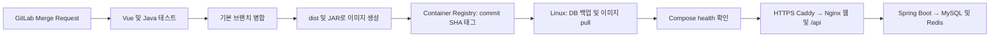

# GitLab → Linux 웹·API 배포 가이드

2026-10-04. 현재 GitLab 원격 이름은 `gitlab`, 주소는 `https://gitlab.com/githubgroup4094208/vue-timeflow.git`다. `origin`은 GitHub이므로 유지한다. 현재 로컬 브랜치는 `master`이며 GitLab의 실제 기본 브랜치는 프로젝트 설정에서 확인한다.

이 구성은 **GitLab 테스트·이미지 생성 → Linux 릴리스 실행** 방식이다. GitLab 자체에서 Spring Boot·DB를 실행하는 것은 아니다. 원격 푸시·실제 GitLab 파이프라인·운영 서버 배포는 아직 수행하지 않았으며 아래 순서로 반영한다.

## 1. 추가한 구성



| 파일 | 역할 |
|---|---|
| [CI 설정](../../.gitlab-ci.yml) | Node 22 웹 테스트·빌드·API 문서 대조, Java 17 Gradle check·bootJar, 기본 브랜치 이미지 생성 |
| [API Dockerfile](../../infra/deploy/Dockerfile.api), [웹 Dockerfile](../../infra/deploy/Dockerfile.web) | 검증된 JAR·dist 복사, API 비루트 실행, healthcheck |
| [Compose](../../infra/deploy/compose.yml) | MySQL 8.4·Redis 7.4·API·웹, 영속 볼륨, 의존 서비스 health 대기 |
| [HTTPS Compose](../../infra/deploy/compose.https.yml), [Caddyfile](../../infra/deploy/Caddyfile) | 도메인 인증서 발급·갱신 및 HTTPS |
| [Nginx](../../infra/deploy/nginx.conf) | SPA 새로고침, 같은 도메인의 /api, 채팅 SSE, API 교체 후 DNS 재조회 |
| [환경 예시](../../infra/deploy/.env.example) | 이미지 경로·SHA·DB/Redis/JWT 값·도메인 |
| [릴리스](../../scripts/deploy/release.sh), [백업](../../scripts/deploy/backup.sh) | 기존 DB 백업, 이미지 교체, health 대기, 성공한 SHA 기록 |
| [.dockerignore](../../.dockerignore) | 비밀 파일·원본 소스·로컬 DB 백업을 이미지 컨텍스트에서 제외 |

웹은 루트 `/`에 배포한다. 로그인·채팅 코드는 같은 출처의 `/api`를 호출하므로 VITE_API_BASE_URL을 설정할 필요가 없다. 현재 프런트엔드는 그 변수를 사용하지 않는다. GitLab Pages 대신 Linux 같은 출처 구성을 사용한다. Capacitor/Electron 설치 파일은 이번 파이프라인에서 만들지 않는다.

현재 관리자 API에는 역할 검사가 없어 Nginx가 `/api/admin`을 차단한다. actuator·Swagger도 외부 프록시에서 차단하고 health는 컨테이너 내부에서 확인한다. 52개 stub·5개 공용 메모리 API와 일부 로컬 저장 기능은 그대로다. 배포 설정이 전체 기능의 서버 연동을 구현하는 것은 아니다. [API 상태](../api/current-api-inventory.md)를 참고한다.

## 2. 로컬 변경을 GitLab에 올리기

PowerShell에서 실행한다.

```powershell
cd E:\vscode-proj\vue-timeflow-proj
git remote -v
git status --short
git fetch gitlab
git switch -c chore/gitlab-linux-deploy
git add .gitlab-ci.yml .gitignore .dockerignore frontend/package-lock.json infra/deploy scripts/deploy backend/src/main/resources/log4j2-deploy.xml docs/deployment/gitlab-cicd.md docs/gitlab-pages-guide.md README.md
git diff --cached --stat
git status --short
git commit -m "chore: GitLab Linux 웹·API 배포 구성 (Codex)"
git push -u gitlab chore/gitlab-linux-deploy
```

GitHub origin은 유지한다. GitLab 원격이 없는 다른 PC에서만 `git remote add gitlab <GitLab 주소>`를 실행한다. HTTPS 인증은 계정 및 write_repository 권한의 Personal Access Token을 사용하거나 GitLab에 등록한 SSH 키를 사용한다. 토큰을 remote URL에 넣지 않는다.

frontend/package-lock.json만 추적 허용으로 변경했다. npm ci에는 이 파일이 필요하다. `.env`·DB 백업·사용자 `.claude/settings.local.json`은 위 커밋 대상이 아니다. 로컬 설정까지 포함하는 `git add .`를 피한다.

## 3. GitLab 설정과 병합

1. **Settings → General**에서 기본 브랜치를 확인한다. master를 유지하면 기본 브랜치를 master로 지정한다. 이미 main을 사용한다면 MR을 main에 병합하고 서버 체크아웃도 main으로 맞춘다. 브랜치를 강제로 덮어쓰지 않는다.
2. **Settings → CI/CD → Runners**에서 Linux Docker executor Runner를 확인한다. 자체 Runner는 rootless BuildKit의 user namespace/mount 시스템 호출을 허용해야 한다. [공식 BuildKit 문서](https://docs.gitlab.com/ci/docker/using_buildkit/)를 참고한다.
3. Container Registry를 활성화한다. GitLab 버전에 따라 **Deploy → Container Registry** 또는 **Packages & Registries → Container Registry**에서 확인한다.
4. chore/gitlab-linux-deploy에서 실제 기본 브랜치로 Merge Request를 만든다. verify_web·verify_api 성공 후 병합한다.
5. 기본 브랜치 파이프라인에서 두 package_images 작업까지 성공했는지 확인한다.
6. Registry에 `web:<40자리 SHA>`, `api:<같은 SHA>`가 생성되었는지 확인한다. latest 대신 정확한 커밋 SHA를 사용한다.

CI_REGISTRY·CI_REGISTRY_IMAGE·CI_REGISTRY_USER·CI_REGISTRY_PASSWORD는 GitLab이 자동 제공한다. 이번 구성에는 원격 SSH 자동 배포 작업이 없으므로 DB/JWT/SSH 비밀값을 CI 변수에 등록할 필요가 없다. 서버의 `.env`에 둔다. Runner·Registry의 실제 성공은 첫 파이프라인에서 확인한다.

## 4. Linux 서버 준비

배포 계정에서 Git·OpenSSH·OpenSSL·curl·Docker Engine·Compose plugin을 사용할 수 있어야 한다. Compose는 up --wait를 지원하는 2.20 이상을 사용한다. Ubuntu 설치는 [Docker 공식 설치 절차](https://docs.docker.com/engine/install/ubuntu/)를 따른다.

```bash
docker --version
docker compose version
docker ps
sudo install -d -o "$USER" -g "$(id -gn)" /opt/timeflow
git clone git@gitlab.com:githubgroup4094208/vue-timeflow.git /opt/timeflow
cd /opt/timeflow
git switch master
git pull --ff-only
```

SSH clone 전에 배포 계정의 공개키를 GitLab에 등록한다. 읽기 전용 프로젝트 Deploy Key도 가능하다. 기본 브랜치가 main이면 git switch main을 사용한다. 배포 계정으로 docker ps도 실행되어야 한다.

## 5. Registry 로그인과 서버 설정

GitLab **Settings → Repository → Deploy tokens**에서 read_registry 권한의 서버 이미지 읽기용 토큰을 만든다. HTTPS clone에 같은 토큰을 쓴다면 read_repository 권한도 필요하다. CI의 임시 job token을 서버에 저장하지 않는다. [Registry 인증](https://docs.gitlab.com/user/packages/container_registry/authenticate_with_container_registry/)을 참고한다.

```bash
read -r -s -p 'Registry token: ' REGISTRY_TOKEN
printf '\n'
printf '%s' "$REGISTRY_TOKEN" | docker login registry.gitlab.com -u '<Deploy token 사용자명>' --password-stdin
unset REGISTRY_TOKEN
umask 077
cp infra/deploy/.env.example infra/deploy/.env
chmod 600 infra/deploy/.env
nano infra/deploy/.env
```

| 키 | 설정 |
|---|---|
| REGISTRY_IMAGE | Registry UI의 경로. 현재 예상값 registry.gitlab.com/githubgroup4094208/vue-timeflow |
| IMAGE_TAG | 성공한 기본 브랜치 파이프라인의 전체 40자리 SHA |
| MYSQL_PASSWORD | API용 DB 사용자 비밀번호 |
| MYSQL_ROOT_PASSWORD | 별도 DB root 비밀번호 |
| REDIS_PASSWORD | 별도 Redis 비밀번호 |
| JWT_SECRET | UTF-8 32바이트 이상 무작위 값. 릴리스마다 변경하지 않음 |
| WEB_PORT | 로컬 점검 포트. 기본 8088 |
| APP_DOMAIN | 실제 소유한 도메인 |
| APP_ORIGIN | https://<실제 APP_DOMAIN> |

각 비밀값은 `openssl rand -hex 32`를 별도로 실행해 만든 서로 다른 64자 값을 사용할 수 있다. `.env`는 Git에 올리지 않는다. 초기화된 DB 비밀번호는 `.env`만 수정해도 바뀌지 않으므로 회전 시 DB 사용자 비밀번호도 변경해야 한다.

## 6. 첫 배포와 데이터 이전

기존 데이터를 가져오지 않는 새 서버는 빈 볼륨에 안전한 Flyway core/chat migration을 적용한다.

```bash
cd /opt/timeflow
git rev-parse HEAD
sh scripts/deploy/release.sh '<성공한 파이프라인의 전체 40자리 SHA>'
docker compose --env-file infra/deploy/.env -f infra/deploy/compose.yml ps
curl --fail http://127.0.0.1:8088/healthz
curl --fail http://127.0.0.1:8088/planner
```

기존 PC의 회원·일정·채팅을 가져오려면 API를 처음 실행하기 전에 별도로 MySQL dump를 만들어 안전하게 전송한다. 현재 로컬 회원은 timeflow.users에 통합되어 있으므로 timeflow 전체를 백업한다. 덤프는 저장소에 넣지 않는다. MySQL 9.0.1 → 8.4 이전은 빈 검증 DB에서 dump 호환성을 확인한 뒤 적용한다. DB 데이터 디렉터리를 그대로 복사하지 않는다.

새 서버의 비어 있는 이전 대상 DB에서만 다음 순서를 사용한다.

```bash
docker compose --env-file infra/deploy/.env -f infra/deploy/compose.yml up -d --wait db redis
docker compose --env-file infra/deploy/.env -f infra/deploy/compose.yml exec -T db \
  sh -c 'MYSQL_PWD="$MYSQL_ROOT_PASSWORD" exec mysql -u root timeflow' < /secure/timeflow.sql
# 회원·데이터·Flyway 이력 확인 후 API와 웹을 시작한다.
sh scripts/deploy/release.sh '<성공한 파이프라인의 전체 40자리 SHA>'
```

기존 DB에 덤프를 덮어쓰거나 Flyway history를 삭제하지 않는다. 검증 실패 시 clean·repair·전체 테이블 삭제로 우회하지 않는다. [데이터 보존 기록](../development/database-recovery-2026-10-03.md)을 참고한다.

## 7. 도메인 HTTPS 활성화

도메인 A 레코드를 서버 공인 IP로 지정한다. AAAA를 등록했다면 IPv6도 같은 서버로 연결되어야 한다. 서버·클라우드 방화벽에서 TCP 80/443을 열고 포트 충돌을 확인한다. HTTP/3 사용 시 UDP 443도 열 수 있다. DB 3306·Redis 6379·API 8080은 공개하지 않는다.

APP_DOMAIN·APP_ORIGIN을 채운 뒤 실행한다.

```bash
sh scripts/deploy/release.sh '<같은 성공 커밋 SHA>' --https
docker compose --env-file infra/deploy/.env -f infra/deploy/compose.yml -f infra/deploy/compose.https.yml ps
curl --fail https://<실제-도메인>/healthz
```

Caddy가 실제 도메인의 인증서를 발급·갱신하고 HTTP를 HTTPS로 전환한다. [HTTPS 설명](https://caddyserver.com/docs/caddyfile/concepts)을 참고한다. 기존 HTTPS 프록시가 있다면 overlay 대신 127.0.0.1:8088로 전달하고 SSE buffering·timeout 및 X-Forwarded-Proto를 맞춘다.

브라우저에서 로그인·새로고침·채팅·멘션·활성 상태를 점검한다. healthz는 웹 health이므로 API 상태는 내부에서 확인한다.

```bash
docker compose --env-file infra/deploy/.env -f infra/deploy/compose.yml exec -T api \
  wget -q -O - http://127.0.0.1:8080/actuator/health
```

## 8. 다음 릴리스·백업·롤백

```bash
cd /opt/timeflow
git pull --ff-only
sh scripts/deploy/release.sh '<새 성공 커밋 SHA>' --https
```

스크립트는 이미지 pull 후 기존 DB 컨테이너가 있으면 백업한다. DB가 멈춰 백업에 실패하면 배포를 중단한다. up --wait 성공 후 `.env`의 IMAGE_TAG와 `.release-state`를 갱신하며 DB/Redis/인증서 볼륨을 유지한다. 백업은 infra/deploy/backups에 저장하며 별도 저장소로 복사·보관한다. 최초 설정 후 `.env.example`로 `.env`를 다시 덮어쓰지 않는다.

수동 백업: `sh scripts/deploy/backup.sh`. 코드만 되돌릴 때는 호환 가능한 이전 성공 SHA로 같은 릴리스 명령을 사용한다. 스키마가 변경됐다면 구버전 앱과 호환되는지 먼저 확인한다. 이 명령은 DB migration을 되돌리지 않는다. DB 복구는 백업과 별도 계획으로 수행한다. 볼륨을 삭제하는 docker compose down -v는 업데이트·롤백에 사용하지 않는다.

## 9. 오류 및 검증 범위

| 현상 | 확인 |
|---|---|
| npm ci 실패 | package-lock.json 커밋 여부, package.json과의 일치 |
| verify_api 실패 | JUnit 보고서·Gradle 로그·외부 의존성 다운로드 |
| BuildKit 권한 오류 | 자체 Runner의 namespace/mount 정책 |
| Registry pull 401/403 | read_registry 권한·사용자명·이미지 경로·만료 |
| 이미지 작업 없음 | 병합 브랜치가 기본 브랜치인지 |
| API unhealthy | docker compose logs --tail=100 api, DB/Redis health·JWT_SECRET |
| HTTPS 실패 | DNS A/AAAA·80/443·포트 충돌·Caddy 로그 |
| 새로고침·채팅 문제 | 루트 base 빌드·SPA fallback·SSE 설정 |

GitLab CI Lint는 **Build → Pipeline editor → Validate**에서 실제 GitLab 설정으로 확인한다. 로컬 검증은 실제 Runner 실행·Registry push·공개 DNS 인증서 발급을 대신하지 않는다. 로컬 검증 결과는 작업 완료 시 아래에 추가한다.
