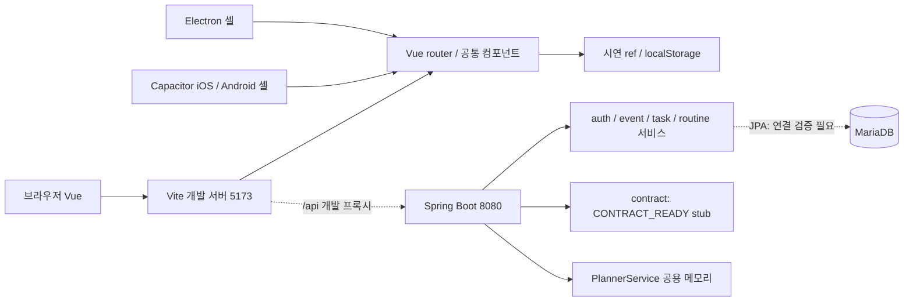
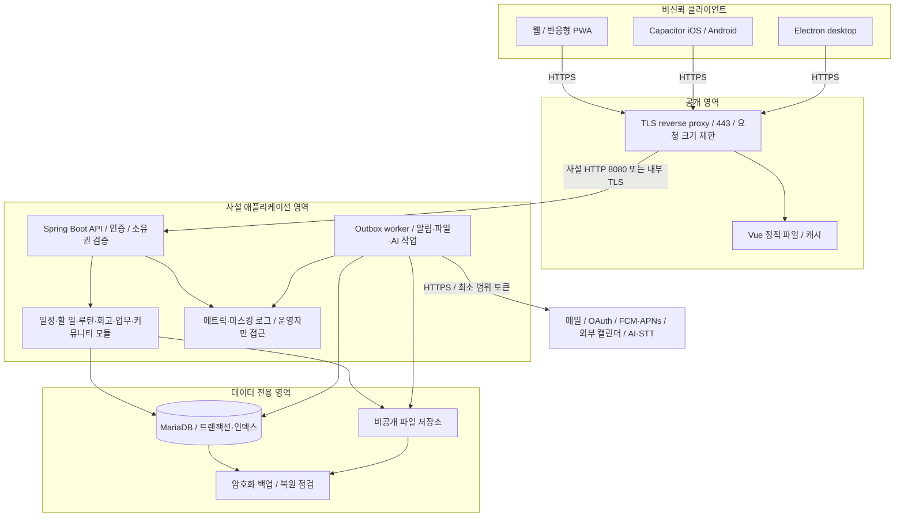
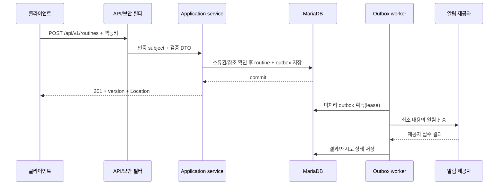

# 시스템 구성도·아키텍처 설계서

기준일 2026-09-26. 현재 코드와 운영 목표를 구분합니다. 서버를 실제 배포하거나 네트워크를 변경한 문서가 아닙니다.

## 현재 개발 구성

- Vue 3/Vite, Capacitor, Electron 설정이 있습니다. 이번 문서만으로 앱스토어·설치 패키지·PWA 오프라인 기능이 완성되었다고 보지 않습니다.
- Spring Boot 모듈: auth/event/task/routine/planner/security/common/contract. 단일 배포 단위인 모듈형 모놀리스입니다.
- MariaDB/JPA/Flyway 설정이 있지만 현재 baseline SQL과 Entity 테이블명이 맞지 않습니다. [정합성 보고서](04-schema-gaps.md) 해결 전 새 DB 설치 가능성을 보장할 수 없습니다.
- 프론트엔드의 최근 작성·WBS·커뮤니티 기능은 로컬 시연입니다. `/api/v1`은 설계이며 현재 컨트롤러 매핑이 아닙니다.

## 운영 목표 구성도

### 구성 요소와 배치 책임

| 구성 | 역할 | 초기 배포 | 확장 조건 |
|---|---|---|---|
| 정적 프론트 | 공통 화면·모바일 폭 대응 | reverse proxy 정적 디렉터리 | 필요 시 CDN |
| API | 검증·인증·도메인 트랜잭션 | Spring Boot 1인스턴스 | 부하 테스트 후 다중 인스턴스 |
| Worker | outbox 처리·재시도 | 동일 코드의 별도 실행 프로세스 | 작업 종류별 소비자 분리 |
| MariaDB | 개인 기록·관계·유일성·이력 | 사설 단일 주 DB | 실제 RPO/RTO에 따라 복제/HA |
| 파일 저장소 | 첨부/음성/내보내기 | S3 호환 비공개 버킷 또는 별도 저장소 | 짧은 서명 URL·검사 격리 영역 |
| 관측 | 메트릭·로그·경보 | 외부 노출하지 않는 수집기 | 예산/운영 도구 결정 후 연결 |
| Redis/메시지 브로커 | 선택 사항 | MVP 필수 아님 | 다중 인스턴스 rate limit/대량 작업 필요 시 도입 |

CPU/RAM·인스턴스 개수는 동시접속·데이터량·SLO가 정해지지 않아 확정하지 않습니다. 우선 컨테이너별 메모리 제한과 부하 테스트를 통해 산정합니다. 새 유료 서비스 계약이나 HA 구성이 이미 설치된 것은 아닙니다.

### 네트워크·보안 경계

| 출발 → 목적 | 프로토콜/포트 | 허용 정책 |
|---|---|---|
| 사용자 → proxy | HTTPS 443 | 공개, TLS 종료·rate limit |
| proxy → API | 8080/TCP 또는 사설 TLS | proxy의 사설 주소만 |
| API/worker → DB | MariaDB 3306/TCP | 앱 계정·migration 계정 분리, 인터넷 공개 금지 |
| API/worker → 외부 제공자 | HTTPS 443 | 제공자 allowlist, timeout, 토큰 최소권한 |
| worker → SMTP | 제공자에 맞는 TLS SMTP | 포트/인증 방식은 선택한 메일 제공자 설정 확인 |
| 운영자 → 관리망 | VPN/제한된 bastion | MFA, 관리자 접근 기록 |

API와 DB가 같은 머신에 있어도 네트워크 접근·계정·백업 권한을 분리합니다. Swagger와 상세 Actuator/로그는 운영에서 공개하지 않습니다. 실제 DNS·인증서·방화벽 규칙은 배포 환경 확정 후 설정합니다.

## 논리 모듈 및 요청 흐름

외부 메일/AI/푸시 호출을 열린 DB 트랜잭션 안에서 대기하지 않습니다. worker의 delivery key와 unique 제약으로 재시도 중복을 제어하며 '정확히 한 번 전송'을 보장한다고 주장하지 않습니다.

## 배포·장애·운영 목표

- GitLab: 정적 검사 → 테스트 → 계약/문서 확인 → 이미지/정적 산출물 → staging → 승인 → production. DB 이관은 앱 배포와 구분해 호환성 순서를 관리합니다.
- 확장-이관-전환-정리 방식으로 컬럼 변경. 적용된 V1 수정·무조건 Flyway repair·운영 SQL 재실행 금지입니다.
- DB 장애 시 쓰기 성공을 가장하지 않고503/500 및 requestId를 반환합니다. 파일/알림 작업은 접수 상태와 완료 상태를 구분합니다.
- 제안 운영 목표: 초기 RPO 24시간/RTO 4시간. 실제 약속이 아니며 백업 주기와 복원 연습 결과로 확정해야 합니다.
- 로그: requestId/operationId/지연/상태코드; 비밀번호·토큰·일기 본문·의료/인사 사유 제외. DB/파일 백업은 암호화 및 제한된 복원 권한을 적용합니다.
- 사용자별 격리, 관리자403, 공유 철회, 버전 충돌, 재시도 중복, 시간대/DST, 백업 복원 테스트가 배포 수용 조건입니다.

관련 문서: [DB 설계](02-current-database.md), [목표 ERD](03-target-database.md), [외부 인터페이스](05-external-interfaces.md), [배포 가이드](../deployment/production.md), [GitLab 가이드](../deployment/gitlab-cicd.md).
