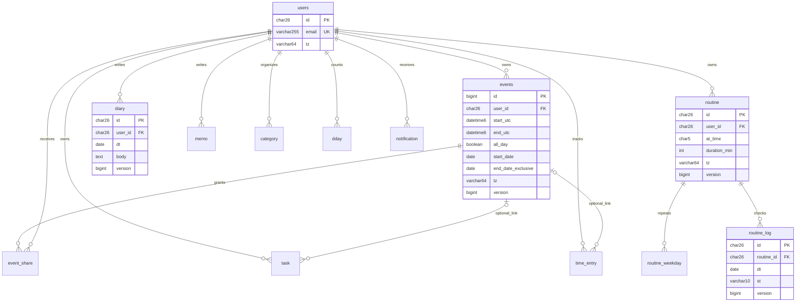
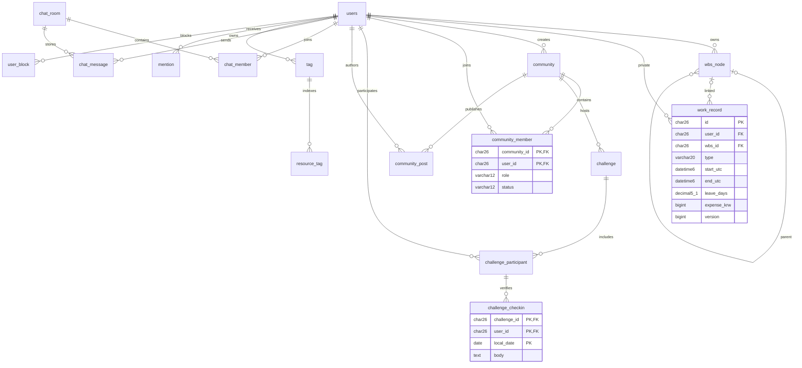
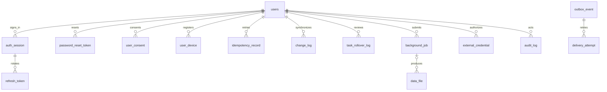

# 목표 DB 설계서·ERD

2026-09-26 · **설계안, 실행 가능한 migration 아님**. 기존 SQL의 tbl_ 이름과 JPA 이름을 먼저 정합화해야 합니다. 아래 이름은 JPA에 맞춘 비접두어 논리명 제안이며 기존 DB에 바로 CREATE/RENAME하지 않습니다.

[현재 DDL 전체 속성 사전](02-current-database.md) · [정합성 이슈](04-schema-gaps.md) · [목표 API](../api-info/catalog.md)

## 설계 원칙

- 신규 PK는 CHAR(26) ULID. 기존 events/planner_item BIGINT는 유지하고 API에서 문자열로 반환합니다.
- 신규 시각 컬럼은 UTC DATETIME(6). 지역 날짜 DATE와 timezone VARCHAR(64)는 의미가 다르므로 별도 보관합니다.
- 사용자 소유 데이터에는 user_id CHAR(26) NOT NULL FK users.id. 권한 쿼리는 ID만이 아니라 (id,user_id) 또는 검증된 membership/ACL을 사용합니다.
- 수정 가능한 리소스에는 version BIGINT NOT NULL DEFAULT1. 개인 기록은 deleted_at DATETIME(6) NULL로 30일 복구 후 정리하는 정책을 제안합니다.
- 신규 일반 엔티티의 공통 컬럼은 id, c_at, u_at NOT NULL입니다. 연결 테이블은 아래 PK/UNIQUE와 관계를 따르며 별도 id가 필요 없는 경우 복합 PK를 사용합니다.
- 필수 여부 표기가 없는 아래 신규 업무 컬럼은 NOT NULL, `?`는 NULL 허용입니다. 기본값은 명시된 경우만 사용합니다. 모든 컬럼은 SQL 변환 전에 실제 Entity와 계약 테스트로 확인합니다.
- 삭제 정책은 기본 RESTRICT. 단순 멤버 연결만 명시적 정리에 한해 CASCADE; 감사·근태 사유·파일 원문은 정책 승인 없이 연쇄 삭제하지 않습니다.

## 핵심 기록 ERD

day-level diary UNIQUE(user_id,dt), routine_log UNIQUE(routine_id,dt)는 재전송/동시 생성에도 중복을 막습니다. 삭제된 일간 회고 복구와 새 회고 충돌은409로 처리하며 사용자가 선택합니다.

## 업무·커뮤니티·메시징 ERD

태그/멘션의 `(resource_type,resource_id)`는 여러 테이블을 가리키므로 하나의 SQL FK로 모든 원본을 참조할 수 없습니다. 동일 트랜잭션의 서비스 계층에서 원본 존재·소유권 검증, 삭제 outbox로 색인 제거, 주기적 orphan 점검을 수행합니다. 향후 공통 resource_registry를 도입한다면 그 키로 FK를 일원화할 수 있습니다.

## 보안·작업 인프라 ERD

## 기존 테이블 변경 계획

| 대상 | 추가/정합화 속성 | 인덱스·제약·이관 주의 |
|---|---|---|
| users / user_pref | user_pref.mode VARCHAR(1), onboarded_at DATETIME(6)?, default visibility, version | mode J/P/B 서버 검증; 기존 tz 유지 |
| refresh_token | session_id CHAR(26), family_id CHAR(26), replaced_by_id CHAR(26)?, reused_at DATETIME(6)? | FK auth_session; 회전 family 단위 폐기, 원문 저장 금지 |
| events | start_utc/end_utc DATETIME(6)?, all_day BOOLEAN, start_date/end_date_exclusive DATE?, tz VARCHAR(64), body TEXT?, version, deleted_at | 시간/종일 필드 조합 검증; INDEX(user_id,start_utc,id); 기존 date/time을 사용자 tz로 이관 |
| task | 연결 event_id_new BIGINT?, version, completed_at DATETIME(6)? | 기존 CHAR event_id에서 변환 가능 ID만 검증 이관; FK events, 원본 보존 |
| routine | duration_min INT, tz VARCHAR(64), goal_count INT, goal_unit VARCHAR(20), body TEXT?, version | 기간1~1440, goal1~9999; weekdays는 routine_weekday로 이관 가능 |
| routine_log | version, checked_at DATETIME(6)? | UNIQUE(routine_id,dt) 유지; 상태/시간대 기준 일치 |
| diary | title VARCHAR(200)?, deleted_at?, version | UNIQUE(user_id,dt) 유지. 로컬 여러 글/일은 사용자 합치기 확인 필요 |
| memo / time_entry | version, 표준 삭제 시각, body 의미 통일 | time_entry CHECK(end_utc>start_utc), 겹침은 잠금 기반 서비스 검증 |
| category | 시스템 범위 discriminator, 부모 자기참조 FK 제안 | nullable user_id UNIQUE의 시스템 중복 문제 해소; 사용자 분류와 시스템 분류 구분 |
| dash_layout | mode, bp NOT NULL 기본 DESKTOP, version | UNIQUE(user_id,mode,bp); NULL bp 중복 정리 |
| user_device | 보관 토큰 암호화 정보, revoked_at | UNIQUE(user_id,device_id); 플랫폼/소유 검증 |
| planner_item | 처리 방향 결정 | 개인 API로 사용하지 않음. 소유자를 추정하여 기존 공용 시연값을 사용자에게 할당하지 않음 |
| ext_cal_account | external_credential 연결 | 메타 JSON에 refresh/access 원문 저장 금지 |

## 신규 테이블 속성·키 정의

공통 `id CHAR(26) PK, c_at/u_at DATETIME(6)` 외에 아래를 정의합니다. 복합 PK로 명시된 연결 테이블에는 공통 id를 생략합니다.

| 테이블 | 업무 속성 (자료형, ?=NULL) | 주요 관계·유일성·인덱스 |
|---|---|---|
| auth_session | user_id CHAR(26), device_id VARCHAR(128), platform VARCHAR(10), last_used_utc DATETIME(6), revoked_utc DATETIME(6)? | FK users; INDEX(user_id,revoked_utc) |
| password_reset_token | user_id CHAR(26), token_hash CHAR(64), expires_utc DATETIME(6), consumed_utc DATETIME(6)? | UNIQUE(token_hash), FK users; 단회15분 |
| user_consent | user_id CHAR(26), type VARCHAR(20), document_version VARCHAR(32), accepted BOOLEAN, decided_utc DATETIME(6) | FK users; INDEX(user_id,type,decided_utc) |
| oauth_attempt | state_hash CHAR(64), provider VARCHAR(12), client_kind VARCHAR(12), redirect_uri VARCHAR(512), code_challenge VARCHAR(128), nonce_hash CHAR(64)?, expires_utc DATETIME(6), consumed_utc DATETIME(6)? | UNIQUE(state_hash); state 원문/비밀 로그 금지 |
| user_identity | user_id CHAR(26), provider VARCHAR(12), provider_subject VARCHAR(255), linked_at DATETIME(6) | FK users, UNIQUE(provider,provider_subject); 이메일 일치만으로 자동 병합 금지 |
| routine_weekday | routine_id CHAR(26), weekday TINYINT | PK(routine_id,weekday), FK routine; weekday1~7 |
| dday | user_id CHAR(26), title VARCHAR(200), target_date DATE, repeat_yearly BOOLEAN, tz VARCHAR(64), version BIGINT | FK users; INDEX(user_id,target_date,id) |
| notification | user_id CHAR(26), event_id CHAR(26), type VARCHAR(40), title VARCHAR(200), body VARCHAR(500), resource_type VARCHAR(20), resource_id VARCHAR(128), read_at DATETIME(6)? | UNIQUE(user_id,event_id), INDEX(user_id,read_at,c_at,id) |
| wbs_node | user_id CHAR(26), parent_id CHAR(26)?, title VARCHAR(200), owner_label VARCHAR(80), effort_md DECIMAL(10,1), progress TINYINT, start_date/end_date DATE?, body TEXT?, version BIGINT, deleted_at DATETIME(6)? | FK users/자기참조; INDEX(user_id,parent_id,id); 순환 서비스 검증 |
| work_record | user_id CHAR(26), wbs_id CHAR(26)?, type VARCHAR(20), title VARCHAR(200), owner_label VARCHAR(80), start_utc/end_utc DATETIME(6), tz VARCHAR(64), status VARCHAR(20), half_day VARCHAR(2)?, leave_days DECIMAL(5,1)?, location VARCHAR(255)?, partner VARCHAR(200)?, transport VARCHAR(255)?, expense_krw BIGINT?, from_company/to_company VARCHAR(200)?, job_role VARCHAR(100)?, handover/body TEXT?, version BIGINT, deleted_at DATETIME(6)? | FK users/wbs_node; INDEX(user_id,type,start_utc,id); 본인만 조회 |
| community | owner_id CHAR(26), name VARCHAR(200), category VARCHAR(12), description LONGTEXT?, capacity INT, deadline DATE?, visibility VARCHAR(10), join_policy VARCHAR(12), version BIGINT, deleted_at DATETIME(6)? | FK users; INDEX(visibility,category,c_at,id) |
| community_member | community_id/user_id CHAR(26), role VARCHAR(12), status VARCHAR(12), join_message VARCHAR(1000)?, decided_by CHAR(26)?, version BIGINT | 복합 PK(community_id,user_id), FK community/users; INDEX(user_id,status) |
| community_post | community_id/author_id CHAR(26), title VARCHAR(200), body LONGTEXT, shared_snapshot_json LONGTEXT?, version BIGINT, deleted_at DATETIME(6)? | FK community/users; INDEX(community_id,c_at,id); 공유 원문 사본 |
| challenge | community_id/creator_id CHAR(26), title VARCHAR(200), description TEXT?, start_date DATE, days INT, tz VARCHAR(64), state VARCHAR(12), version BIGINT | FK community/users; INDEX(community_id,start_date,id) |
| challenge_participant | challenge_id/user_id CHAR(26), state VARCHAR(12), joined_at DATETIME(6) | 복합 PK(challenge_id,user_id), FK challenge/users |
| challenge_checkin | challenge_id/user_id CHAR(26), local_date DATE, body TEXT?, proof_files_json TEXT? | 복합 PK(challenge_id,user_id,local_date), 복합 FK participant, 일일 멱등 |
| ranking_consent | user_id/community_id CHAR(26), accepted BOOLEAN, decided_at DATETIME(6) | 복합 PK(user_id,community_id), FK users/community |
| achievement_award | user_id CHAR(26), code VARCHAR(64), period_key VARCHAR(32), awarded_at DATETIME(6), sticker_item_id CHAR(26)? | UNIQUE(user_id,code,period_key), FK users/sticker_item |
| chat_room | kind VARCHAR(10), name VARCHAR(80)?, dm_pair_key VARCHAR(80)?, version BIGINT | UNIQUE(dm_pair_key), DM은 정렬된 두 사용자 ID로 중복 방지 |
| chat_member | room_id/user_id CHAR(26), role VARCHAR(12), joined_at DATETIME(6), left_at DATETIME(6)?, last_read_message_id CHAR(26)? | 복합 PK(room_id,user_id), FK chat_room/users; 읽음 메시지의 방 일치 검증 |
| chat_message | room_id/sender_id CHAR(26), text TEXT?, record_type VARCHAR(12)?, record_id VARCHAR(128)?, client_message_id CHAR(36), deleted_at DATETIME(6)? | FK chat_room/users; UNIQUE(room_id,sender_id,client_message_id), INDEX(room_id,c_at,id) |
| tag | user_id CHAR(26), name VARCHAR(40), normalized_name VARCHAR(40) | FK users, UNIQUE(user_id,normalized_name) |
| resource_tag | user_id/tag_id CHAR(26), resource_type VARCHAR(20), resource_id VARCHAR(128) | 복합 PK(tag_id,resource_type,resource_id), FK users/tag; 원본 polymorphic 참조는 서비스 검증 |
| mention | from_user_id/to_user_id CHAR(26), resource_type VARCHAR(20), resource_id VARCHAR(128), read_at DATETIME(6)? | UNIQUE(to_user_id,resource_type,resource_id), FK users; INDEX(to_user_id,read_at,c_at) |
| user_block | blocker_id/blocked_id CHAR(26) | 복합 PK(blocker_id,blocked_id), FK users; 자기 차단 금지 |
| calendar_group_invitation | group_id/sender_id/recipient_id CHAR(26), role VARCHAR(10), status VARCHAR(12), expires_at DATETIME(6), version BIGINT | FK cal_group/users; 활성 초대 중복은 서비스 잠금·유일키 전략 |
| task_rollover_log | task_id/user_id CHAR(26), source_due/target_due DATE, policy_version BIGINT, reason VARCHAR(200) | UNIQUE(task_id,source_due,policy_version), FK task/users |
| idempotency_record | user_id CHAR(26), method VARCHAR(8), path_hash CHAR(64), key_value CHAR(36), body_hash CHAR(64), status VARCHAR(12), response_status SMALLINT?, response_json LONGTEXT?, expires_at DATETIME(6) | UNIQUE(user_id,method,path_hash,key_value); 만료 인덱스 |
| change_log | revision BIGINT AUTO_INCREMENT, user_id CHAR(26), resource_type VARCHAR(20), resource_id VARCHAR(128), resource_version BIGINT, deleted BOOLEAN, changed_at DATETIME(6) | revision PK(공통id 없음), INDEX(user_id,revision), tombstone30일 |
| outbox_event | aggregate_type VARCHAR(20), aggregate_id VARCHAR(128), event_type VARCHAR(64), payload_json LONGTEXT, state VARCHAR(12), available_at DATETIME(6), lease_until DATETIME(6)?, attempts INT DEFAULT0 | INDEX(state,available_at,id); payload 민감 원문 최소화 |
| delivery_attempt | outbox_id CHAR(26), channel VARCHAR(12), recipient_key_hash CHAR(64), provider_message_id VARCHAR(255)?, status VARCHAR(12), next_attempt_at DATETIME(6)? | FK outbox_event; UNIQUE(outbox_id,channel,recipient_key_hash) |
| background_job | user_id CHAR(26), type VARCHAR(20), status VARCHAR(12), progress INT, request_json LONGTEXT, result_json LONGTEXT?, result_file_id CHAR(26)?, error_code VARCHAR(64)?, expires_at DATETIME(6)? | FK users/data_file; INDEX(user_id,type,c_at,id) |
| external_credential | user_id CHAR(26), provider VARCHAR(12), ciphertext LONGTEXT, key_version VARCHAR(32), scopes VARCHAR(500), revoked_at DATETIME(6)? | UNIQUE(user_id,provider), FK users; 암호화 키는 DB 밖 secret store |
| audit_log | actor_id CHAR(26), action VARCHAR(64), target_type VARCHAR(20), target_id VARCHAR(128), reason VARCHAR(500), redacted_diff_json LONGTEXT?, at_utc DATETIME(6) | FK users; INDEX(at_utc,actor_id,id); 변경/삭제 권한 제한 |

## 데이터·동시성 정책

- 시간 겹침 검증은 단순 인덱스만으로 보장되지 않습니다. 같은 사용자의 시간 기록 변경에 대한 잠금/충돌 제어와 트랜잭션 내 overlap 조회가 필요합니다.
- 멤버 수 확인과 가입 insert는 같은 트랜잭션에서 community 행 잠금 후 처리합니다. 화면의 memberCount를 신뢰하지 않습니다.
- WBS 부모 이동은 같은 사용자 범위와 순환/깊이를 검사하고, 상위 공수는 말단 합으로 계산합니다. 집계값을 저장한다면 변경과 동일 트랜잭션으로 재계산합니다.
- 개인 업무·회고·파일 참조는 커뮤니티 공개 글에 원본 링크를 무제한 노출하지 않습니다. 명시적으로 확정한 최소 정보 사본만 저장합니다.
- 개인정보 삭제/감사 보존 기간은 운영·법무 정책 합의가 필요합니다. 제안 휴지통30일/멱등키24시간/단회 reset15분은 서비스 설계값이지 법적 보관 의무를 의미하지 않습니다.
- nullable UNIQUE, 대소문자 collation, 자정/DST, 윤일, 중복가입/인증, 중복 refresh, 다른 사용자 FK 참조, 최대 숫자/문자 길이를 테스트합니다.

## 변경 승인 조건

이 설계서에서 DDL을 만들어 바로 적용하지 않습니다. 실제 DB 조사 → 이름 정합화 결정 → Entity/DTO 및 migration 동시 작성 → 빈 DB/기존 DB 복제본 테스트 → 데이터 비교·복원 연습 → 승인 후 배포 순서를 따릅니다.
