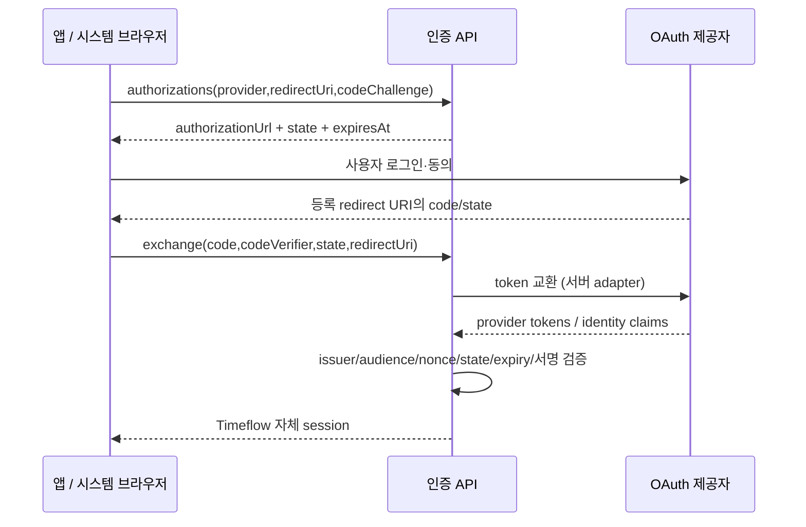
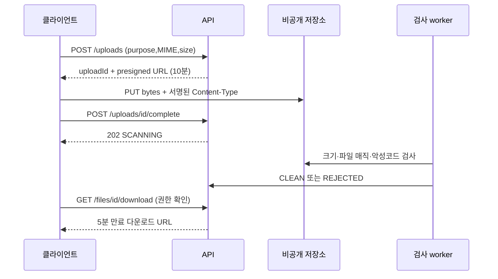

# 외부 인터페이스 정의서

2026-09-26 · 설계 단계. 메일·푸시·소셜 로그인·캘린더·AI/STT 제공자와 실제 연결을 생성하지 않았습니다. 요청 예시의 도메인/코드/키는 비실제 값입니다.

## 인터페이스 목록

| ID | 외부/내부 경계 | 방향·주기 | 규격·인증 | 구현 상태 |
|---|---|---|---|---|
| IF-01 | Vue/Capacitor/Electron ↔ API | 사용자 요청 | HTTPS JSON, JWT/브라우저 refresh 쿠키 | 현재 /api 일부, 목표 /api/v1 미구현 |
| IF-02 | 인증 adapter ↔ Google/Apple/Kakao | 로그인 시 | OAuth code + PKCE/state, 제공자별 token 검증 | 설계 |
| IF-03 | 알림 worker → 메일 서비스 | reset/이메일 검증 이벤트 | 제공자 HTTPS 또는 TLS SMTP, 서버 자격증명 | mail starter만 존재 |
| IF-04 | 알림 worker → FCM/APNs | 예약 알림·멘션 이벤트 | HTTPS, 서버에서 OAuth/JWT credential | 설계 |
| IF-05 | 동기화 worker ↔ Google Calendar | 사용자 수동/주기 실행 | HTTPS OAuth scope + syncToken | 설계 |
| IF-06 | 클라이언트 ↔ 비공개 객체 저장소 | 첨부/음성 업로드 | 제한된 presigned PUT/GET, 짧은 만료 | 설계 |
| IF-07 | AI/STT worker ↔ 선택 제공자 | 명시적 동의 후 비동기 | HTTPS JSON/바이너리, 서버 비밀키 | 제공자 미정 |
| IF-08 | 도메인 → Outbox → 알림/통계 | 트랜잭션 commit 후 | 버전된 내부 JSON 이벤트, DB lease | 설계 |
| IF-09 | GitLab CI → 배포 환경 | 승인된 release | 제한된 runner/deploy 계정, protected 변수 | 가이드/설정 검토 필요 |

## 공통 외부 호출 정책

- 제공자 토큰은 서버 secret store 또는 암호화 저장. 브라우저 번들·Git·일반 로그·작업 payload에 원문 키를 넣지 않습니다.
- 사용자 제공 URL을 서버가 임의 fetch하지 않습니다. 제공자 host/redirect URI/storage host를 allowlist로 제한하고 SSRF 및 열린 redirect를 막습니다.
- 제안 초기 timeout: 연결3초, 일반 읽기10초. 긴 AI/파일 처리는202 작업으로 전환하며 동기 HTTP를 오래 유지하지 않습니다. 실제 값은 제공자 제한/부하 테스트 후 조정합니다.
- 429/5xx/일시 timeout만 backoff+jitter 재시도(예: 1/4/16/60초, 최대5회), Retry-After 우선. 인증 실패/영구 수신자 오류는 재시도하지 않습니다. 워커 장애 후 lease 만료로 재개합니다.
- 접수 성공과 최종 전달/열람을 구분합니다. message/job ID는 결과 대조용이지 사용자가 읽었다는 증거가 아닙니다.
- 감사는 requestId/interfaceId/providerRequestId/result/latency 중심, 본문·토큰·개인 일정 내용 제외입니다.

## IF-01: 공통 앱/API

요청과 응답 규격은 [9-API](../9-API/README.md)의 모든 엔드포인트를 따릅니다. 모바일/PC는 별도 DB를 쓰지 않습니다. 화면별 응답 차이가 필요하면 명시적인 DTO 버전으로 관리하고 User-Agent로 보안 정책을 변경하지 않습니다.

## IF-02: OAuth 계정 연동/로그인



| 필드 | 전달 방향 | 규칙 |
|---|---|---|
| provider | 앱→서버 | GOOGLE/APPLE/KAKAO, 서버 등록 대상만 |
| authorizationCode | 앱→서버→제공자 | 단회, 로그 금지 |
| state | 서버→앱→서버 | 시도/클라이언트/redirect URI에 묶고 해시 보관, 재사용 금지 |
| codeVerifier/challenge | 앱 생성, 서버 검증 | PKCE S256, 제공자 지원 규격 확인 |
| provider subject | 제공자→서버 | provider+subject로 UNIQUE; 이메일이 같다고 자동 계정 병합하지 않음 |
| refresh token | 제공자→서버 | 서버 암호화; 앱에는 자체 서비스 세션만 반환 |

제공자 endpoint URL, scope, JWKS 및 client ID는 adapter 설정으로 관리하고 앱 배포 환경별 callback을 사전 등록합니다. Apple의 form_post callback/서명된 identity token 등 제공자별 차이는 공통 exchange로 숨기되 서버 수신 adapter·등록 URI를 별도 검증해야 합니다. 실제 코드에 adapter가 구현된 것은 아닙니다.

실패: 사용자 취소는 로그인 복귀, state/nonce 불일치는403 및 시도 폐기, code 만료/재사용은 새 로그인, provider429/503은 제한적 재시도. 보안 원칙은 [RFC 9700](https://www.rfc-editor.org/rfc/rfc9700.html), Kakao의 코드/토큰 교환 세부 형식은 [공식 REST 문서](https://developers.kakao.com/docs/ko/kakaologin/rest-api)를 참고합니다.

## IF-03: 이메일

내부 메일 요청 DTO:

```json
{
  "eventId": "01J00000000000000000000001",
  "template": "PASSWORD_RESET",
  "recipientUserId": "01J00000000000000000000002",
  "locale": "ko-KR",
  "templateDataRef": "secure-one-time-payload-ref",
  "expiresAt": "2026-09-26T00:15:00Z"
}
```

수신 이메일 주소와 reset 원문 토큰은 worker가 제한된 저장소에서 읽습니다. 공개 reset 요청 응답은 계정 존재 여부와 무관하게202입니다. `(eventId,channel,recipientHash)`로 중복 발송을 제어합니다. provider 접수 ID와 시각만 저장하고 이메일 본문은 기본 로그에 남기지 않습니다. 토큰 만료 후 큐가 처리되면 발송하지 않습니다. bounce/webhook은 제공자 선정 전 미확정이며 임의 공개 callback을 열지 않습니다.

## IF-04: 모바일·웹 알림

기기 등록은 PUT `/api/v1/me/devices/{deviceId}`입니다. pushToken 변경/권한 철회/로그아웃 시 서버 등록을 갱신 또는 해제합니다. DND/사용자 수신 설정/시간대를 worker에서 평가합니다.

```json
{
  "message": {
    "token": "example-device-token",
    "notification": { "title": "루틴 알림", "body": "앱에서 내용을 확인해주세요." },
    "data": { "eventId": "01J00000000000000000000001", "resourceType": "ROUTINE", "resourceId": "01J00000000000000000000002" }
  }
}
```

위는 FCM HTTP v1 형태의 설계 예시입니다. 서버 인증 및 메시지 보내기는 [FCM 공식 문서](https://firebase.google.com/docs/cloud-messaging/send/v1-api)를 따릅니다. 직접 APNs를 선택하면 Apple 팀/키/topic/environment 설정이 필요하며 [APNs 인증 문서](https://developer.apple.com/documentation/usernotifications/establishing-a-token-based-connection-to-apns)를 별도 확인합니다. iOS를 FCM 경유로 보낼 경우 같은 이벤트를 APNs 직접 전송과 중복 실행하지 않습니다.

토큰 만료/미등록 오류는 기기 토큰 비활성화, provider 인증 실패는 운영 경보,429는 재시도합니다. 푸시에는 일기/인사/위치 원문 대신 내부 리소스 식별자만 담습니다. 앱은 열람 시 다시 권한 검사된 API를 호출합니다. 임의 URL deep link는 허용하지 않습니다.

카카오 알림톡은 카카오 로그인과 별개입니다. 비즈메시지 계약·템플릿·수신 동의가 필요한 제공자별 연동으로 남겨두며, 로그인 API만으로 임의 사용자에게 알림을 보낼 수 있다고 가정하지 않습니다. 공급사 선정 전 요청 URL·요금·발송 규격을 임의 확정하지 않습니다.

## IF-05: 외부 캘린더

- 초기 범위는 Google 단방향 가져오기 제안. 내 일정의 외부 업로드·삭제 전파는 사용자 별도 동의와 충돌 정책 확정 후 확장합니다.
- 로그인 사용자에 묶인 OAuth 시도: `/calendar-connections/authorizations`; 연결: `/calendar-connections`; 실행: `/{id}/sync-jobs`; 상태: `/calendar-sync-jobs/{id}`. 로그인 OAuth state와 캘린더 연동 state는 목적을 구분하고 혼용하지 않습니다.
- 사용자별 providerAccount/calendarId/externalEventId/etag/syncToken/lastSyncedAt 매핑을 보관하고 `(connectionId,externalEventId)` 중복을 차단합니다. 외부 token은 external_credential에서 분리 관리합니다.
- 최초 전체 목록 → 페이지 끝까지 처리 → nextSyncToken 저장. 이후 변경만 가져옵니다. 요청 필터 조합은 처음과 유지합니다. token 만료410은 기존 변경을 보호하면서 전체 동기화로 전환합니다. [Google 증분 동기화 공식 가이드](https://developers.google.com/workspace/calendar/api/guides/sync)
- 외부 종일 date/end-exclusive와 시간 dateTime/timeZone을 구분합니다. 취소된 항목은 내부 tombstone 후보로 처리하고 사용자가 독립 편집한 사본을 즉시 지우지 않습니다.
- credential401은 REAUTH_REQUIRED,429는 대기, 타임아웃/5xx는 job 재시도. 연결 해제는 외부 credential 폐기 후 작업을 중지하며 이미 가져온 개인 일정 삭제 여부는 사용자 선택입니다.
- webhook 없이 수동/예약 polling부터 구현합니다. 향후 webhook은 서명/채널 검증·중복 이벤트·TTL을 설계한 뒤 별도 계약으로 추가합니다.

## IF-06: 파일 저장소



클라이언트가 보낸 size/MIME를 신뢰하지 않고 저장소 실제 객체를 확인합니다. 실행 파일·SVG/HTML은 초기 첨부 allowlist에서 제외합니다. purpose별 상한은 첨부10MiB/음성25MiB/import50MiB 제안. CLEAN 이전 파일을 글에 연결하지 않습니다. 사용자 파일명은 object key나 로컬 경로로 사용하지 않습니다. 검사 결과는 GET `/api/v1/uploads/{id}`로 조회합니다. complete 요청의 멱등 결과만 반복해서 읽으면 SCANNING 접수 응답에 머물 수 있으므로 별도 상태 조회를 사용합니다.

## IF-07: AI·STT

내부 요청은 `{jobId,userId,consentId,sourceResourceIds,locale,taskType}`로 제한합니다. adapter가 권한 확인 후 필요한 텍스트/검사완료 음성만 추출합니다. 사용자 기록 안의 명령문은 데이터이며 도구 실행 지시로 취급하지 않습니다.

응답은 `{jobId,status,drafts,errorCode}`. 후보 텍스트는 다시 길이/형식 검사 후 표시하며 자동 저장하지 않습니다. STT 결과의 인식 오류도 사용자가 수정할 수 있어야 합니다. vendor token/입력 보관/국외 전송/학습 사용 정책·비용 상한은 공급사 선택 후 동의문과 함께 확정합니다. 단일 제공자 미정 상태에서 실제 endpoint나 모델명을 꾸며 넣지 않습니다.

## IF-08: 내부 이벤트

```json
{
  "eventId": "01J00000000000000000000001",
  "schemaVersion": 1,
  "eventType": "ROUTINE_UPDATED",
  "aggregate": { "type": "ROUTINE", "id": "01J00000000000000000000002", "version": 3 },
  "ownerId": "01J00000000000000000000003",
  "occurredAt": "2026-09-26T00:00:00Z",
  "requestId": "req-example"
}
```

본문 대신 리소스 참조를 담고 소비 시 권한/현재 상태를 다시 확인합니다. 순서 역전 시 낮은 version 이벤트를 중복 반영하지 않습니다. worker 수동 재처리는 원래 eventId를 유지하며 실패 레코드를 지우지 않습니다. 채팅도 초기에는 REST 조회가 기준이고, polling/푸시는 새 메시지 알림일 뿐 전달 보장 프로토콜이 아닙니다. WebSocket 티켓·heartbeat·재접속 규격은 후속 설계입니다.

## IF-09: GitLab 배포 경계

protected branch/tag와 승인된 runner만 production secret을 읽도록 합니다. MR/외부 fork 파이프라인에는 배포 비밀을 노출하지 않습니다. backend artifact·frontend static artifact·migration 파일의 버전과 checksum을 함께 기록합니다. SSH라면 전용 최소권한 계정과 검증된 host key, 컨테이너 배포라면 제한된 registry/deployment credential을 사용합니다. 이 문서로 실제 GitLab 연결이나 배포는 수행하지 않았습니다. [기존 GitLab 배포 가이드](../deployment/gitlab-cicd.md)

## 수용 테스트

제공자 sandbox에서 사용자 취소/중복 callback/code 재사용/만료, provider429/5xx, 메일 만료, 푸시 토큰 폐기, 캘린더410, upload 용량/위조 MIME/감염 파일, AI 동의 철회, worker lease 만료/재시도를 검증합니다. 실제 제공자 계정이 없으므로 이번 작업은 이 테스트를 실행한 것이 아니라 계약과 체크리스트를 제공한 것입니다.
