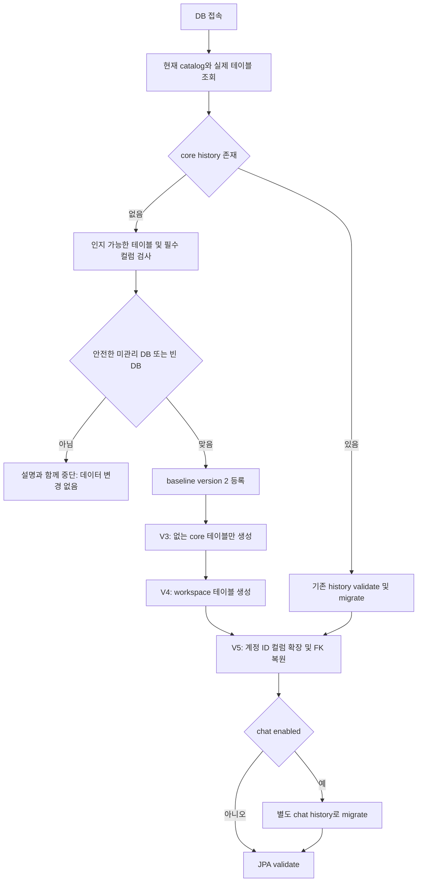

# 데이터 보존형 DB 복구 설계 및 검증

2026-10-03. 코드 변경 전 확인한 실제 환경은 Docker `mysqldata`의 MySQL 9.0.1, `timeflow` schema이며 `events` 0행과 `tbllog` 13행만 있다. Flyway history가 없다. `auth_db.users`에는 UUID 36자 ID를 쓰는 기존 회원 6명이 있다. 계정 내용과 비밀번호 해시는 문서·로그에 기록하지 않는다.

## 사전 설계

기존 `db/migration/V1__initial_schema.sql`은 checksum 보존을 위해 변경하지 않는다. 안전한 V3 bootstrap을 추가하고 실행 전략에서 아래 흐름을 적용한다. `baseline-on-migrate`를 무조건 켜거나 `ddl-auto=update`, DROP, CREATE OR REPLACE, clean, repair를 실행하지 않는다.



미관리 DB는 기본 설정의 기대 schema `timeflow`와 일치해야 하며, 알려진 core/로그 테이블만 허용한다. core history 없이 workspace 테이블이 있으면 V4 중복 생성 위험 때문에 adoption을 거절한다. `tbl_*`만 존재하는 경우 임의 RENAME을 하지 않고 중단한다. 존재하는 core 테이블의 필수 컬럼을 확인하고 미완성 새 기능 테이블도 실패하도록 한다. 사용자 행·내용을 읽지 않는 metadata 검사다. 기존 history가 있는 DB에는 새 baseline을 덮어쓰지 않는다.

V3는 `CREATE TABLE IF NOT EXISTS`로 JPA 대응 core 8개를 준비한다. 기존 `events`/`tbllog`는 건드리지 않는다. 새 사용자와 계정 참조는 UUID 36자와 새 ULID 26자를 모두 수용한다. V5는 기존 26자 계정 참조를 확장하며 관계 FK를 먼저 기록하고 필요한 제약만 해제한 뒤 원래 이름·컬럼·삭제/수정 규칙으로 복원한다. ID 값·행·PK 값은 변경하지 않는다. 이벤트·할 일·채팅방·메시지 등 새 ULID 리소스 ID의 길이는 그대로다.

채팅은 별도 V4로 계정 ID와 DM pair key를 확장한다. 기존 채팅 migration과 core V1 checksum은 보존한다. Flyway 실행 책임은 core 전략 한 곳으로 모아 chat 활성 여부에 관계없이 core bootstrap이 먼저 완료된다.

DB 접속은 DB_URL/DB_DRIVER/DB_SCHEMA/DB_USERNAME/DB_PASSWORD로 재정의할 수 있게 한다. 실제 서버가 MySQL이므로 기본 드라이버는 Connector/J다. MariaDB는 URL과 드라이버를 함께 재정의한다. 로컬 JVM 실행은 무시된 backend/.env를 읽어 DB 비밀 값과 무작위 JWT secret을 사용한다. 빈 JWT 설정은 명확한 설정 오류로 처리하고 코드에 공용 개발 signing key를 추가하지 않는다. 기본 JDBC 로그 appender의 별도 DB 접속을 제거하고 콘솔·파일 로그를 유지한다. SMTP가 미설정이면 mail health 검사를 끄고, chat이 켜진 환경에서만 Redis health를 필수로 검사한다.

## 적용 및 검증 절차

1. 기존 schema와 모듈별 회원 데이터를 mysqldump로 백업하여 ignored build/database-recovery에 보관한다. 백업 내용은 출력하지 않는다.
2. 실제 schema 복사본과 별도 빈 schema에서 bootstrap/JPA validate/재기동을 검증한다. 실패한 migration 또는 미인식 schema에 대한 거절도 검사한다.
3. 복사본에서 기존 UUID 계정·신규 ULID 계정, 로그인·플래너 설정·체크리스트 담당자·완료·버전 충돌·채팅·검색을 실제 DB로 검사한다.
4. 전체 Gradle 검사와 API 문서 대조를 완료한다.
5. 검증된 설정·코드를 실제 `timeflow`에 반영한다. 기존 회원 6명은 ID·해시를 유지하여 단일 DB에 복사하고 원본 auth_db는 남긴다. 기존 로그·일정 및 회원의 보존 수를 확인한다. 계정 충돌은 덮어쓰지 않고 중단한다.
6. 실제 서버 health 및 재시작을 확인하고 테스트 계정 생성은 복사본에 한정한다.

## 실제 적용 결과 · 2026-10-03/04

전체 Gradle check·bootJar를 통과했다. JUnit 137개(행동·HTTP 95개, 네이밍·서식 42개)는 실패·오류 0이다. 실제 MySQL 9.0.1·Redis 7.4·HTTP 검증 13개도 통과했다.

| 검증 | 결과 |
|---|---|
| 기존 partial schema 및 빈 schema 초기화 | baseline 2 → core V3 → workspace V4 → core V5, JPA validate 통과 |
| 기존 데이터 보존 | 복사본의 실제 로그 13행과 추가 이벤트 sentinel 보존 |
| 계정 호환 | 신규 ULID 가입·기존 UUID 로그인, JWT subject 보존 |
| 플래너 기본값 | 첫 저장·재조회·오래된 version 0 갱신 409 |
| 체크리스트 담당자 | UUID 배정·조회·완료 버전 증가·동일 완료 재호출 유지 |
| 동시 수정 | 두 실제 동시 요청 중 200 하나·409 하나, 저장 version 일치 |
| 채팅 | UUID/ULID DM 재사용, UUID 멘션, gram 색인 검색 |
| Redis | UUID 계정 활성 상태 갱신·조회 |
| 재기동 | 기존 core history·checksum 그대로 validate, 재baseline 없음 |
| 안전 검사 | 미인식 테이블이 있는 DB는 history 생성·데이터 변경 전에 거절 |
| 기존 26자 core/FK | 계정·할 일 데이터 및 FK 수 보존, 36자 확장 후 JPA validate |

실제 로컬 `timeflow`의 반영도 확인했다. 기존 IDE 개발 서버가 코드 변경을 자동 재로딩해 위 마이그레이션을 적용했다. 서버를 중복 실행하거나 기존 프로세스를 종료하지 않았다. core history는 baseline 2 및 성공한 V3·V4·V5이며 chat history는 baseline 0 및 성공한 V1~V4다. 기존 SQL checksum은 수정하지 않았다.

`auth_db.users`의 기존 회원 6명을 빈 `timeflow.users`에 단일 트랜잭션으로 복사했다. ID·이메일·비밀번호 해시·닉네임·역할·상태·시간대·인증 상태·로그인/변경/생성/갱신/삭제 시각·활성값 총 14개 필드를 NULL-safe 비교해 6명 모두 일치함을 확인했다. 원본 auth_db는 유지하며 테스트 계정은 실제 DB에 생성하지 않았다. 기존 events 0행, tbllog 13행, 원본 회원 6행의 내용 보존을 확인했고 로그는 작업 전 복사본과 모든 행의 SHA-256 비교도 일치했다.

실제 서버 `http://localhost:8080/actuator/health`는 UP이며 `/v3/api-docs`에는 현행 API 117개가 있다. [API 목록](../api/current-api-inventory.md)·소스·실서버 매핑 대조도 117개 모두 일치했다. 최종 JAR를 임시 18086 포트에서 원본 DB에 재기동해 `.env` 자동 로딩·JPA validate·health UP·core/chat 이력 불변 및 미인증 계정 요청 401을 확인한 뒤 테스트 JVM만 종료했다. 기존 8080 서버는 유지한다. 프런트엔드의 모든 기능을 이 API에 연결하거나 실제 MariaDB 엔진을 테스트한 결과는 아니다. Flyway 11.7은 이 MySQL 버전이 자체 검증 버전보다 높다는 경고를 남기지만 이번 실제 마이그레이션·JPA·HTTP 검증은 통과했다.

## 실행 및 재검사

로컬 비밀값은 git에 포함되지 않는 `backend/.env`에 보관한다. [설정 예시](../../backend/.env.example)를 참고하고 JWT secret은 UTF-8 32바이트 이상의 무작위 값으로 설정한다. MariaDB에 연결하려면 `DB_DRIVER=org.mariadb.jdbc.Driver` 및 `jdbc:mariadb://...` URL을 함께 지정한다. 미관리 DB의 `DB_SCHEMA`는 접속 catalog와 일치해야 한다.

```powershell
cd backend
.\gradlew.bat --offline --no-daemon check bootJar --console=plain
cd ..
powershell -NoProfile -ExecutionPolicy Bypass -File scripts/start-backend.ps1 -Background
node frontend/scripts/audit-api-docs.mjs --live --base-url=http://127.0.0.1:8080 --date=2026-10-03
```

[실행 스크립트](../../scripts/start-backend.ps1)는 실제 JVM을 숨김 실행하고 PID·로그를 ignored build/local-server에 보관한다. 8080이 이미 사용 중이면 기존 서버를 유지하고 중복 실행을 거절한다. IDE 실행도 `.env`를 자동으로 읽는다.

[복구 HTTP 검사](../../scripts/database/recovery_check.py)와 [기존 FK 검사](../../scripts/database/core_upgrade_check.py)는 이번 작업에서 준비한 명시적 검증 스키마에만 테스트 데이터를 만든다. 원본 timeflow/auth_db에는 쓰지 않는다. 사전 준비된 로컬 검증 스키마와 빌드 JAR, Docker MySQL/Redis를 사용한다. 결과는 ignored `backend/build/database-recovery/http-results.json`(11), `core-upgrade-results.json`(2), `live-results.json`에 남겼다. 원본 백업은 같은 디렉터리의 `timeflow-before-recovery-20261003.sql`(56,601바이트)에 보관한다. 백업·로컬 설정·테스트 로그를 git에 추가하지 않는다.

baseline은 지정 버전 이하 migration을 제외하는 이력 등록이다. 자동 baseline의 오접속 위험을 피하려고 메타데이터 검사 후 명시적으로 적용했다. 근거: [Flyway baseline 공식 문서](https://documentation.red-gate.com/flyway/reference/commands/baseline), [baselineOnMigrate 설정](https://documentation.red-gate.com/flyway/reference/configuration/flyway-namespace/flyway-baseline-on-migrate-setting).
